# 3CX Supply Chain Lab

**Platform:** CyberDefenders    
**Difficulty:** Easy  
**Duration:** ~45 min   
**Category:** Thread Intel
**Link:** https://cyberdefenders.org/blueteam-ctf-challenges/3cx-supply-chain/
 
## Scenario
A large multinational corporation heavily relies on the 3CX software for phone communication, making it a critical component of their business operations. After a recent update to the 3CX Desktop App, antivirus alerts flag sporadic instances of the software being wiped from some workstations while others remain unaffected. Dismissing this as a false positive, the IT team overlooks the alerts, only to notice degraded performance and strange network traffic to unknown servers. Employees report issues with the 3CX app, and the IT security team identifies unusual communication patterns linked to recent software updates.  

As the threat intelligence analyst, it's your responsibility to examine this possible supply chain attack. Your objectives are to uncover how the attackers compromised the 3CX app, identify the potential threat actor involved, and assess the overall extent of the incident.   

## Q1
Understanding the scope of the attack and identifying which versions exhibit malicious behavior is crucial for making informed decisions if these compromised versions are present in the organization. How many versions of 3CX running on Windows have been flagged as malware?  

For this lab, we are provided with a single MSI file that contains the malware. Obviously, we must not execute it and we should handle it with caution.

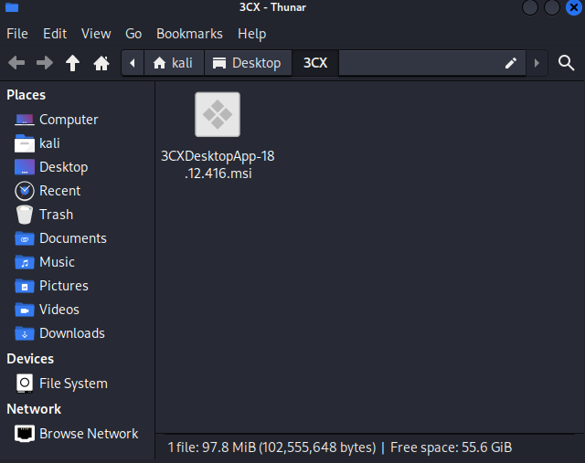   

To begin with, we need to obtain the file hash. We can get it with the sha256 command.

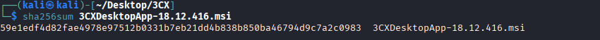   

sha265: 59e1edf4d82fae4978e97512b0331b7eb21dd4b838b850ba46794d9c7a2c0983

However, to answer this question all we need to do is to search it on google.  

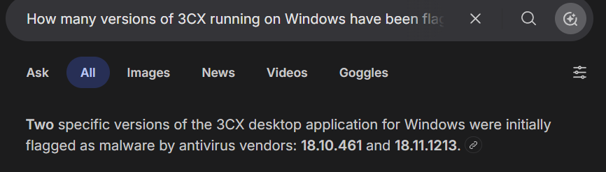  

## Q2
Determining the age of the malware can help assess the extent of the compromise and track the evolution of malware families and variants. What's the UTC creation time of the .msi malware?  

Using the hash obtained earlier, we can now search for it on VirusTotal.

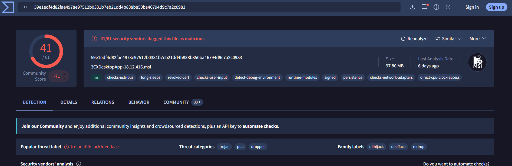  

To obtain the creation time, we can go to the details tab, and search for the History section.  

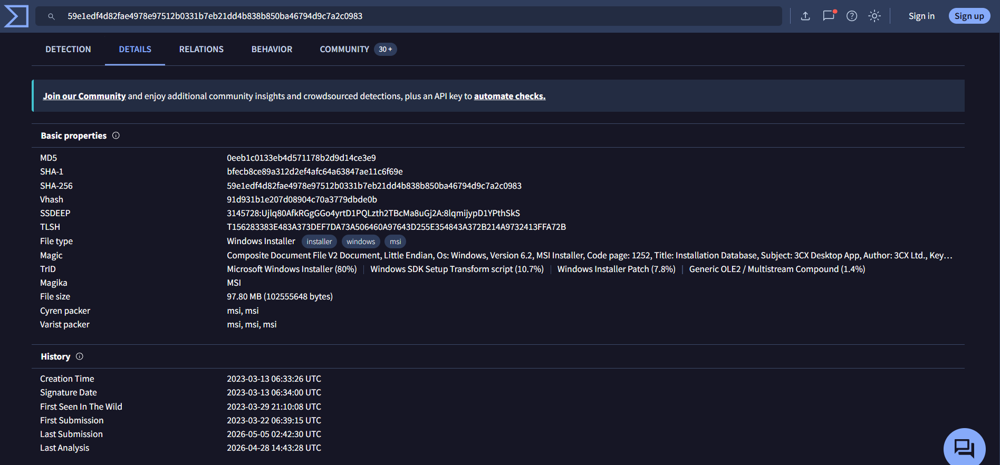

As observed, the creation time is 2023-03-13 06:33:26.

## Q3
Executable files (.exe) are frequently used as primary or secondary malware payloads, while dynamic link libraries (.dll) often load malicious code or enhance malware functionality. Analyzing files deposited by the Microsoft Software Installer (.msi) is crucial for identifying malicious files and investigating their full potential. Which malicious DLLs were dropped by the .msi file?  

We can find the malicios dll files, on the behavior tab, below the opened file section.  

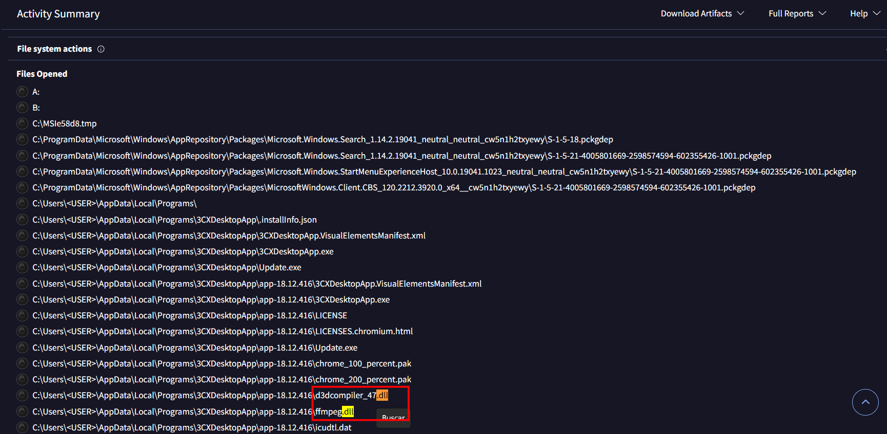  

## Q4
Recognizing the persistence techniques used in this incident is essential for current mitigation strategies and future defense improvements. What is the MITRE Technique ID employed by the .msi files to load the malicious DLL?  

The malware does not delete the legitimate DLL files, as we can see by the list of files it removes.  

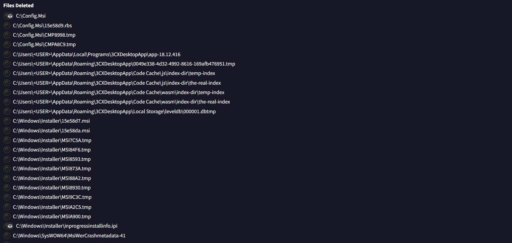

This suggests that the malware either modified the legitimate path or leveraged it directly. By examining the Behavior tab and reviewing the MITRE ATT&CK section, we can determine that the technique used is DLL side-loading, meaning the attacker abused a trusted execution path to load a malicious DLL.

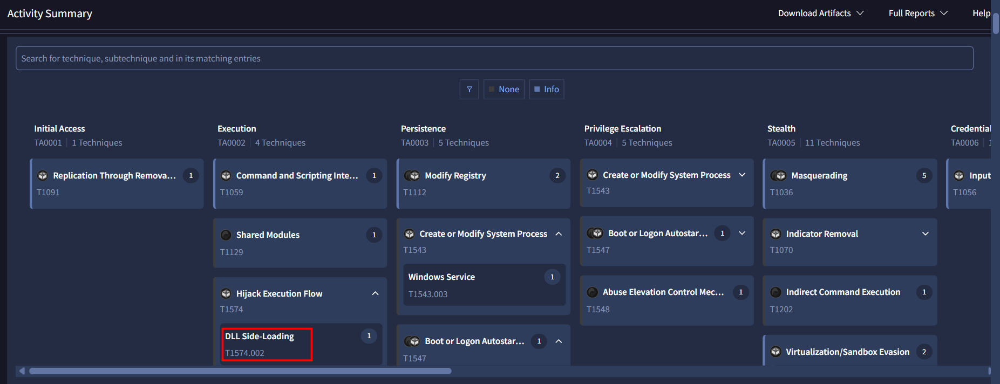  

## Q5
Recognizing the malware type (threat category) is essential to your investigation, as it can offer valuable insight into the possible malicious actions you'll be examining. What is the threat category of the two malicious DLLs?  

VirusTotal shows that both dlls are trojan.

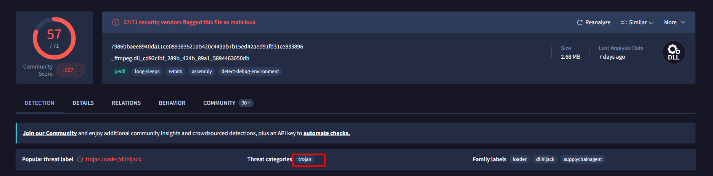  
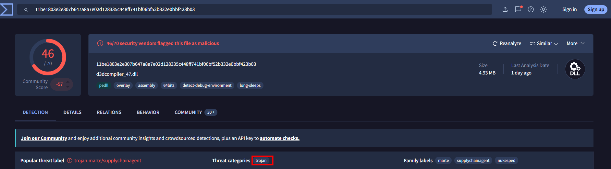  

## Q6  
As a threat intelligence analyst conducting dynamic analysis, it's vital to understand how malware can evade detection in virtualized environments or analysis systems. This knowledge will help you effectively mitigate or address these evasive tactics. What is the MITRE ID for the virtualization/sandbox evasion techniques used by the two malicious DLLs?  

Going back to the MITRE ATT&CK section, we can identify the Virtualization tab under the stealth section.

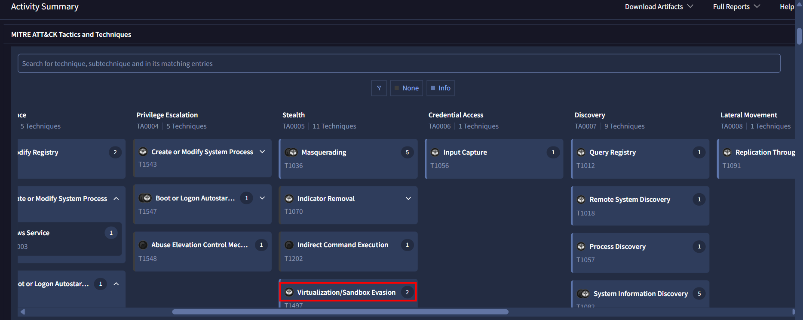   

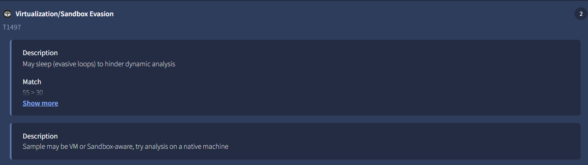   

## Q7
When conducting malware analysis and reverse engineering, understanding anti-analysis techniques is vital to avoid wasting time. Which hypervisor is targeted by the anti-analysis techniques in the ffmpeg.dll file?  

As we did before, in the MITRE ATT&CK section of the dll file we can find the sandbox evasion below either stealth or discovery tab.

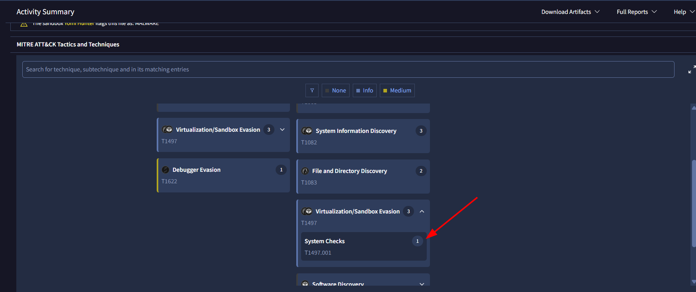   

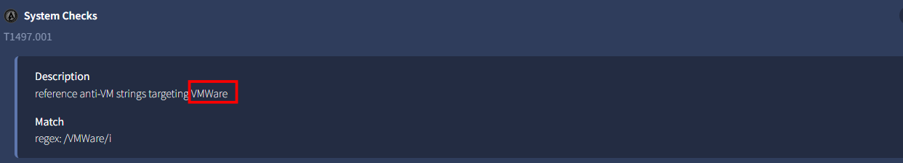

## Q8
Identifying the cryptographic method used in malware is crucial for understanding the techniques employed to bypass defense mechanisms and execute its functions fully. What encryption algorithm is used by the ffmpeg.dll file?  

In the same tab, under the MITRE ATT&CK section, we can find the encryption algorithm.

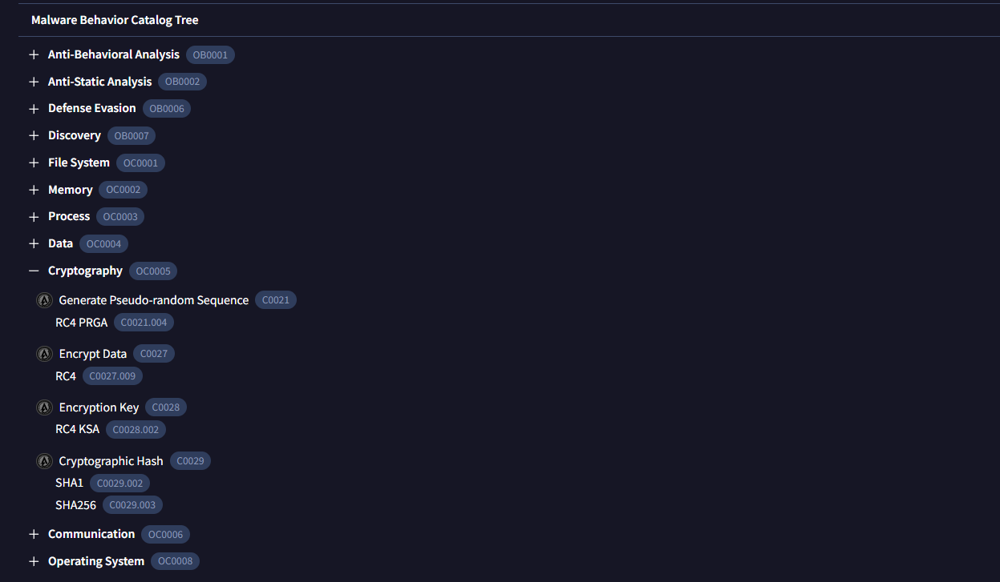   

## 9
As an analyst, you've recognized some TTPs involved in the incident, but identifying the APT group responsible will help you search for their usual TTPs and uncover other potential malicious activities. Which group is responsible for this attack?   

Finaly, we can solve this with a quick search.

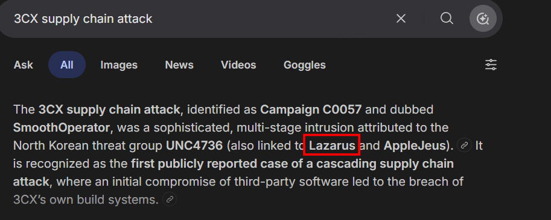 