# BlueSky Ransomware Lab

**Platform:** CyberDefenders    
**Difficulty:** Medium  
**Duration:** ~60 min   
**Category:** Thread Intel  
**Link:** https://cyberdefenders.org/blueteam-ctf-challenges/bluesky-ransomware/
 
## Scenario
A high-profile corporation that manages critical data and services across diverse industries has reported a significant security incident. Recently, their network has been impacted by a suspected ransomware attack. Key files have been encrypted, causing disruptions and raising concerns about potential data compromise. Early signs point to the involvement of a sophisticated threat actor. Your task is to analyze the evidence provided to uncover the attacker’s methods, assess the extent of the breach, and aid in containing the threat to restore the network’s integrity.   

## Q1
Knowing the source IP of the attack allows security teams to respond to potential threats quickly. Can you identify the source IP responsible for potential port scanning activity?  

We can identify port scanning activity using Wireshark IPv4 statistics.

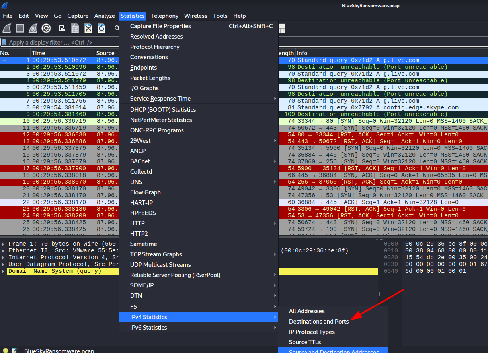   

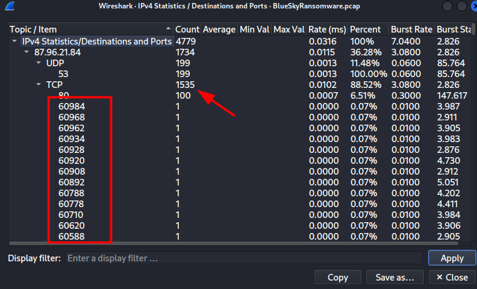   

Therefore, the IP responsible for port scanning activity is "87.96.21.84"

## Q2
During the investigation, it's essential to determine the account targeted by the attacker. Can you identify the targeted account username?

We have to determine the targeted account.To do this we can either follow the attacker stream, which can be a huge task, or we can take a look at the protocols to see if we have something we can use like ssh.

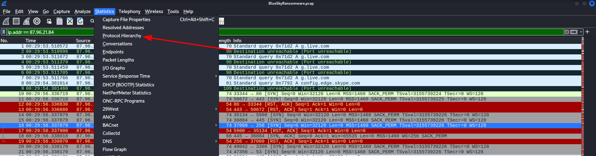   

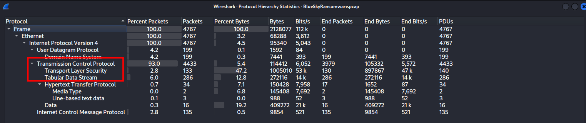   

Analyzing the protocol hierarchy, we find the TDS protocol (Tabular Data Stream), which is used to interact with a DB, and what matters to us right now, it needs an account.

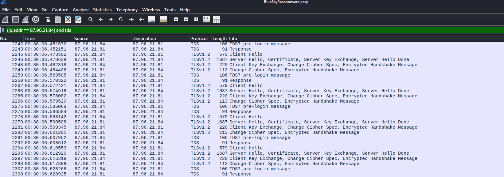   

Using a basic filter (as shown in the picture), we find many attempts to use TDS, which indicates a brute-force attack.

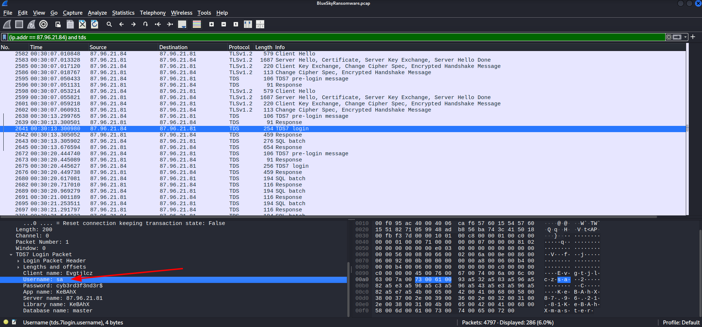 

Analyzing the successful attempt, we can observe the username and password of the logged user.

The username is "sa".

## Q3
We need to determine if the attacker succeeded in gaining access. Can you provide the correct password discovered by the attacker?

The password is "cyb3rd3f3nd3r$"

## Q4
Attackers often change some settings to facilitate lateral movement within a network. What setting did the attacker enable to control the target host further and execute further commands?

Further analysis on the following sql packets shows a reconfiguration made by the attacker.

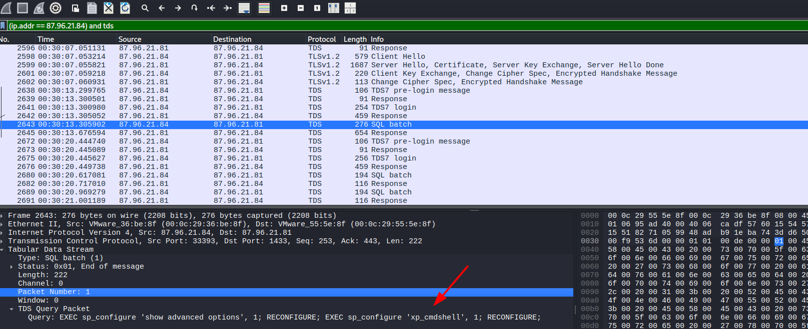

The attacker changed the setting "xp_cmdshell", which means that the attacker now has acces to a CMD shell.

## Q5
Process injection is often used by attackers to escalate privileges within a system. What process did the attacker inject the C2 into to gain administrative privileges?

To determine which process was affected, we can use the Windows Event Viewer on the provided logs.   

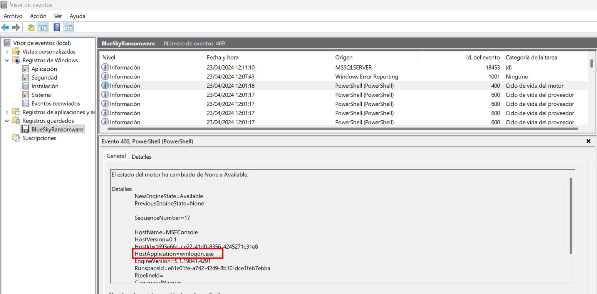

The affected process is "winlogon.exe".

## Q6
Following privilege escalation, the attacker attempted to download a file. Can you identify the URL of this file downloaded?

Using a simple 'HTTP' filter, we can observe many HTTP requests, the first of which downloads a powershell script ".ps1".

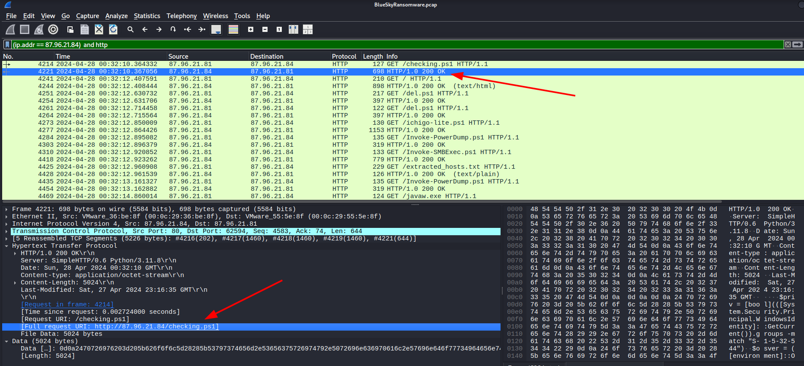

The URL asked is "http://87.96.21.84/checking.ps1"

## Q7
Understanding which group Security Identifier (SID) the malicious script checks to verify the current user's privileges can provide insights into the attacker's intentions. Can you provide the specific Group SID that is being checked?

Following the HTTP stream from the downloaded file, we find the following CMD command.

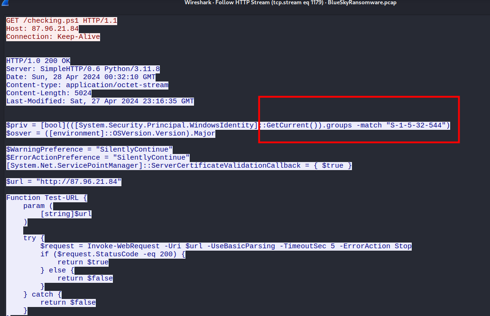

Clearly, the group checked is "S-1-5-32-544".

## Q8
Windows Defender plays a critical role in defending against cyber threats. If an attacker disables it, the system becomes more vulnerable to further attacks. What are the registry keys used by the attacker to disable Windows Defender functionalities? Provide them in the same order found.

Reading further into the same powershell script, we find the registry keys used.

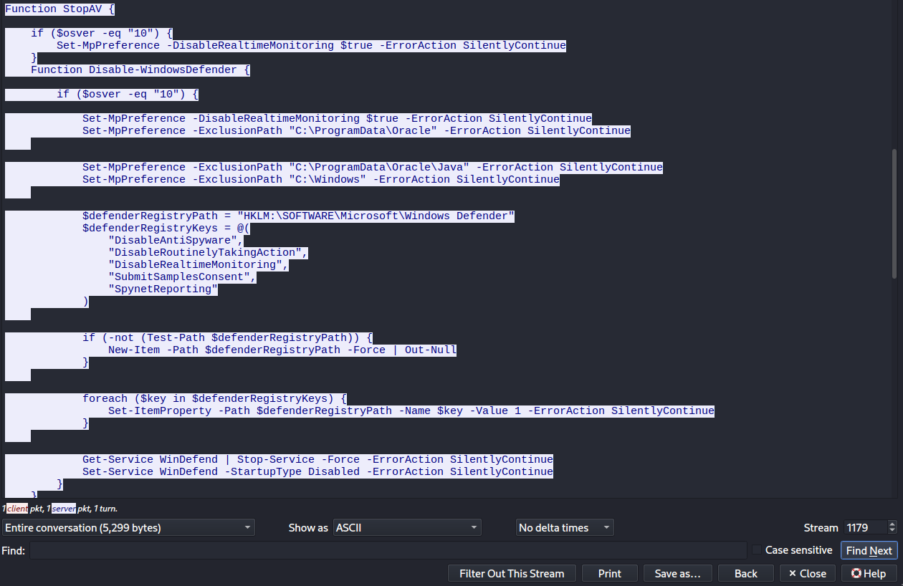

The registry keys in order are: "DisableAntiSpyware,DisableRoutinelyTakingAction,DisableRealtimeMonitoring,SubmitSamplesConsent,SpynetReporting"

## Q9
Can you determine the URL of the second file downloaded by the attacker?

We can obtain the second URL like we did in Q6.

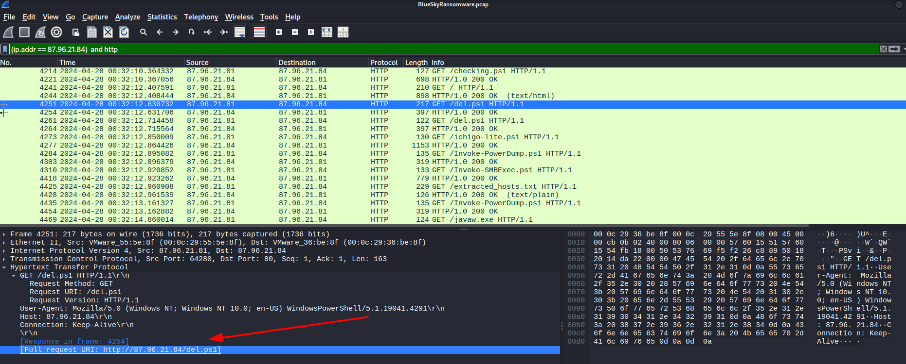

## Q10
Identifying malicious tasks and understanding how they were used for persistence helps in fortifying defenses against future attacks. What's the full name of the task created by the attacker to maintain persistence?

To search for Windows scheduled tasks, we can use the filter 'http contains "schtasks"' on Wireshark.

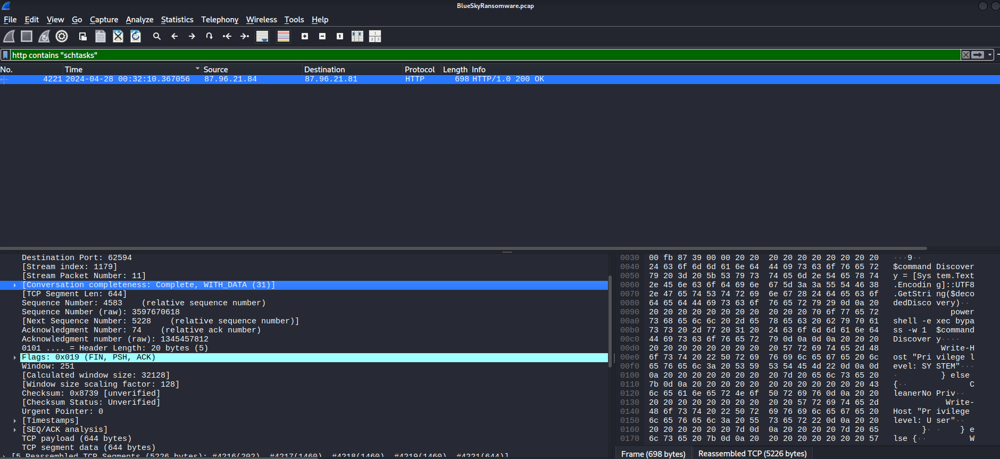

After investigating the code in more detail, We found the function ClearEtc, which downloads the .ps1 file.  

In the third line of the script, it creates a fake task named "\Microsoft\Windows\MUI\LPupdate". Additionally, it executes the same ps1 file every 4 hours.  

Finally, with the function "Invoke-Expression()" the attacker executes the entire ichigo-lite.ps1 code (obtained with DownloadString). This is likely to be a C2 script made by the attacker to obtain information or for further attacks.

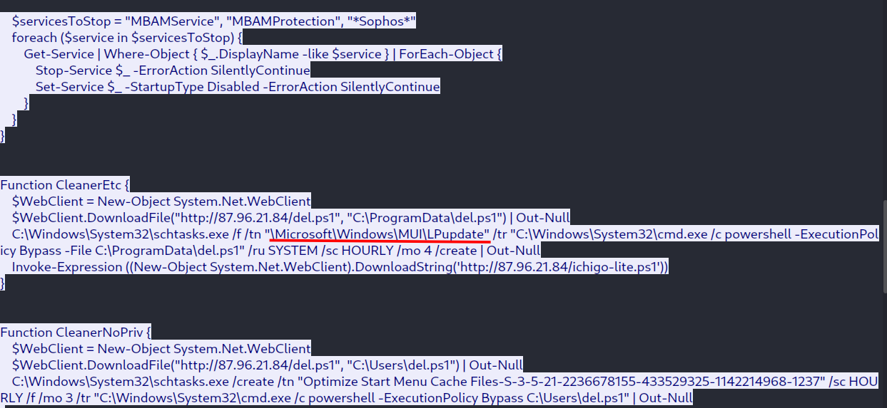

## Q11
Based on your analysis of the second malicious file, What is the MITRE ID of the main tactic the second file tries to accomplish?

Based on our analysis, the script covers both Persistence (by setting up the 4-hour scheduled task) and Execution (by repeatedly invoking PowerShell). However, most of its logic is heavily focused on Defense Evasion (TA0005), as it constantly uses techniques like execution policy bypasses, in-memory execution, and task masquerading to avoid detection.

## Q12
What's the invoked PowerShell script used by the attacker for dumping credentials?

Further inspection on the ichigo-lite.ps1 script, which we suspect it may be the one leaking information, we find it uses another script named "Invoke-PowerDump.ps1"

Opening PowerDump.ps1 script, we confirm our suspicious as this is indeed the script we were searching for.

## Q13
Understanding which credentials have been compromised is essential for assessing the extent of the data breach. What's the name of the saved text file containing the dumped credentials?

Looking into the PowerDump.ps1 We find that it stores the information in memory, meaning that the file we are searching for isn't here.

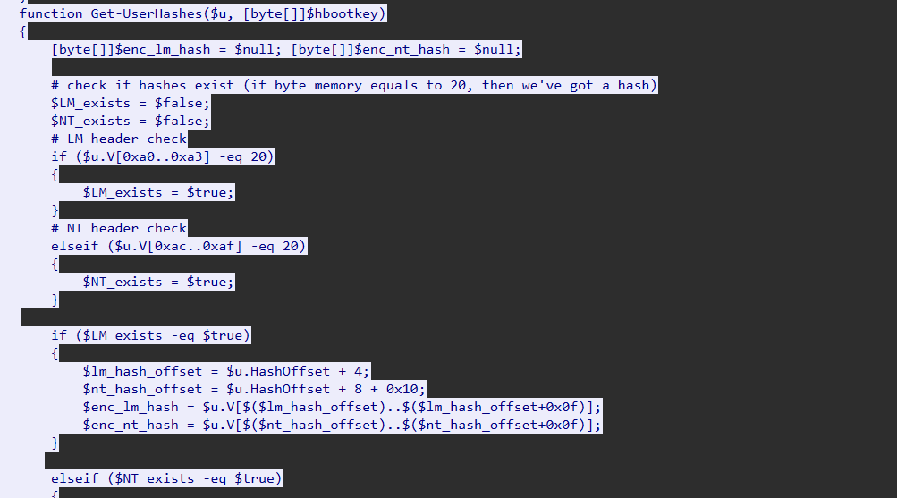

Going back to the ichigo.ps1 script, we find a file named hashed.txt that stores the information.

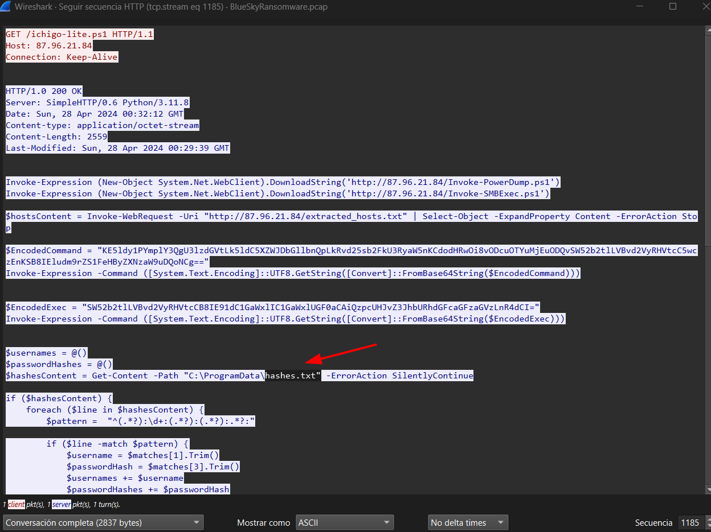

## Q14
Knowing the hosts targeted during the attacker's reconnaissance phase, the security team can prioritize their remediation efforts on these specific hosts. What's the name of the text file containing the discovered hosts?

Finding the text file is easy as the attacker doesn't hide it.

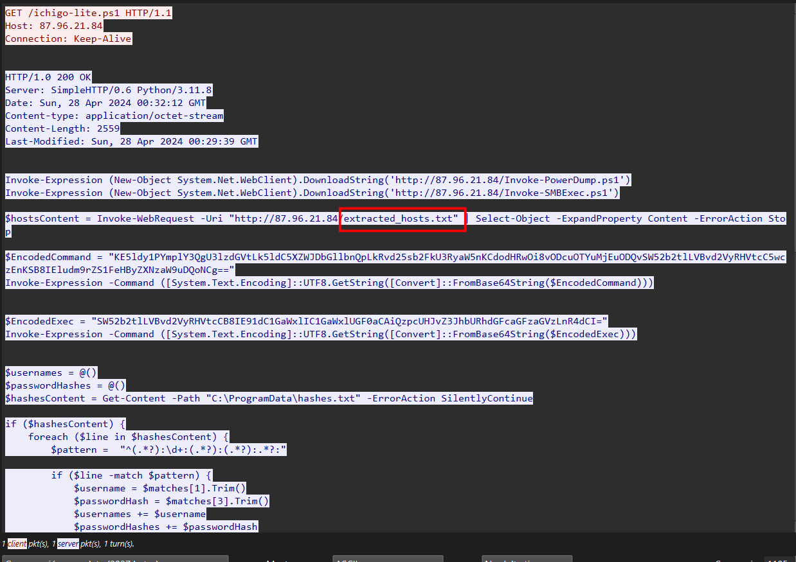

## Q15
After hash dumping, the attacker attempted to deploy ransomware on the compromised host, spreading it to the rest of the network through previous lateral movement activities using SMB. You’re provided with the ransomware sample for further analysis. By performing behavioral analysis, what’s the name of the ransom note file?

To analyze this we can use VirusTotal after obtaining the hash of the executable.

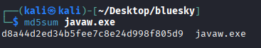

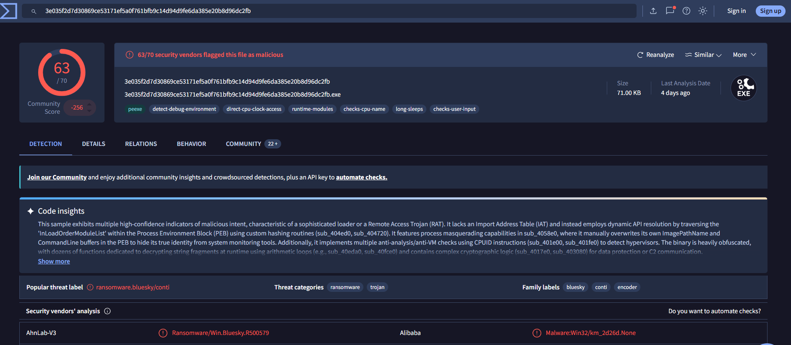

Going to the behavior tab, we can observe many notes across the files opened by the malware.

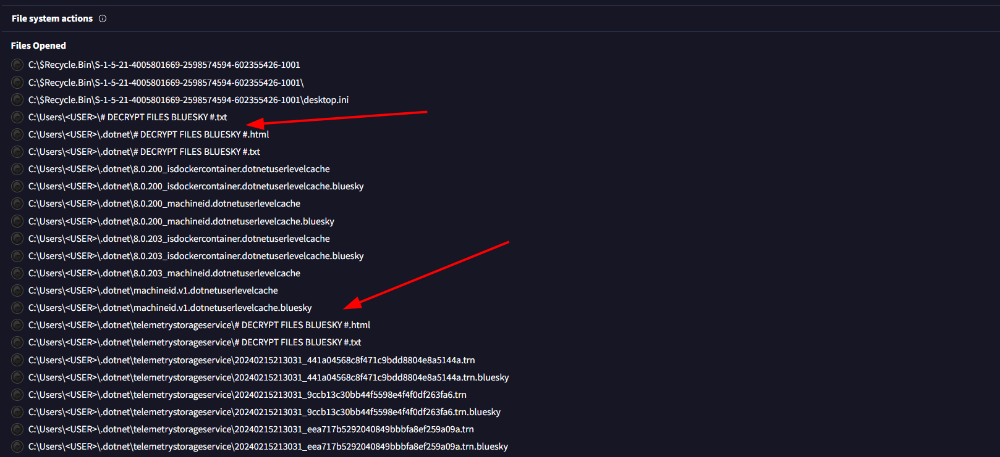

## Q16
In some cases, decryption tools are available for specific ransomware families. Identifying the family name can lead to a potential decryption solution. What's the name of this ransomware family?

The name of the ransomware family is "bluesky"

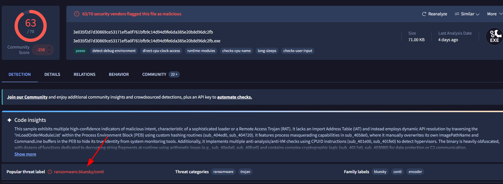

