# DanaBot Lab

**Platform:** CyberDefenders    
**Difficulty:** Easy  
**Duration:** ~45 min  
**Category:** Endpoint Forensics  
**Link:** https://cyberdefenders.org/blueteam-ctf-challenges/brave/
 
## Scenario
A memory image was acquired from a suspected compromised Windows workstation. The system belonged to a user flagged for potentially malicious activities, including unauthorized access attempts and unusual browsing patterns. The security team observed network activity to external IPs associated with encrypted communication services.

Your task is to analyze the provided memory dump to uncover details about the processes involved, identify active connections at the time of the compromise, and trace the usage patterns of specific applications.

## Tools

- Volatility 3  
- Hexedit

## Q1
What time was the RAM image acquired according to the suspect system?

To find information about the OS, we can use the command windows.info.

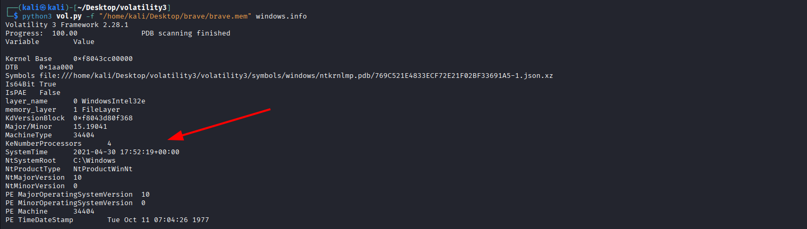 

## Q2
What is the SHA256 hash value of the RAM image?

We can use the command sha256sum to obtain it.

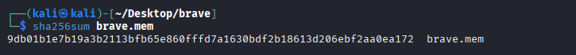 

## Q3
What is the process ID of brave.exe?

Using the command windows.pstree, we can obtain the list of processes and their PIDs.

Using grep, we can quickly find the "brave.exe" process, whose ID is "4856".

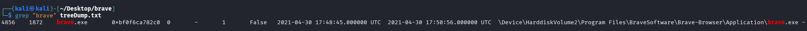

## Q4
How many established network connections were there at the time of acquisition?

Similarly, we can use the command windows.netscan to obtain the network connections.

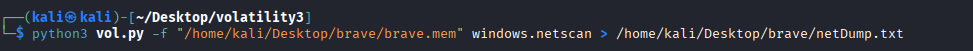
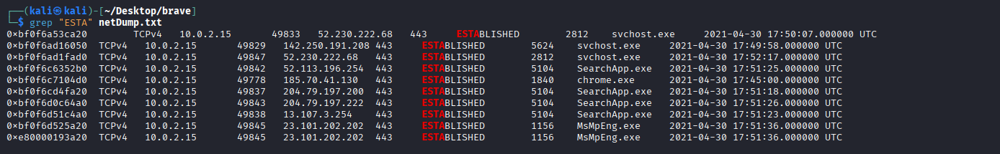

There are 10 established connections in total.

## Q5
Which domain name does Chrome have an established network connection with?

Using a DNS lookup tool, like VirusTotal, we find that the IP "185.70.41.130" corresponds to protonmail.ch.

## Q6
What is the MD5 hash value of the process executable for PID 6988?

Using the command: "windows.pslist --pid 6988 --dump" we can extract the file.

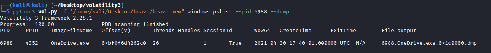

Once we have it, we can use the command md5sum to obtain the hash.

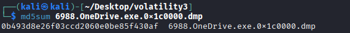

The md5 hash is "0b493d8e26f03ccd2060e0be85f430af".

## Q7
Can you identify the word that begins at offset 0x45BE876 and is 6 bytes long?  

Using the command-line tool hexedit, we can locate the word at that offset instantly.

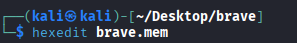

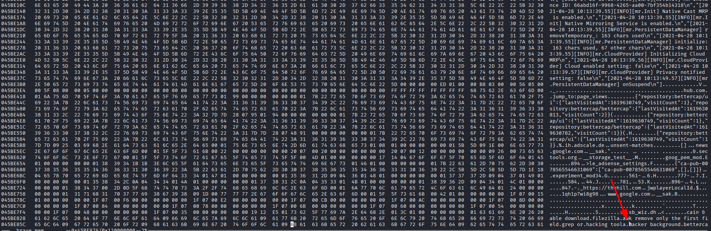

The word we were searching for is "hacker".

## Q8
What is the creation date and time of the parent process of powershell.exe?

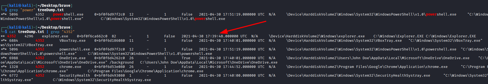

The creation date and time is "2021-04-30 17:39"

## Q9
What is the full path and name of the last file opened in notepad?

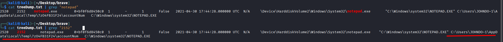

The path is "C:\Users\JOHNDO~1\AppData\Local\Temp\7zO4FB31F24\accountNum"

## Q10
How long did the suspect use Brave browser? (In Hours)

We can use the command windows.registry.userassist to analyze UserAssist registry keys, which track how long applications have been used.

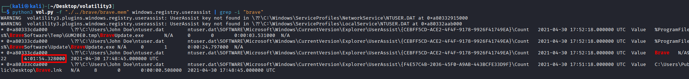

