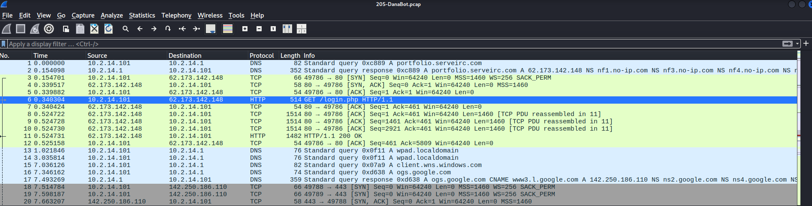
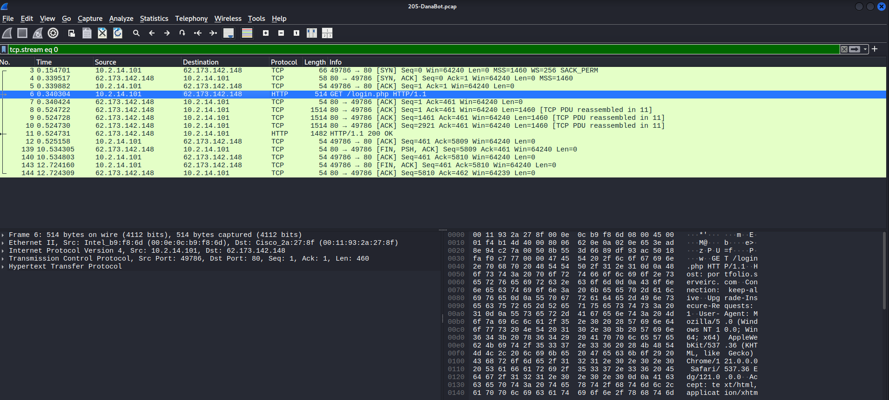
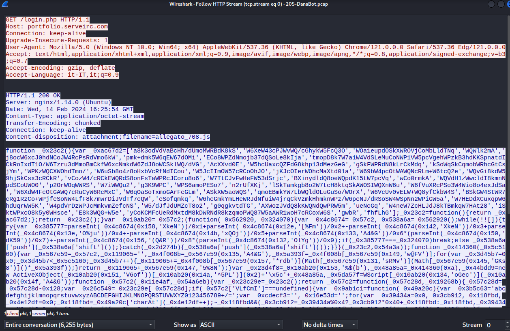
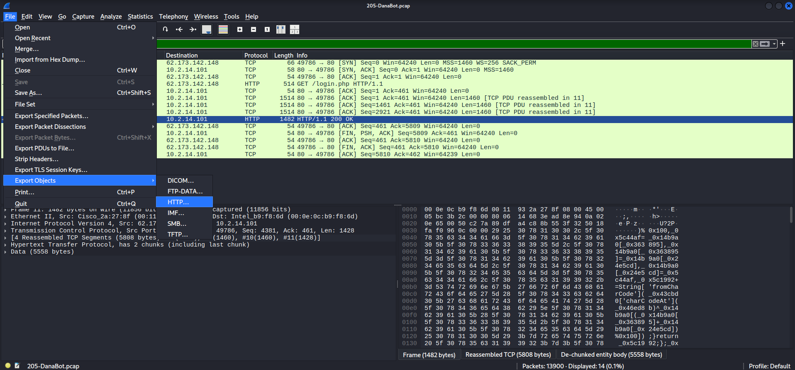
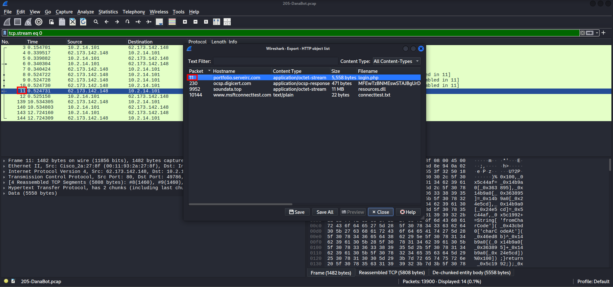
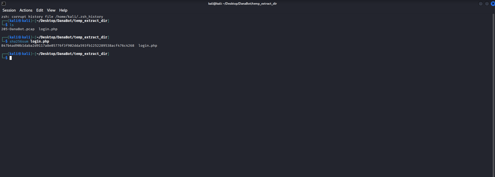
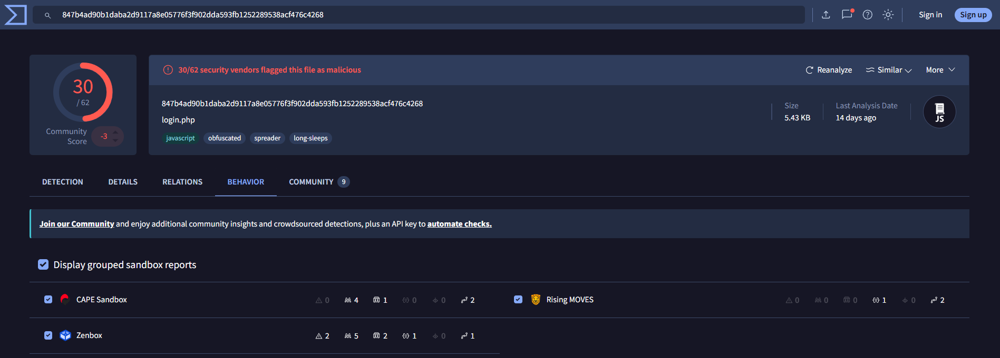
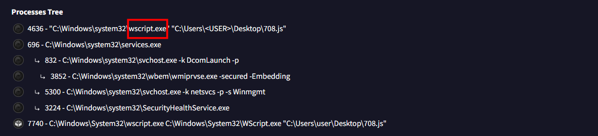
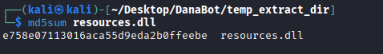

# DanaBot Lab

**Platform:** CyberDefenders    
**Difficulty:** Easy  
**Duration:** ~30 min   
**Category:** Network Forensics  
**Link:** https://cyberdefenders.org/blueteam-ctf-challenges/danabot/
 
## Scenario
The SOC team has detected suspicious activity in the network traffic, revealing that a machine has been compromised. Sensitive company information has been stolen. Your task is to use Network Capture (PCAP) files and Threat Intelligence to investigate the incident and determine how the breach occurred.  

## Q1
Which IP address was used by the attacker during the initial access?  

The first thing I noticed upon opening the pcap file was a GET request.  
   

At first, I suspected that the attacker was using the IP address 10.2.14.101, so I decided to investigate the request further.

  

After following the http stream, I determined that the initial request itself was legitimate. However, the server response was not.  

As shown in the content disposition header, the server delivers a malicious js file as a downloadable attachment. Meaning that the attacker comes from the server, specifically from the IP:62.173.142.148.

  

## Q2
What is the name of the malicious file used for initial access?  

As we can see in the http stream, the name of the file is allegato_708.js.  

## Q3
What is the SHA-256 hash of the malicious file used for initial access?  

To obtain the file hash, we first need to extract the file. This can be done as follows:

   

   

Now that we have the file, we just need to use the sha256 command.  
   

## Q4
Which process was used to execute the malicious file?  

Using the file hash, we can search for the sample on VirusTotal.  

In the Behavior section, we can navigate to the Processes tab, where the Process Tree is displayed. There, we can observe that the initial process is wscript.exe, a legitimate Windows process used to execute JavaScript files through the Windows Script Host.  

  

## Q5
What is the file extension of the second malicious file utilized by the attacker?  

Searching for files over http as we did before. I identified a suspicious file named resources.dll.

Upon further investigation, I discovered that the file was requested by the initial victim, strongly suggesting that it is part of the malware activity.

## Q6
What is the MD5 hash of the second malicious file?  

Following the same steps as in Q3, I found out that the file hash is: e758e07113016aca55d9eda2b0ffeebe

