# EscapeRoom Lab

**Platform:** CyberDefenders    
**Difficulty:** Medium
**Duration:** ~60 min   
**Category:** Network Forensics   
**Link:** https://cyberdefenders.org/blueteam-ctf-challenges/escaperoom/  
 
## Scenario
You as a soc analyst belong to a company specializing in hosting web applications through KVM-based Virtual Machines. Over the weekend, one VM went down, and the site administrators fear this might be the result of malicious activity. They extracted a few logs from the environment in hopes that you might be able to determine what happened.  

This challenge is a combination of several entry to intermediate-level tasks of increasing difficulty focusing on authentication, information hiding, and cryptography. Participants will benefit from entry-level knowledge in these fields, as well as knowledge of general Linux operations, kernel modules, a scripting language, and reverse engineering. Not everything may be as it seems. Innocuous files may turn out to be malicious so take precautions when dealing with any files from this challenge.

## Q1
What service did the attacker use to gain access to the system?

To identify the service used by the attacker, we can use the protocol hierarchy in the statistics menu.

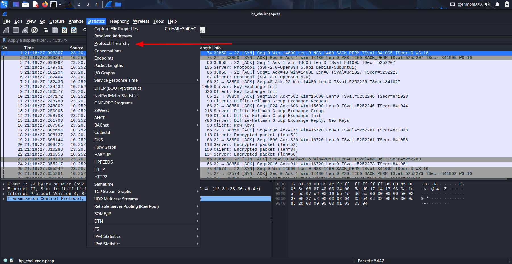

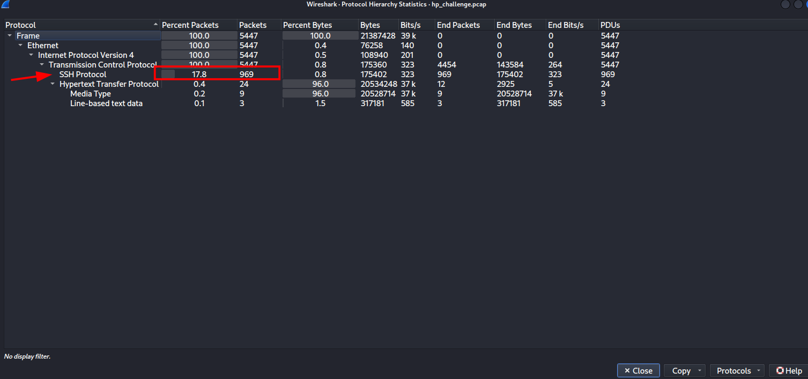

From the capture, we can clearly see that there's only one transmission protocol. Therefore the service we were searching for is "ssh". In case we had more than one protocol, we should investigate further.

## Q2
What attack type was used to gain access to the system?(one word)

Following the first tcp connection, we can observe an ssh exchange.

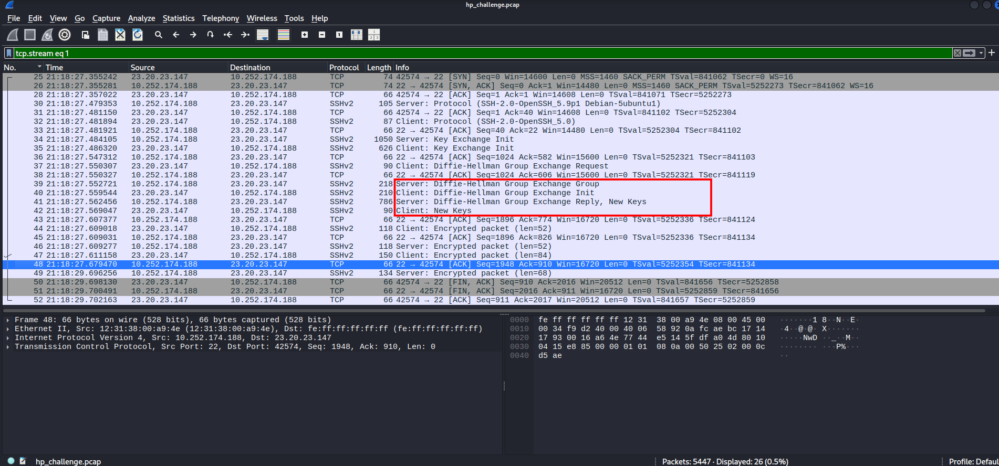

It may come to our attention that when the protocol is negotiating the secure keys it uses the algorithm [Diffie-Hellman](https://en.wikipedia.org/wiki/Diffie%E2%80%93Hellman_key_exchange), which wikipedia has a really good explanation for. However, as a summary we can use this image (also from wikipedia).

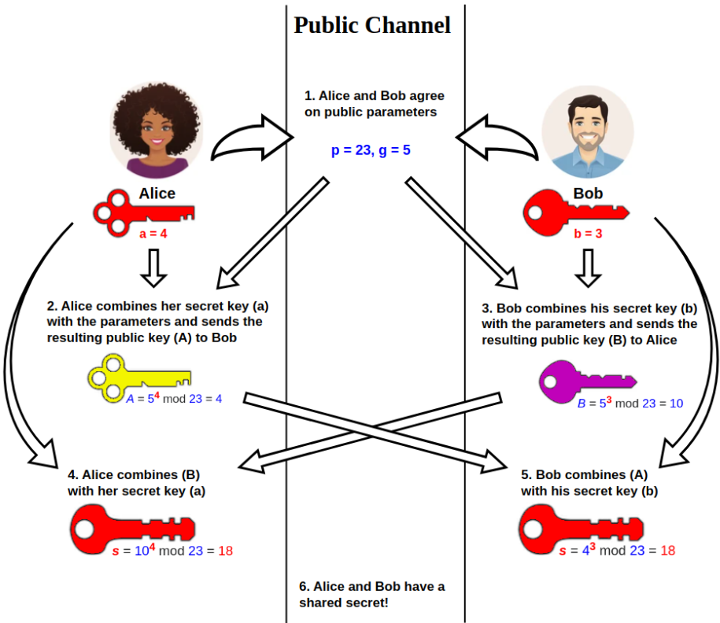

For now, it doesn't seem like a problem with the algorithm so we can keep searching.

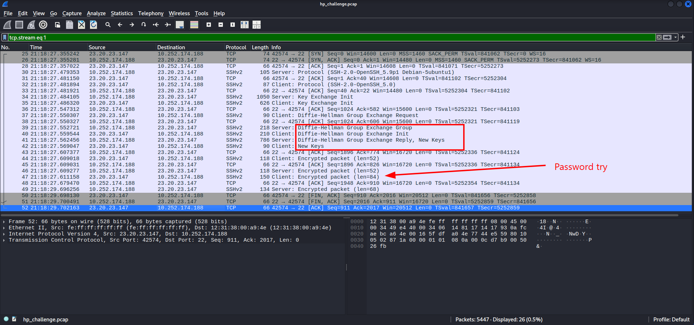

After watching more tcp streams, it comes to my attention that they all act in the same way, over and over, indicating that this is the work of a bot.

Every ssh connection stops when the client exchanges a message with the server after agreeing on the keys. This is likely an authentication attempt that failed. Therefore we are facing a **brute-force** attack.

## Q3
What was the tool the attacker possibly used to perform this attack?

The most popular tool used to perform this type of attack is **Hydra** or Medusa.

## Q4
How many failed attempts were there?

For this question, we will be using [ZUI](https://www.brimdata.io/download/) (also known as BrimSecurity). A great tool for analysing large .pcap files or details like this.

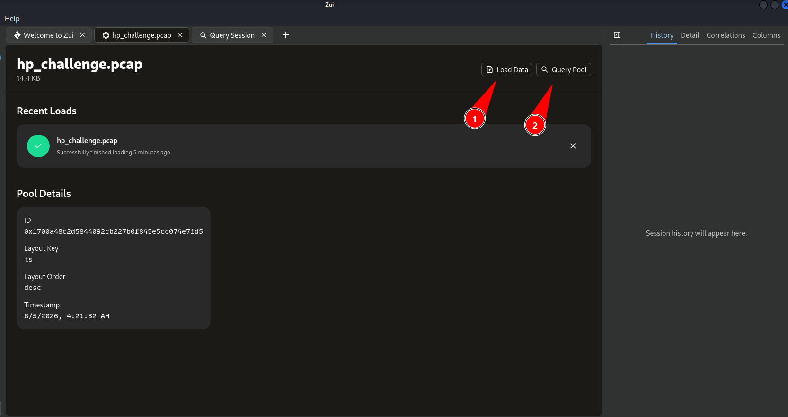

To use the tool, we have to upload the capture and select the query pool button.

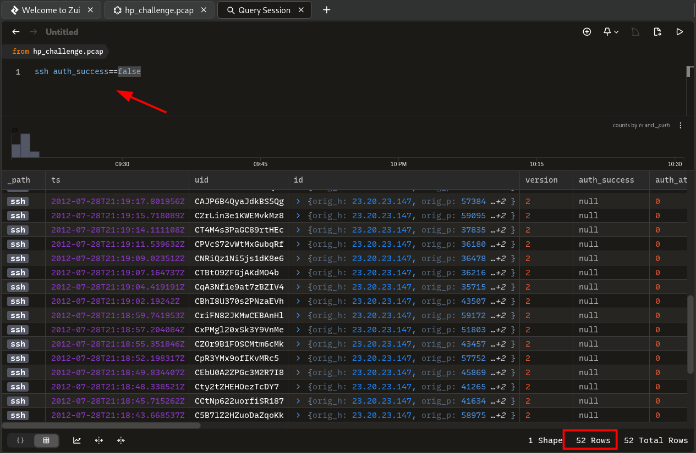

This time, the filter will be ssh and auth_success==false, to search for every brute-force attempt.

## Q5
What credentials (username:password) were used to gain access? Refer to shadow.log and sudoers.log.

Looking at shadow.log, we find several users that may have been breached. We should start with the most privileged ones (such as the manager) and work our way down to the least privileged.

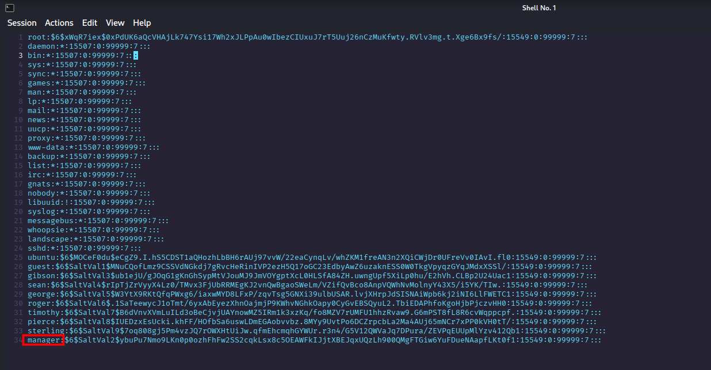

To obtain the password we can use the popular tool JohnTheRipper. To do so, first we need to extract the hash of the user "manager".

The file contains this text:
```
manager:$6$SaltVal2$ybuPu7Nmo9LKn0p0ozhFhFw2SS2cqkLsx8c5OEAWFkIJjtXBEJqxUQzLh900QMgFTGiw6YuFDueNAapfLKt0f1:15549:0:99999:7:::  
```

However, we just need the hash, which can be found between the first and second ":".

User + hash:
```
manager:$6$SaltVal2$ybuPu7Nmo9LKn0p0ozhFhFw2SS2cqkLsx8c5OEAWFkIJjtXBEJqxUQzLh900QMgFTGiw6YuFDueNAapfLKt0f1
```

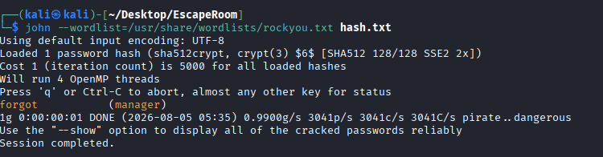

Using john, we obtain the credentials "manager:forgot".

## Q6
What other credentials (username:password) could have been used to gain access also have SUDO privils? Refer to shadow.log and sudoers.log.

As we are asked for more passwords, we will create a hash.txt with every possible user and use it like we did before.

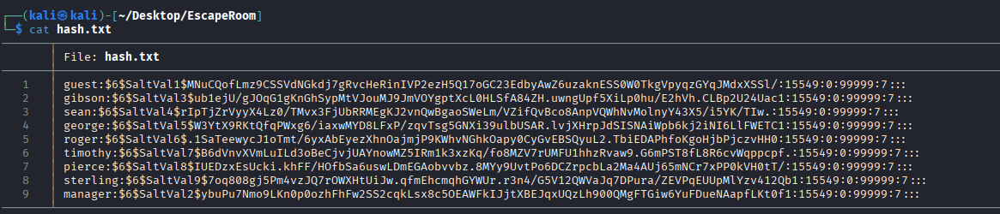

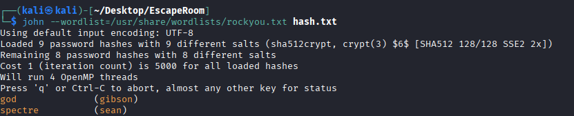

With this, we know 2 new passwords from 2 different users, sean and gibson.

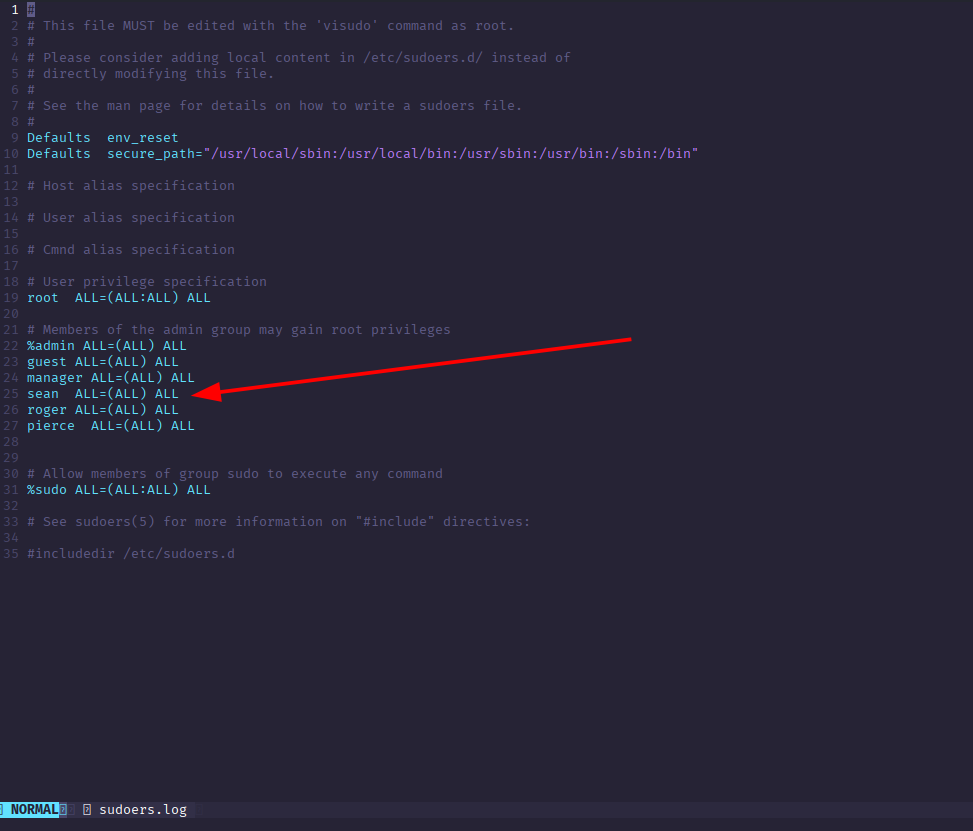

Unlike gibson, sean appears in the sudoers.log with all privileges. So this is the breached account we were searching for.

## Q7
What is the tool used to download malicious files on the system?

When searching for downloads, we always start by looking at http traffic. In this case, we find many downloads of images that may contain malware.


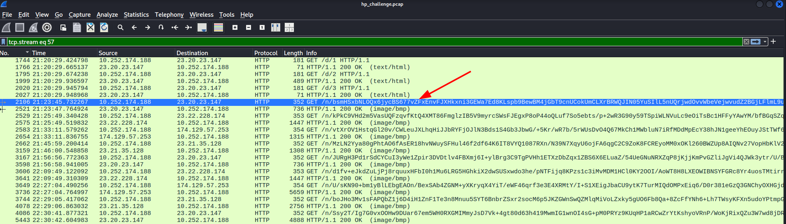

Investigating the first frame, we find out that the User-Agent is Wget, a common tool used to download files over http/https.

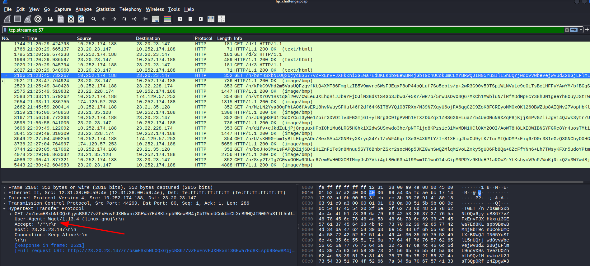

## Q8
How many files the attacker download to perform malware installation?

To track how many files were downloaded, we can use Wireshark export object function to list them.

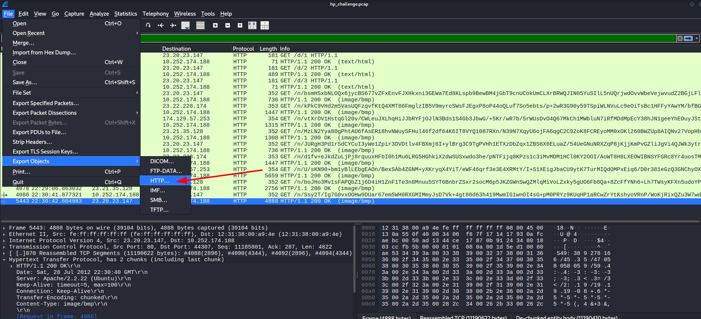

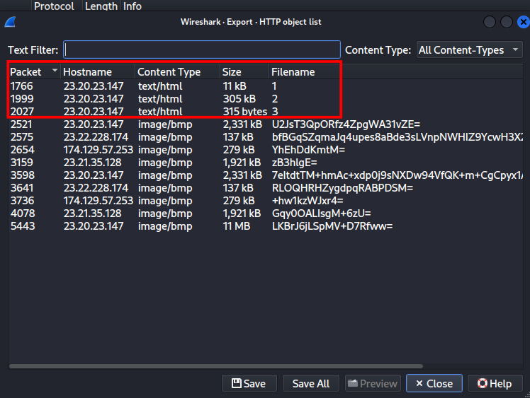

With this, we find many image downloads, and 3 files named "1", "2","3".

As this is suspicious enough, we will use a specialized tool to investigate this further, we'll use **Zui** again.


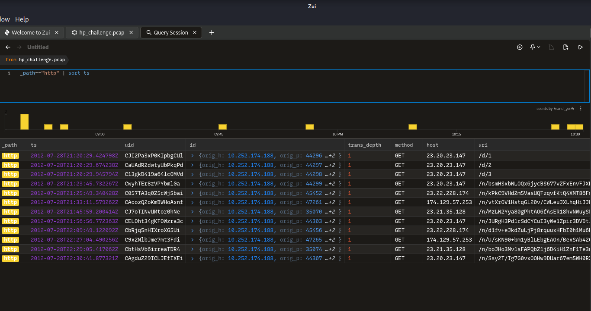

After locating the 3 suspicious files again, we will now investigate the files.  

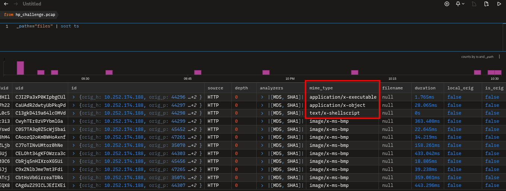

As we can see, they are not html as their extension suggested, but executables and shellscripts.

## Q9
What is the main malware MD5 hash?

We can obtain the MD5 hash in the same query we had before.

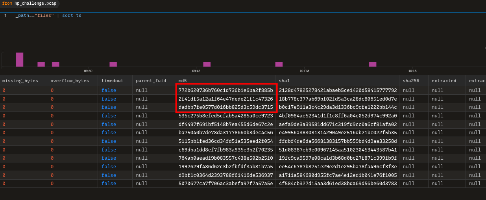

The first file "1", as the executable was the main malware with the hash: "772b620736b760c1d736b1e6ba2f885b".

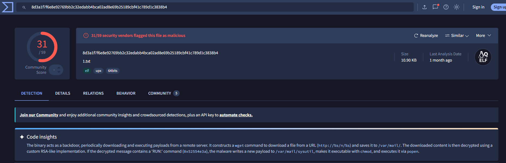

## Q10
What file has the script modified so the malware will start upon reboot?  


For this task, we need to download the third file, as we know it contains the bash script.  

We can download it with Wireshark and it's not difficult to answer this question having the bash code.

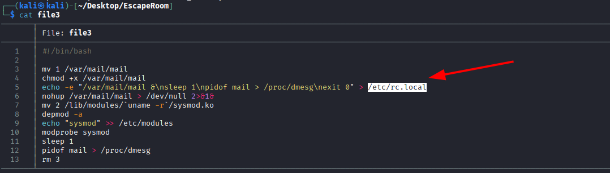

The script clearly modifies the /etc/rc.local file.

## Q11
Where did the malware keep local files?

The malware keeps the local files in /var/mail/

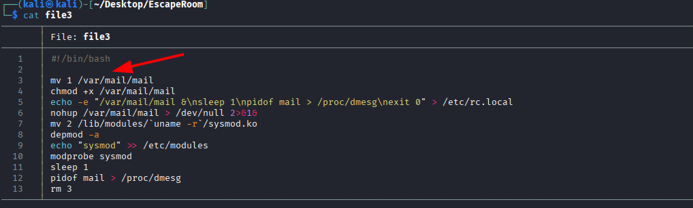

## Q12
What is missing from ps.log?

In line 12, we can see how the attacker sends the PID of the mail, which executes the malware, to /proc/dmesg.

Between lines 7 and 10, the script installs a new kernel module named sysmod.ko. This module hooks into /proc/dmesg so the malware can hide its process from monitoring tools like ps.

Because of this, we know that any information of **mail** will be missing from ps.log.


## Q13
What is the main file that used to remove this information from ps.log?

As stated before, the file "sysmod.ko" is essential to hide the process.

## Q14
Inside the Main function, what is the function that causes requests to those servers?

