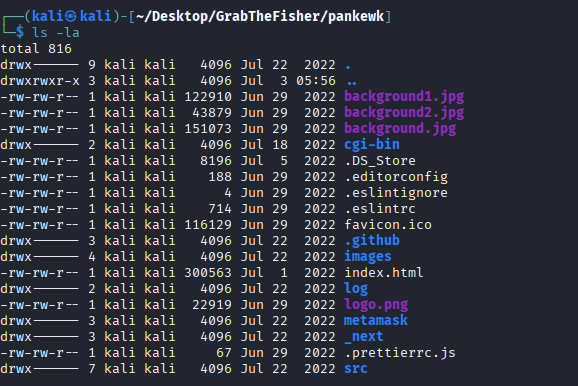
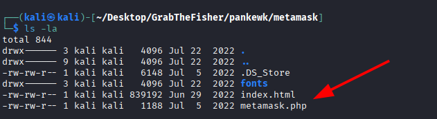
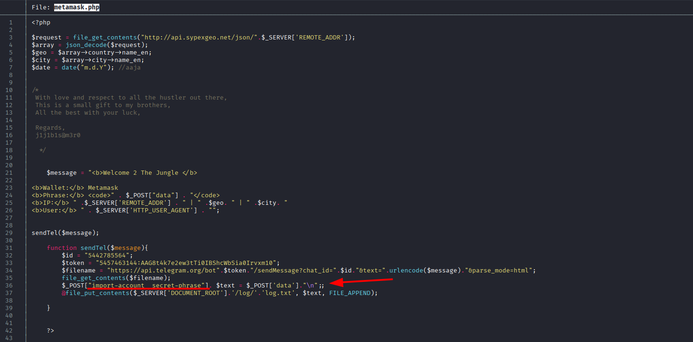
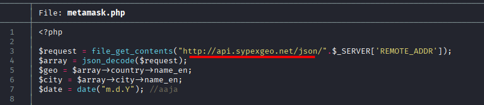
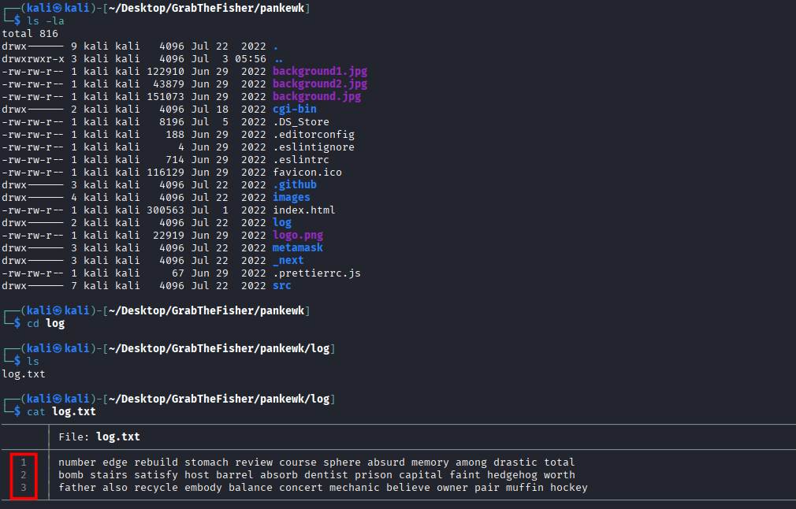
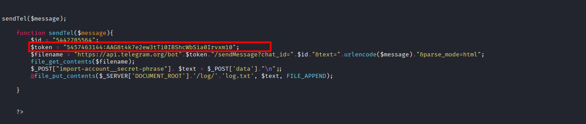
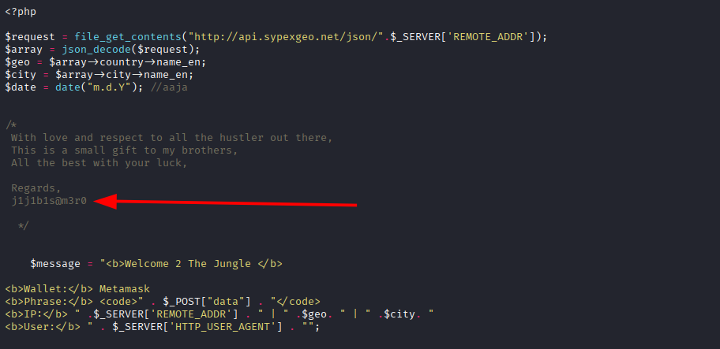

# DanaBot Lab

**Platform:** CyberDefenders    
**Difficulty:** Easy  
**Duration:** ~45 min   
**Category:** Thread intel
**Link:** https://cyberdefenders.org/blueteam-ctf-challenges/grabthephisher/
 
## Scenario
A decentralized finance (DeFi) platform recently reported multiple user complaints about unauthorized fund withdrawals. A forensic review uncovered a phishing site impersonating the legitimate PancakeSwap exchange, luring victims into entering their wallet seed phrases. The phishing kit was hosted on a compromised server and exfiltrated credentials via a Telegram bot.  

Your task is to conduct threat intelligence analysis on the phishing infrastructure, identify indicators of compromise (IoCs), and track the attacker’s online presence, including aliases and Telegram identifiers, to understand their tactics, techniques, and procedures (TTPs).  

## Q1
Which wallet is used for asking the seed phrase?  

   

Upon listing the files on the given folder we can see Metamask, a popular crypto wallet.

## Q2
What is the file name that has the code for the phishing kit?  

Inside the Metamask folder we can find a php program called Metamask.php

  

Investigating further, we can read the code of the program using cat or your prefered text editor.

  

Analyzing the code we can easily spot some suspicious activity:  
- In line 34, the program comunicates with a telegram bot
- In line 36, it stoles the secret phrase so it can send it later
- In line 37, it stores the phrase in the server logs,most likely in case telegram fails.

Just with this, we know it is sending the secret phrase to a telegram bot after the user inserts the password.  

We could analyze it further, but it is unnecessary for now, as it is clearly malicious code.  

## Q3
In which language was the kit written?

As seen before, it was written in php.

## Q4
What service does the kit use to retrieve the victim's machine information?  

At the beginning of the script, we can see it is retrieving the information from sypexgeo, an IP geolocation service.

 

## Q5
How many seed phrases were already collected?  

As we have learned from analyzing the code, the seed phrases are stored in logs, now we just have to find them.  

Looking through the main folder, we can quickly find the logs folder, which contains the log.txt we were searching for.  

Opening the file reveals 3 lines with random words, these are the seed phrases stolen by the threat actor.

## Q6
Could you please provide the seed phrase associated with the most recent phishing incident?  

We just have to copy the last entry of the log.txt file:
- father also recycle embody balance concert mechanic believe owner pair muffin hockey

## Q7
Which medium was used for credential dumping?

As stated before, the attacker used telegram.

## Q8
What is the token for accessing the channel?

When creating a telegram bot, a token is generated both to control the bot and to monitor its activity in real time via a private channel.

The token is explicitly stated in the code, as a token variable.

## Q9
What is the Chat ID for the phisher's channel?

Likewise, the id is above the token.

## Q10
What are the allies of the phish kit developer?

We can find the phishing kit developer mentioned in a comment.

