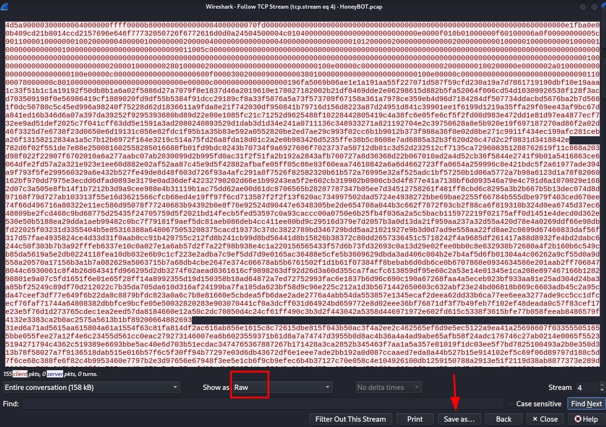
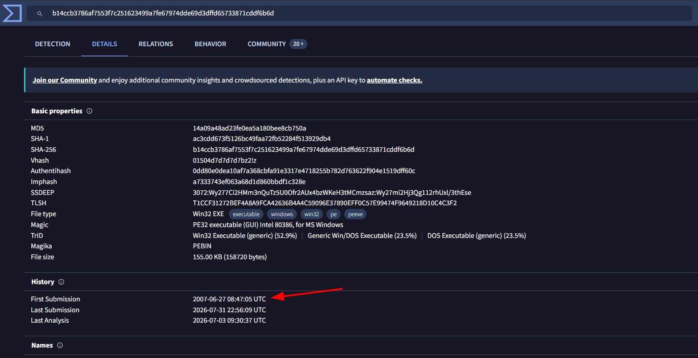
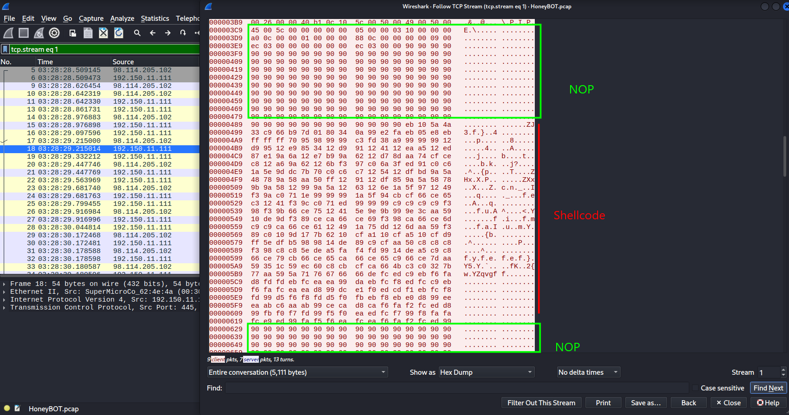
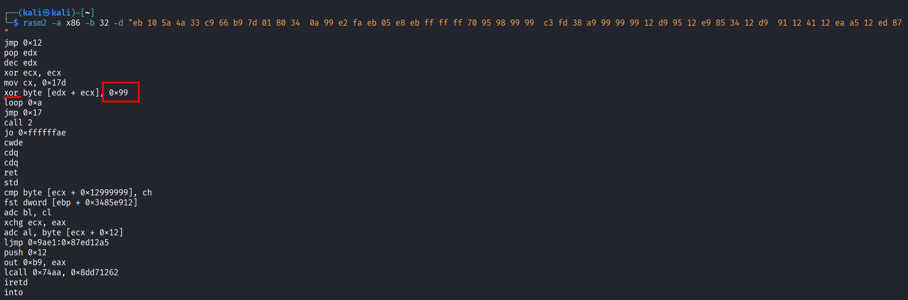
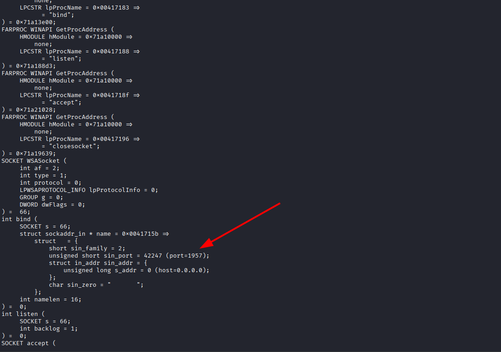

# HoneyBot Lab

**Platform:** CyberDefenders    
**Difficulty:** Medium
**Duration:** ~60 min   
**Category:** Network Forensics  
**Link:** https://cyberdefenders.org/blueteam-ctf-challenges/honeybot/
 
## Scenario
A PCAP analysis exercise highlighting attacker's interactions with honeypots and how automatic exploitation works.. (Note that the IP address of the victim has been changed to hide the true location.)

As a soc analyst, analyze the artifacts and answer the questions.

## Q1
What is the attacker's IP address?

Before we start investigating the frames directly, I like to check the statistics, as sometimes we can deduce who the attacker is just by looking at the frame rate or the ports it uses.


This time, from the summary alone we cannot be completely sure about who the attacker is, although we know that there are only 2 IP addresses.

Investigating the file,we quickly notice some malicious behavior from the IP "98.114.205.102".  

This IP address starts an SMB communication, and it authenticates with an anonymous session using "/".  

If this was not enough, it also creates two paths, /ipc and /lsarpc. At the end, a duplicate ACK warning is sent probably because the channel is congested.


## Q2
What is the target's IP address?

Since there are only two IP addresses, the other one is clearly the target "192.150.11.111".

## Q3
Provide the country code for the attacker's IP address (a.k.a geo-location).

We can easily find this using an online IP geolocation tool such as "whatismyipaddress.com".


The country is the United States ("us" code).


## Q4
How many TCP sessions are present in the captured traffic?

We can find the number of TCP sessions in the Conversations summary.


As seen in the capture above, we have 5 distinct TCP sessions.

## Q5
How long did it take to perform the attack (in seconds)?

To obtain the total duration of the capture, we can use the capture file properties.


The duration of the attack is 16 seconds.


## Q6
Provide the CVE number of the exploited vulnerability.

To search for the specific CVE, we have to find the key components of the attack. Investigating the capture, we find a common protocol for Windows exploitation "DSSETUP" and the request for "DsRoleUpgradeDownlevelServer".   


With this information, we can try our luck searching the Internet.


## Q7
Which protocol was used to carry over the exploit?

We already know that the protocol used is SMB.

## Q8
Which protocol did the attacker use to download additional malicious files to the target system?

Following one of the TCP streams we find out that the name of the malicious file is "ssms.exe" and the protocol used to transfer the file is "FTP"


## Q9
What is the name of the downloaded malware?

As stated before, the name of the malicious file is "ssms.exe".

## Q10
The attacker's server was listening on a specific port. Provide the port number.

In the same capture we can see the attacker opening a server using port 8884.


## Q11
When was the involved malware first submitted to VirusTotal for analysis? Format: YYYY-MM-DD

To search on VirusTotal, we need the hash of the malware. To obtain it, first we have to locate the file in Wireshark.  


Following the tcp stream, we find a tcp handshake started by the attacker on port 2152. Not only that, but it also shows "Unknown" on Wireshark, meaning it isn't following the socket standard communication. Therefore, it's likely to be transferring the malicious file we were searching for.




With the raw data, we can use the command md5sum to obtain the hash:"14A09A48AD23FE0EA5A180BEE8CB750A".Having the hash, finding the first submission on VirusTotal is easy.



## Q12
What is the key used to encode the shellcode?

A shellcode is a low-level binary code injected into memory (RAM). It is usually transferred along with its encoding key at the start of the shellcode.

Following the tcp stream at the start, we find a suspicious payload before many x90 (NOP instructions), a technique used to abuse the memory buffer and increase the chances of executing the malicious code.



As we know, the key is commonly at the start of the shellcode, without encryption so it can be read and executed by the victim.

To obtain the key, we will use rasm2, taking the first part of the hex dump data to decode it.



As we can see from the capture, it uses xor to decode it and the key is 0x99.

## Q13
What is the port number the shellcode binds to?

To obtain the instructions, we will use sctest after sanitizing the binary with xxd.

```
xxd -p shellcode.bin | grep 'eb10' -A 1000 | xxd -r -p > shellcode
sctest -S -s 10000 -vv < shellcode
```

Now that we have the code, finding the port used is easy.



The port is:1957

## Q14
The shellcode used a specific technique to determine its location in memory. What is the OS file being queried during this process?

The shellcode uses "GetProcAddress" multiple times. Since GetProcAddress is part of "kernel32.dll" we have found our OS file.