# HoneyBot Lab

**Platform:** CyberDefenders    
**Difficulty:** Medium
**Duration:** ~60 min   
**Category:** Network Forensics  
**Link:** https://cyberdefenders.org/blueteam-ctf-challenges/honeybot/
 
## Scenario
A PCAP analysis exercise highlighting attacker's interactions with honeypots and how automatic exploitation works.. (Note that the IP address of the victim has been changed to hide the true location.)

As a soc analyst, analyze the artifacts and answer the questions.

## Q1
What is the attacker's IP address?

Before we start investigating the frames directly, I like to check the statistics, as sometimes we can deduce who the attacker is just by looking at the frame rate or the ports it uses.

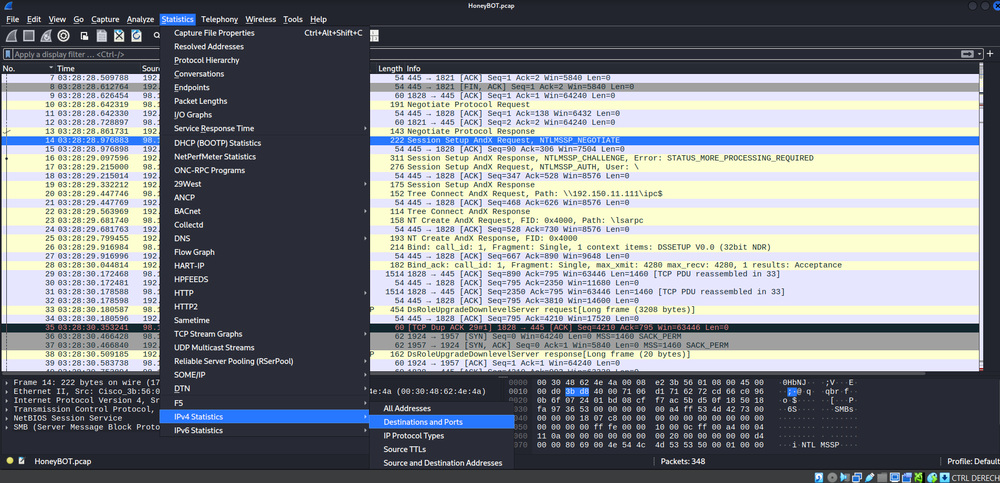

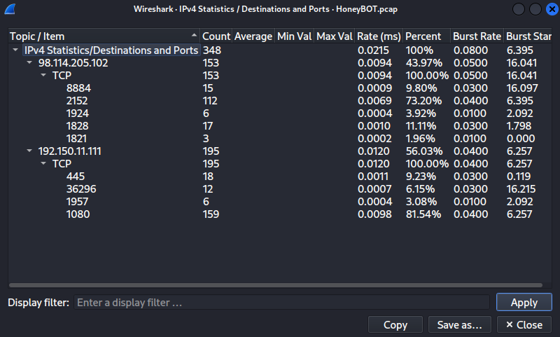

This time, from the summary alone we cannot be completly sure about who the attacker is, although we know that there are only 2 IP addresses.

Investigating the file,we quickly notice some malicious behavior from the IP "98.114.205.102".  

This IP address starts a SMB comunication, and it authenticates with an anonimous session using "/".  

If this was not enought, it also creates two paths, /ipc and /lsarpc. At the end, a duplicated ACK warning is sended probably because the channel is congested.

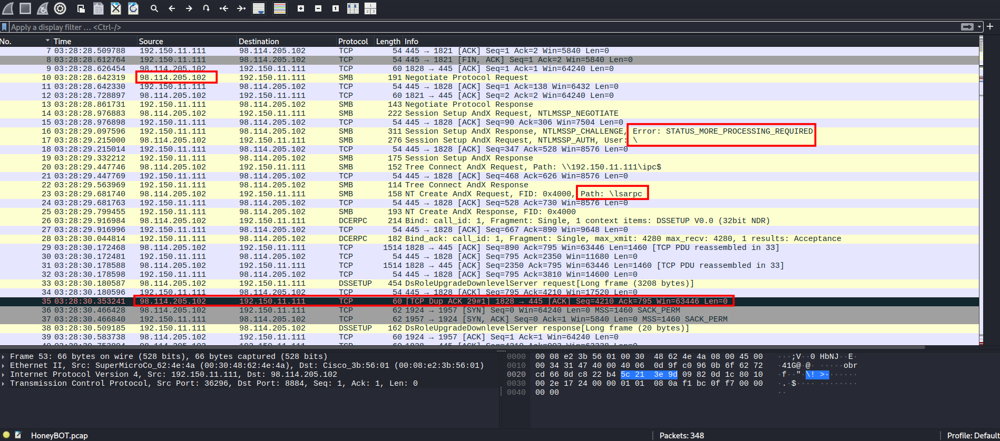

## Q2
What is the target's IP address?

As there are only two IP addresses, the other one is clearly the target "192.150.11.111".

## Q3
Provide the country code for the attacker's IP address (a.k.a geo-location).

We can easly find this using an online IP geolocation tool such as "whatismyipaddress.com".

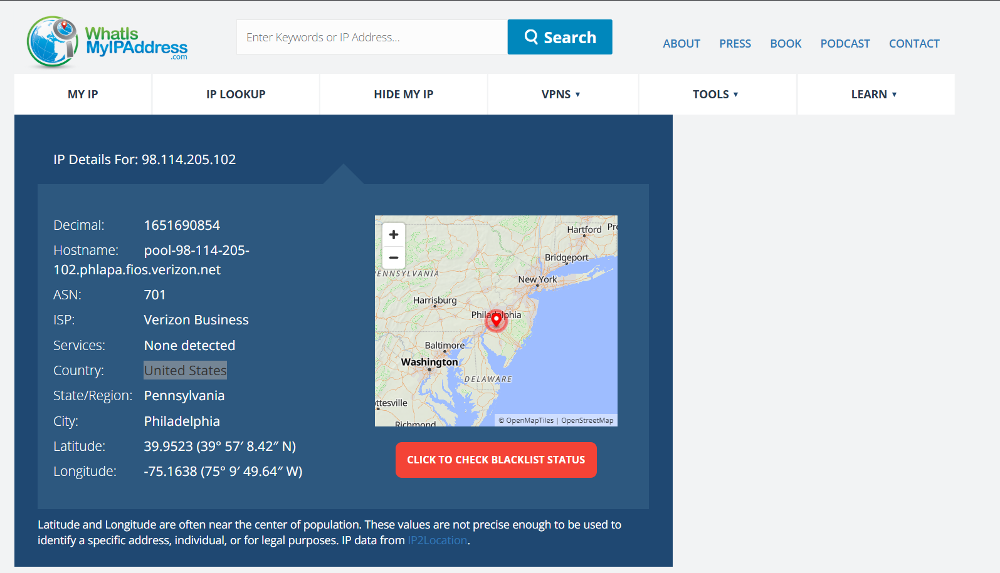

The country is United States ("us" code).

## Q4
How many TCP sessions are present in the captured traffic?

We can find the amount of TCP sessions on the Conversations summary.

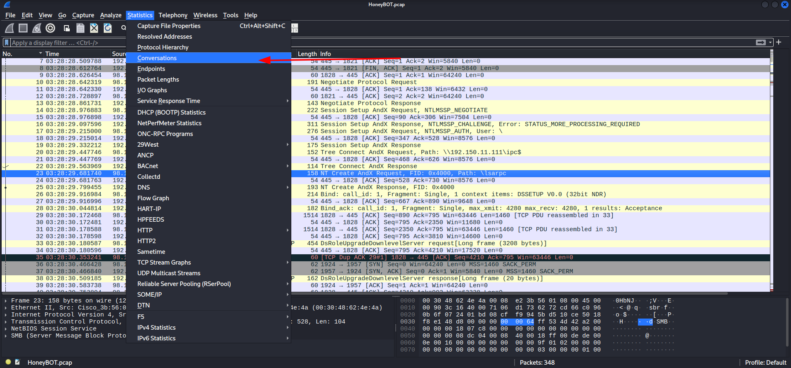

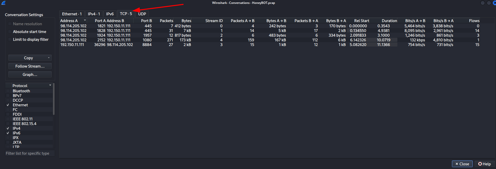

As seen in the capture above, we have 5 distinct TCP sessions.

## Q5
How long did it take to perform the attack (in seconds)?

To obtain the total duration of the capture we can use the capture file properties

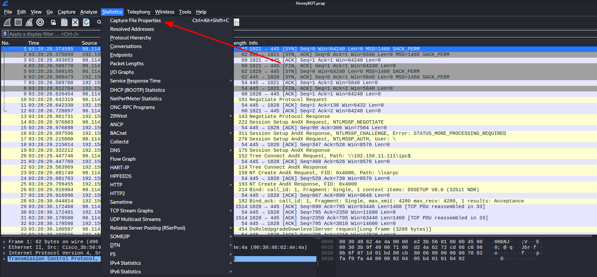

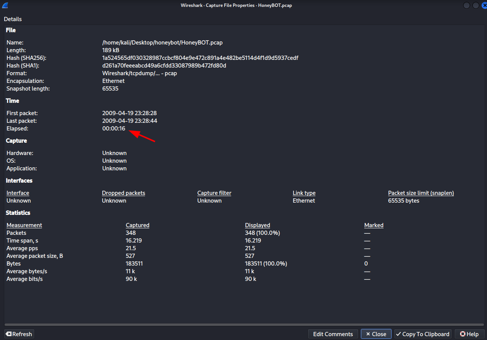

The duration of the attack is 16 seconds.

## Q6
Provide the CVE number of the exploited vulnerability.

To search for the specific CVE, we have to find the key components of the attack. Investigating the capture, we find a common protocol for Windows exploitation "DSSTUP" and the request of "DsRoleUpgradeDownlevelServer".   

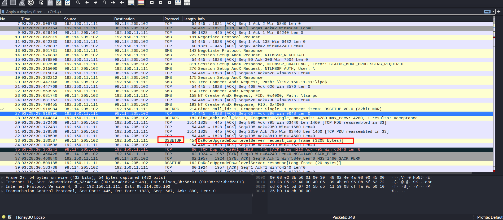

With this information, we can try our luck searching the Internet.

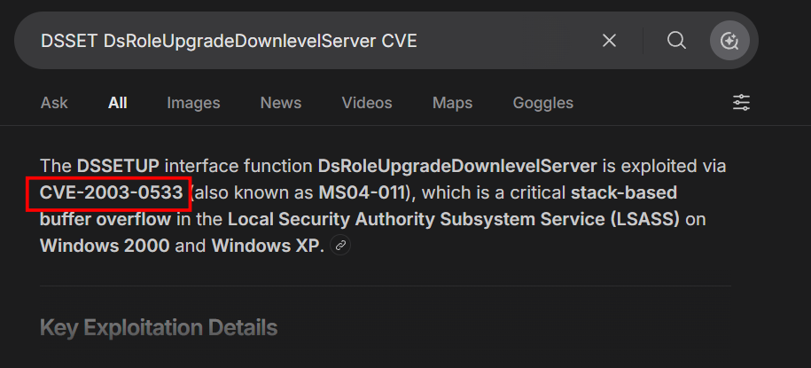

## Q7
Which protocol was used to carry over the exploit?

We already know that the protocol used is SMB.

## Q8
Which protocol did the attacker use to download additional malicious files to the target system?

Following one of the tcp streams we find out the name of the malicious file is "ssms.exe" and the protocol used to transfer the file is "ftp"

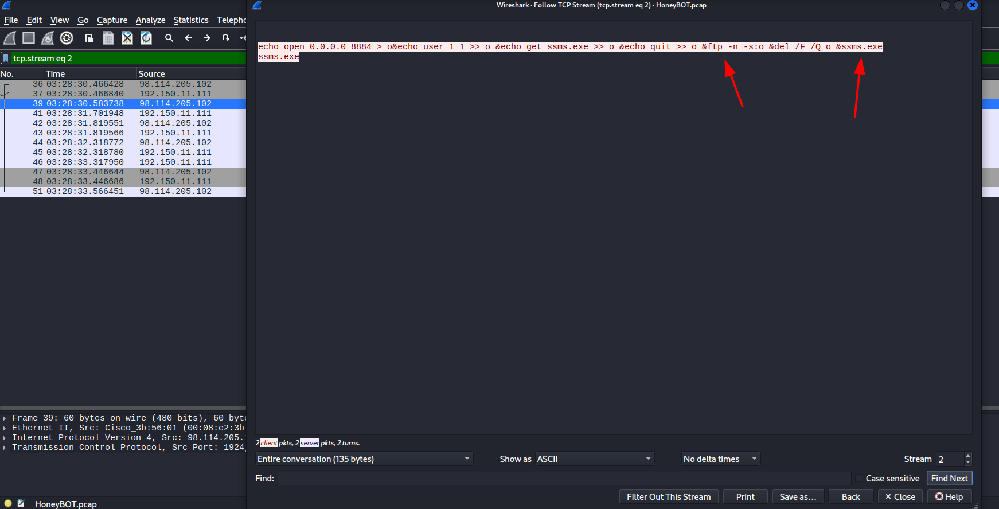

## Q9
What is the name of the downloaded malware?

As stated before, the name of the malicious file is "ssms.exe"

## Q10
The attacker's server was listening on a specific port. Provide the port number.

In the same capture we can see the attacker opening a server using the "8884" port.

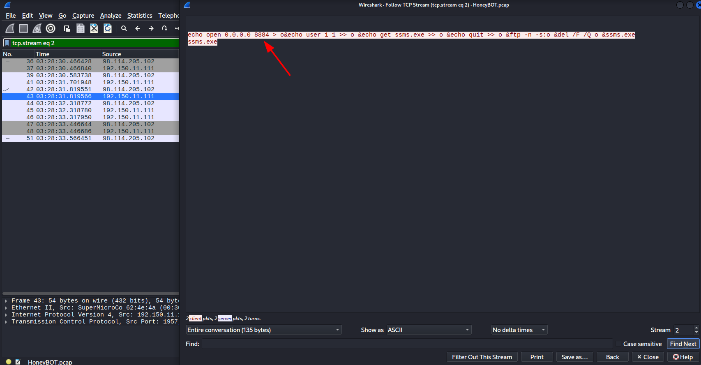

## Q11
When was the involved malware first submitted to VirusTotal for analysis? Format: YYYY-MM-DD

To search on VirusTotal, we need the hash of the malware. Knowing the CVE, this can be done with a quick search on the Internet.

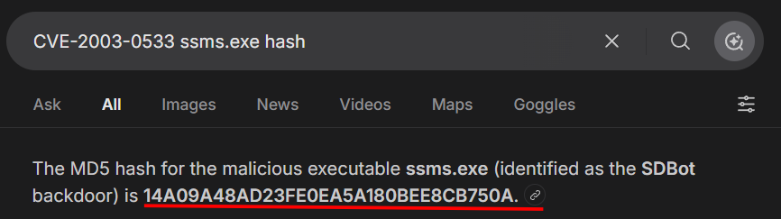

With the obtained hash "14A09A48AD23FE0EA5A180BEE8CB750A", finding the first submission on VirusTotal is easy.

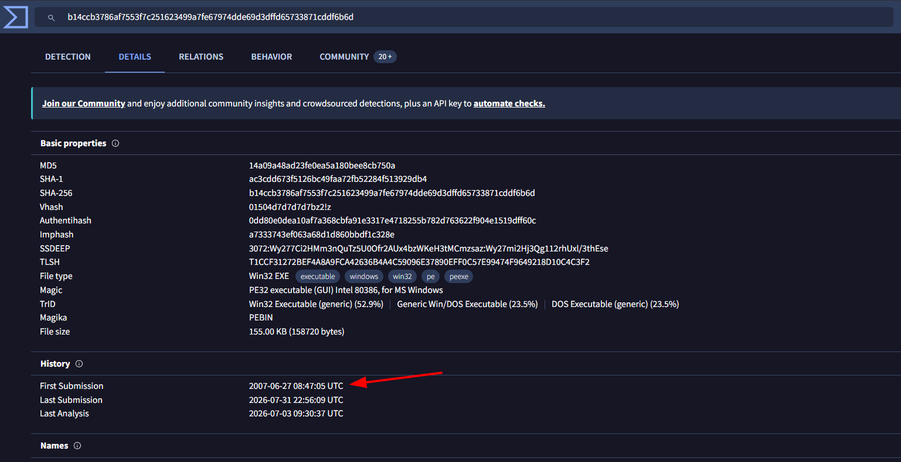

## Q12
What is the key used to encode the shellcode?
