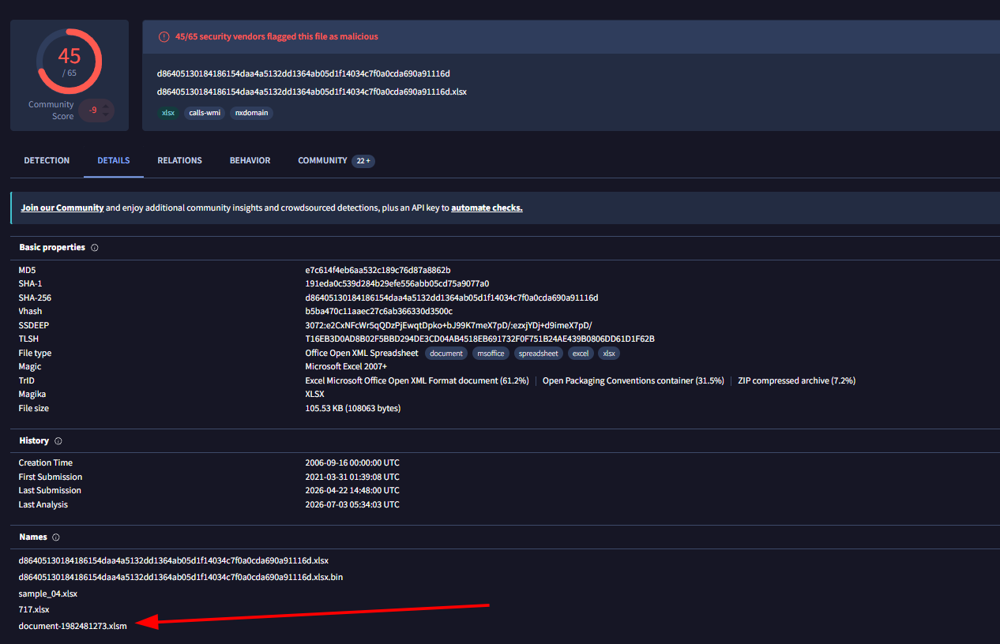
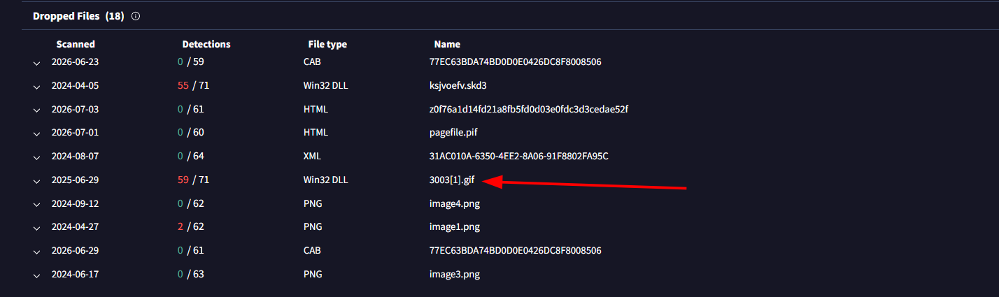
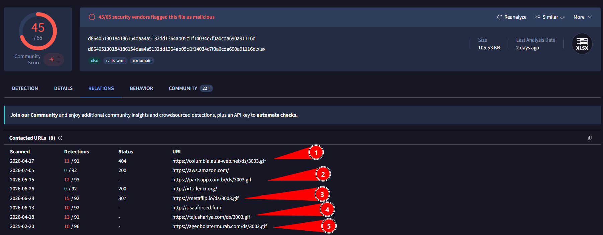
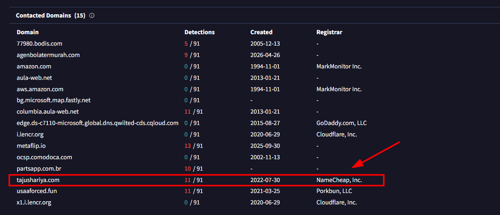
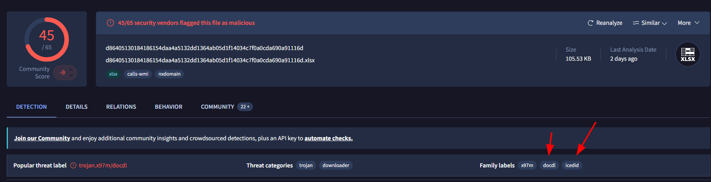
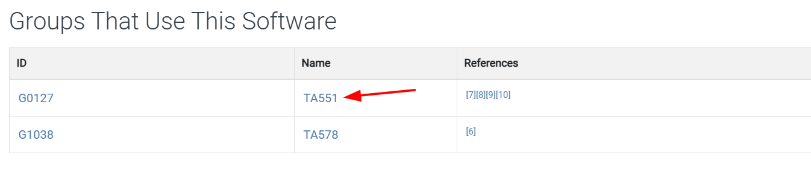
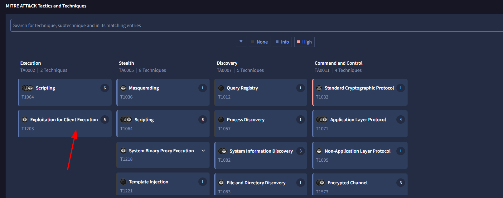
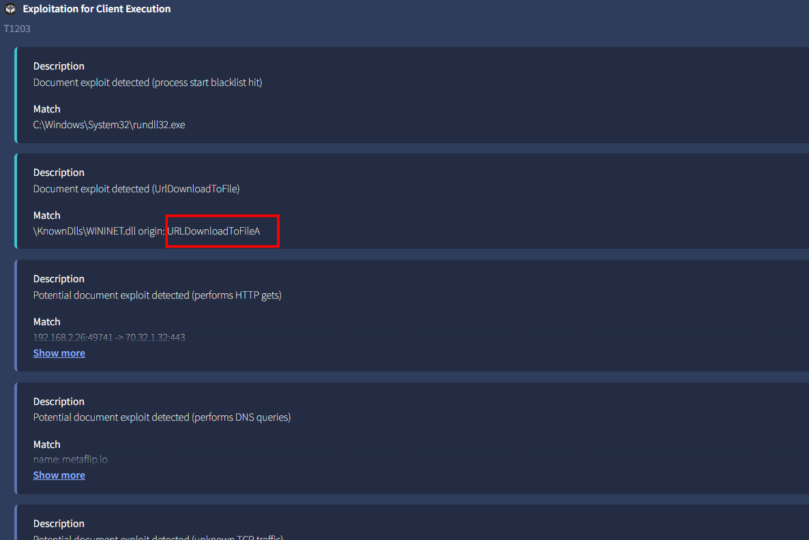

# IcedID Lab

**Platform:** CyberDefenders    
**Difficulty:** Easy  
**Duration:** ~30 min   
**Category:** Threat Intel   
**Link:** https://cyberdefenders.org/blueteam-ctf-challenges/icedid/
 
## Scenario
A cyber threat group was identified for initiating widespread phishing campaigns to distribute further malicious payloads. The most frequently encountered payloads were IcedID. You have been given a hash of an IcedID sample to analyze and monitor the activities of this advanced persistent threat (APT) group. 

hash:  191eda0c539d284b29efe556abb05cd75a9077a0 

## Q1
What is the name of the file associated with the given hash? 

Using VirusTotal, we can obtain the name by checking the details tab, among all the known filenames of the malware, the one requested is document-1982481273.xlsm

   

## Q2
Can you identify the filename of the GIF file that was deployed?

The filename of the gif is 3003.gif. We can obtain it by searching on the relations tab, under the dropped files section.

   

## Q3
How many domains does the malware look to download the additional payload file in Q2?

The malware downloads the payload via 5 diferent domains. These can be found in the relations tab under the contacted URL section. We are looking for the URLs that end with the gif, as shown in the image.

 

## Q4
From the domains mentioned in Q3, a DNS registrar was predominantly used by the threat actor to host their harmful content, enabling the malware's functionality. Can you specify the Registrar INC?  

Likewise, in the section below we can find the DNS registrar of the domains.

 

## Q5
Could you specify the threat actor linked to the sample provided?  

Searching on VirusTotal I found nothing mentioning the threat actor. However in the detection tab I found some labels worth investigating.

 

Using MITRE ATT&CK, I searched for docdl, which yielded nothing and IcedID which provided interesting results.

Investigating the first group, I found that its name is GOLD CABIN, which is the one we were looking for.

## Q6
In the Execution phase, what function does the malware employ to fetch extra payloads onto the system?

To investigate MITRE ATT&CK Tactics and Techniques using VirusTotal, we can go to the behavior section and search for the relevant tab.

 

Once there, all we have to do is read the execution phase techniques and we will quickly find the one that interests us.

 