# Insider Lab

**Platform:** CyberDefenders    
**Difficulty:** Easy  
**Duration:** ~45 min   
**Category:** Endpoint Forensics  
**Link:** https://cyberdefenders.org/blueteam-ctf-challenges/insider/  
 
## Scenario
After Karen started working for 'TAAUSAI,' she began doing illegal activities inside the company. 'TAAUSAI' hired you as a soc analyst to kick off an investigation on this case.  

You acquired a disk image and found that Karen uses Linux OS on her machine. Analyze the disk image of Karen's computer and answer the provided questions.  

## Tool

To complete this lab, I will use Exterro FTK Imager, a Windows tool designed to inspect disk images on windows systems.

You can install it from the official website:
https://www.exterro.com/digital-forensics-software/ftk-imager

## Q1
Which Linux distribution is being used on this machine?  

With the disk image loaded in FTK Imager we can start our analysis.  
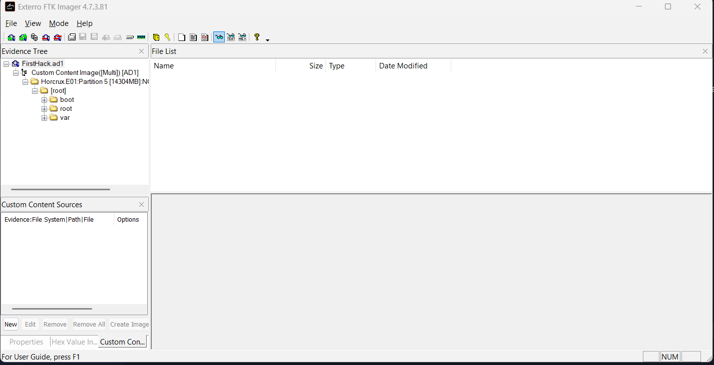   

Just by looking at the Evidence Tree, we can already tell it's a Linux-based system, because of the boot folder,which is non-existent on Windows.  

If we click on it, it will show us some system specifications like the distribution we were looking for.  
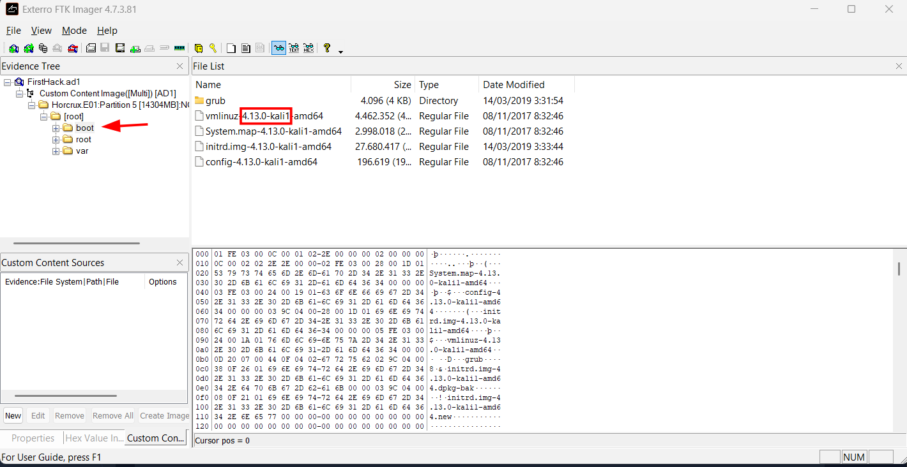   

## Q2
What is the MD5 hash of the Apache access.log file?  

As we know, logs in Linux are usually found in the var folder. There, we can find the access.log in the apache2 folder.  

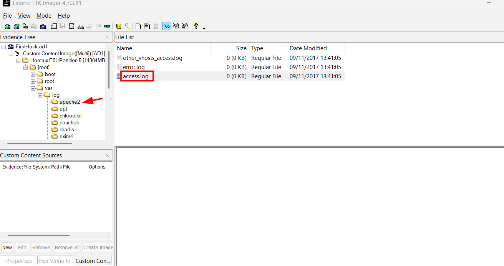  

To obtain the hash, we have to click on the page button.

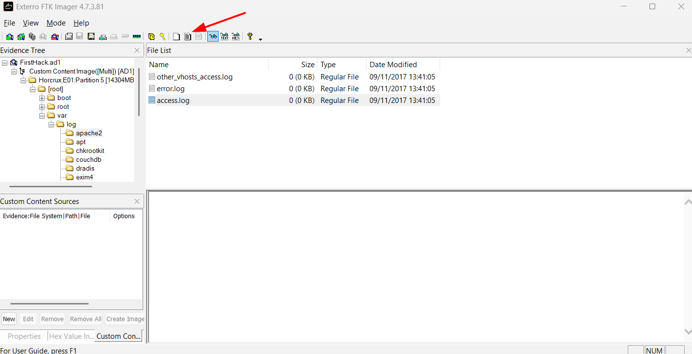   

This button will generate a .csv file with the hash inside.  

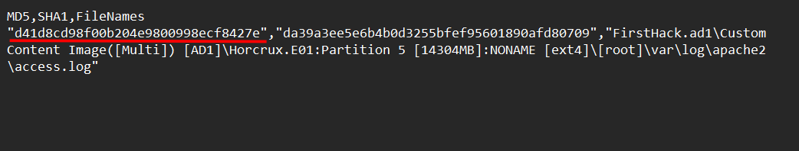  

## Q3
It is suspected that a credential dumping tool was downloaded. What is the name of the downloaded file?  

We can find the .zip file in the Downloads folder

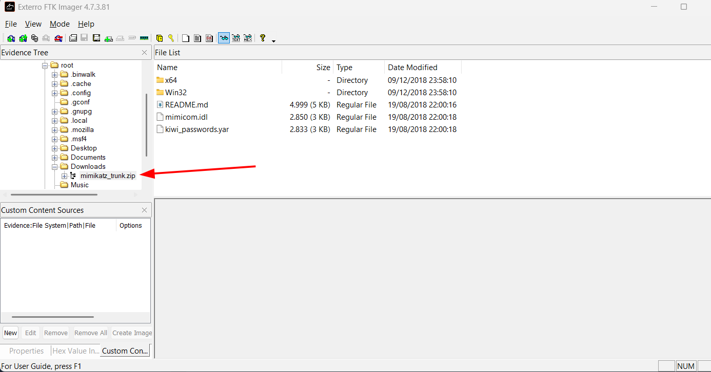  

## Q4  
A super-secret file was created. What is the absolute path to this file?  

At first, I searched through every log in the var folder, however I found nothing. After searching a bit on the root folder, it turns out all we had to do for this task was search for the bash_history file located on root.

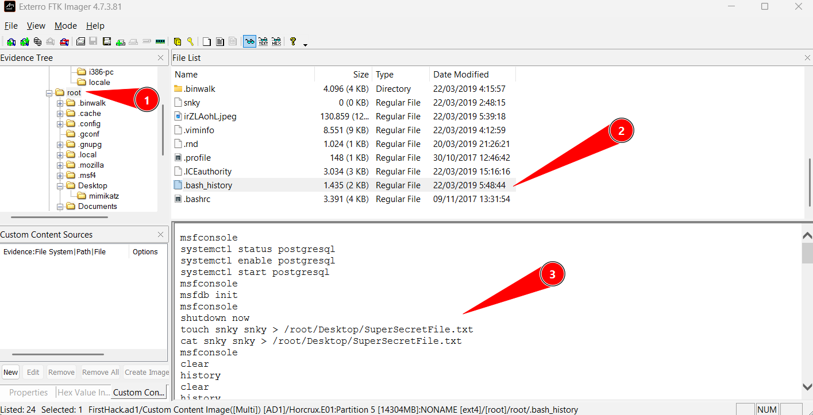 

## Q5  
What program used the file didyouthinkwedmakeiteasy.jpg during its execution?  

If we continue reading the bash_history, we will find the file being used during execution.  

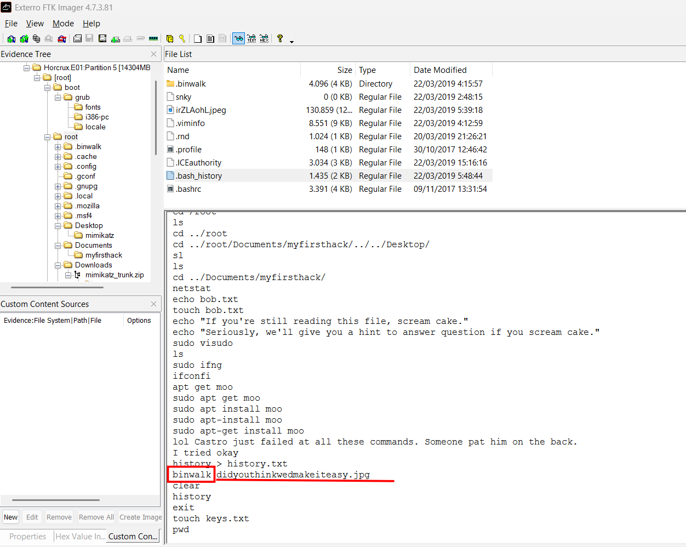

## Q6
What is the third goal from the checklist Karen created?  

Searching in the Desktop folder, I found the checklist.  

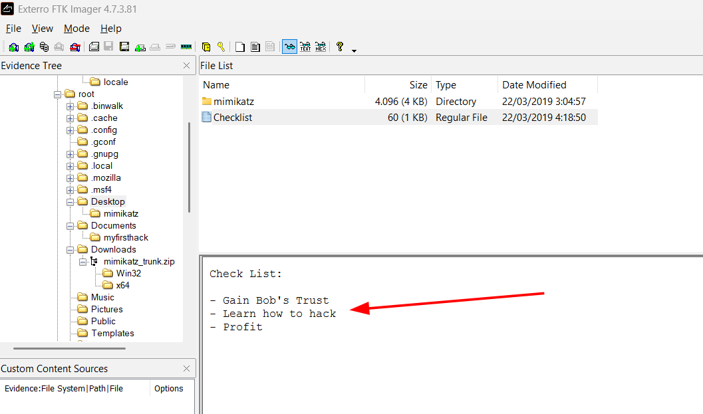  

## Q7
How many times was Apache run?  

To know this, we can look for apache logs in the var/log folder. There we can see that there are no logs, meaning it had not been executed at all.  

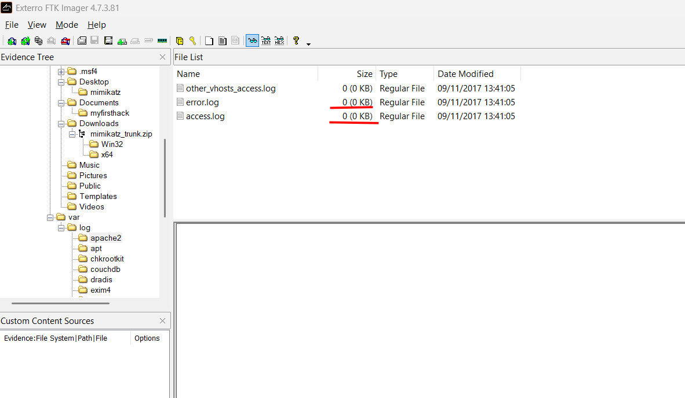  

## Q8
This machine was used to launch an attack on another. Which file contains the evidence for this?  

After investigating several files, I found a suspiciously named image on the root folder. Upon opening it, I found evidence of someone opening a CMD with elevated privileges using FlightSim, a network simulation tool.  

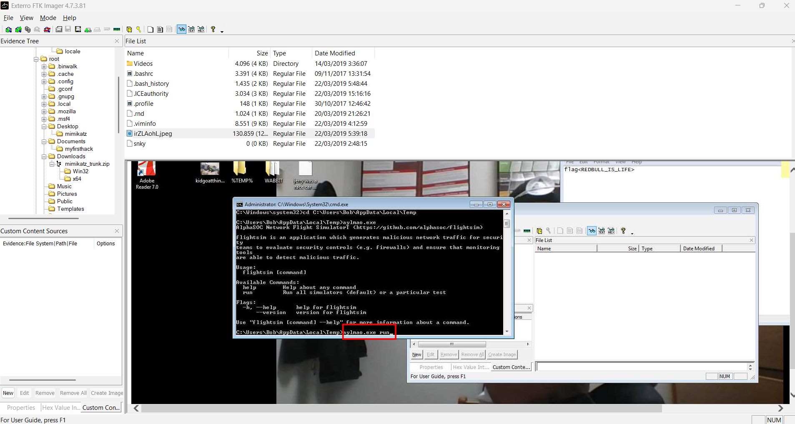  

## Q9
It is believed that Karen was taunting a fellow computer expert through a bash script within the Documents directory. Who was the expert that Karen was taunting?  

In the file firstscript_fixed we can see a reference to someone called "Young".  

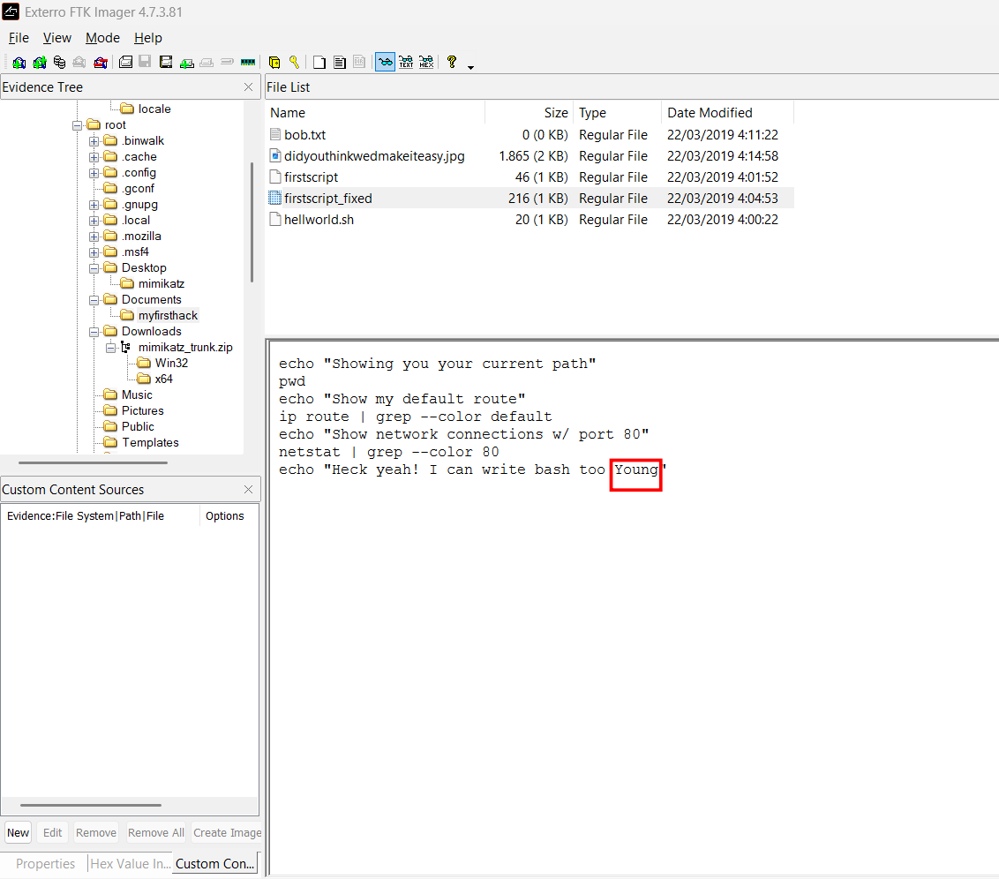

## Q10
A user executed the su command to gain root access multiple times at 11:26. Who was the user?  

As we are searching for authentication tries, we can go to var/logs and open the auth.log to see every authentication try. We just have to find the logs at 11:26.  

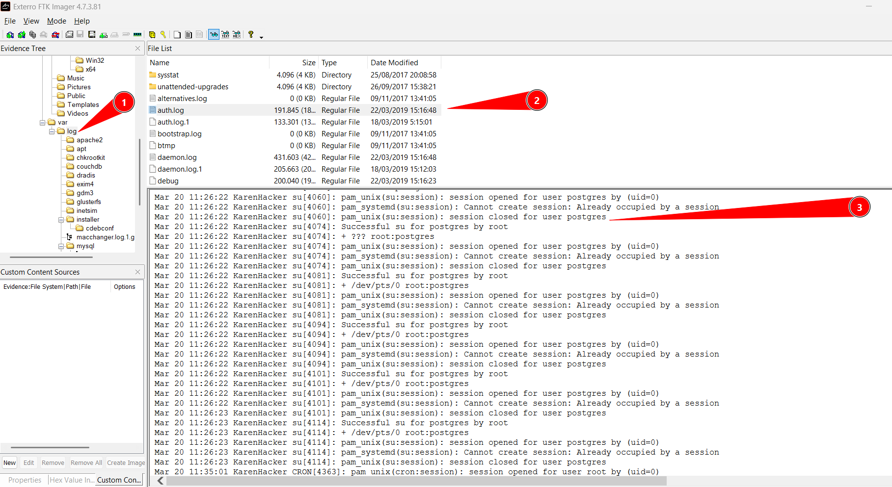

## Q11
Based on the bash history, what is the current working directory?  

The last file referenced was didyouthinkwedmakeiteasy.jpg, so the directory containing it is the current working directory. 

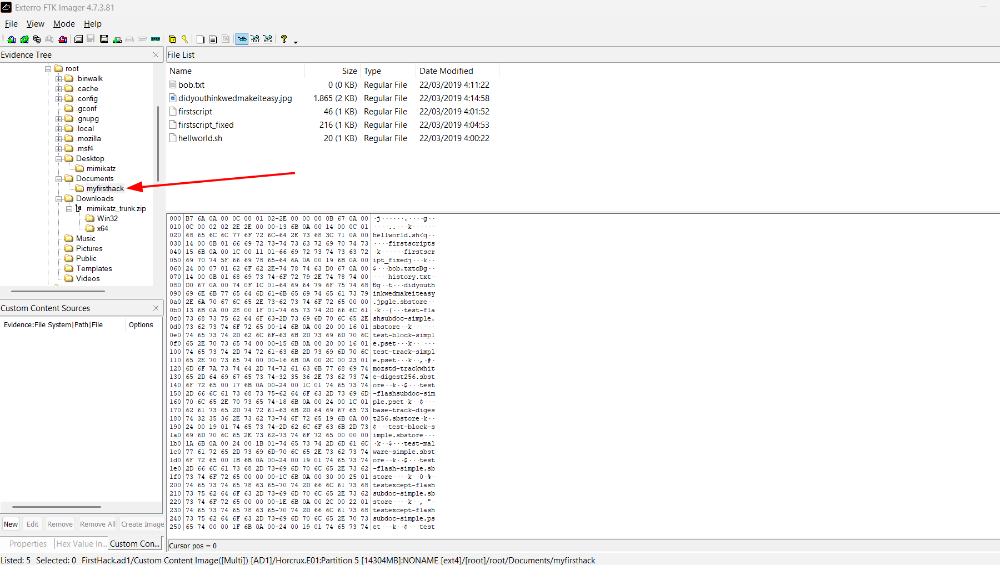

We can find the image on documents in the path /root/documents/myfirsthack/

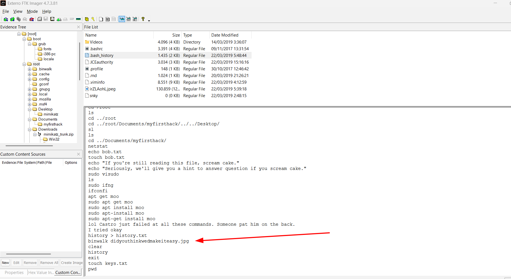
