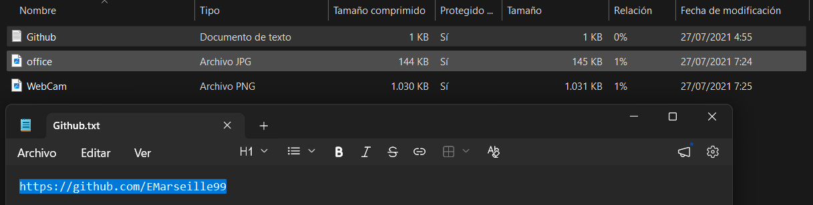
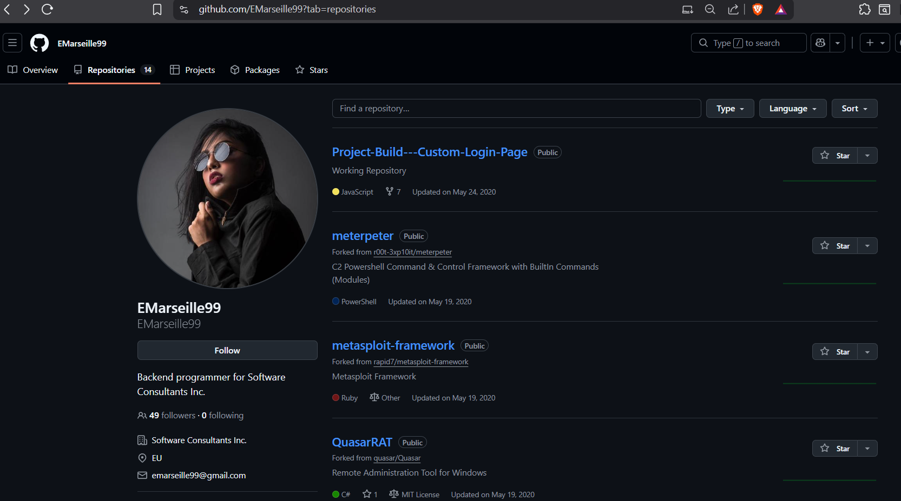
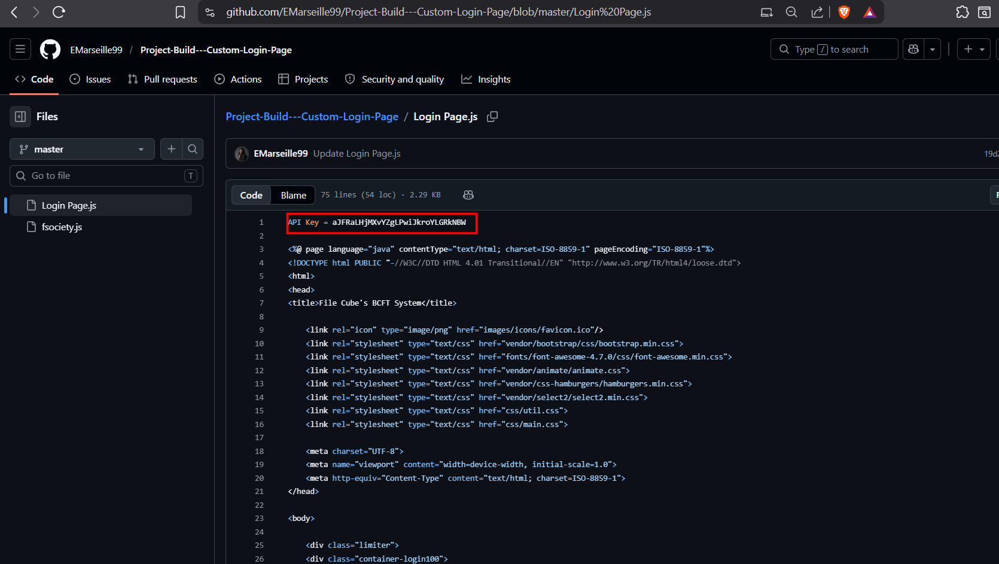
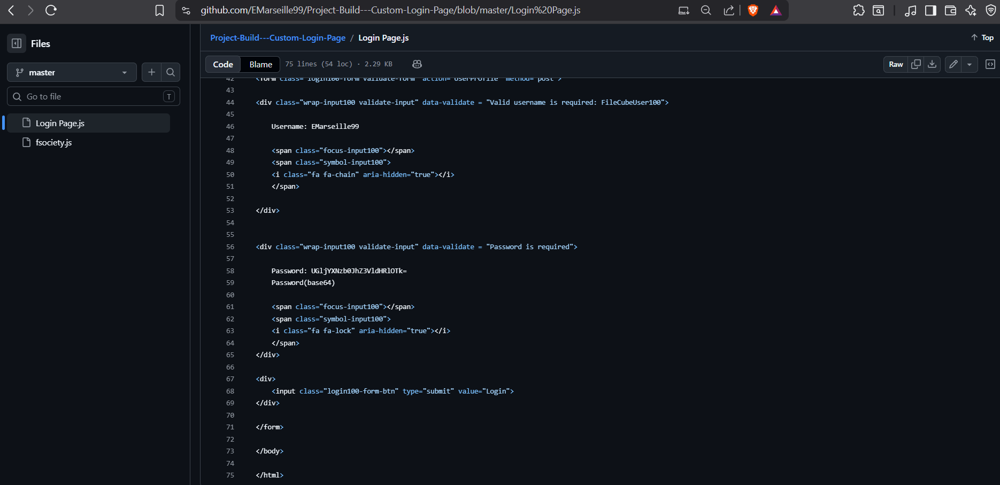
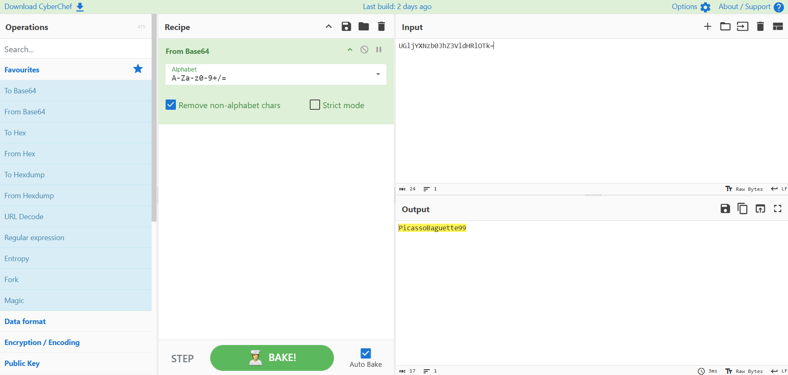
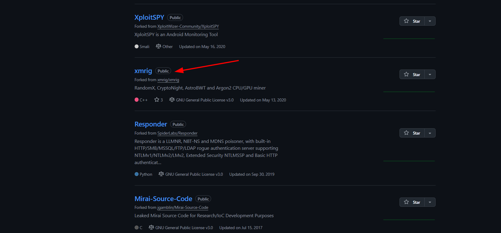
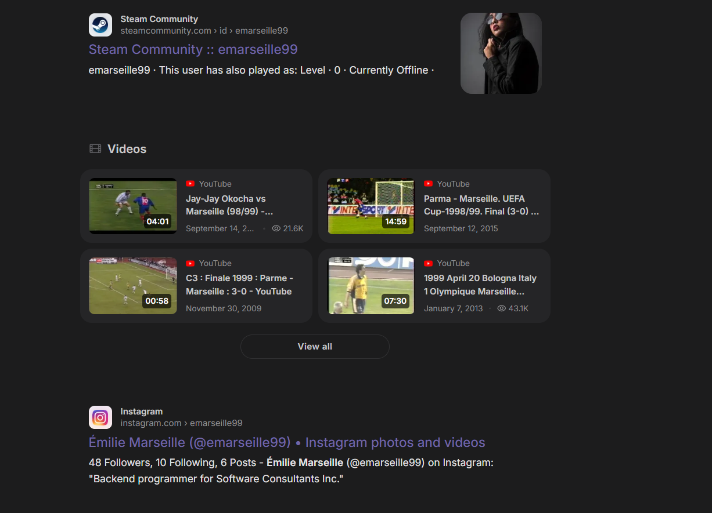
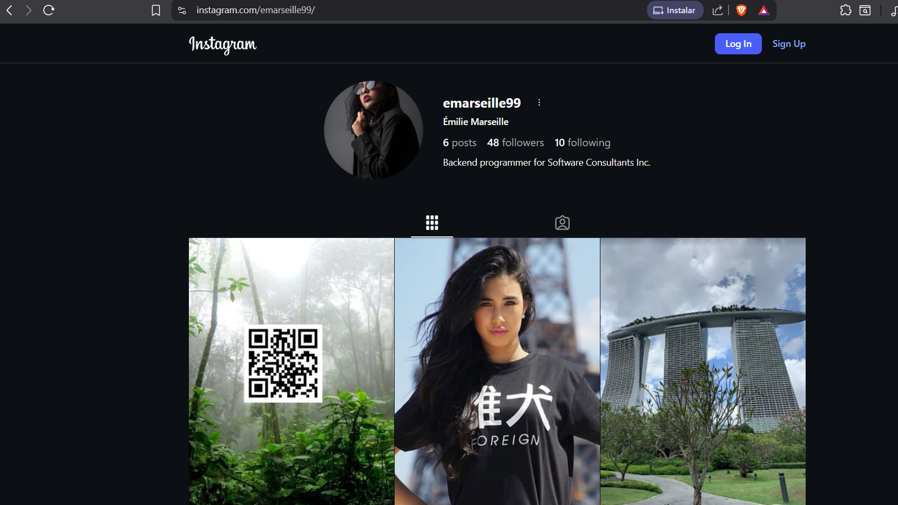
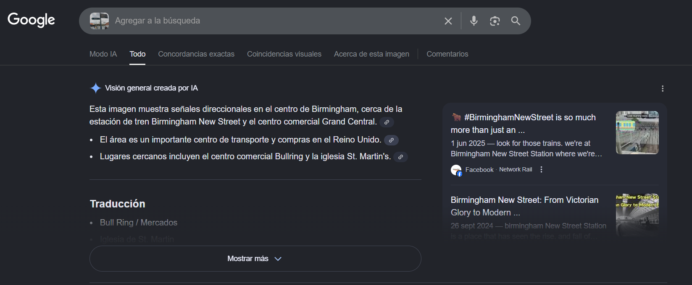
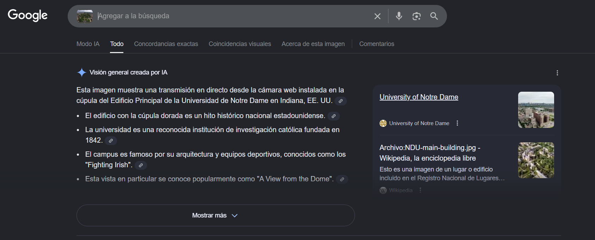

# Lespion Lab 

**Platform:** CyberDefenders    
**Difficulty:** Easy  
**Duration:** ~30 min   
**Category:** Thread intel  
**Link:** https://cyberdefenders.org/blueteam-ctf-challenges/lespion/
 
## Scenario
You have been tasked by a client whose network was compromised and brought offline to investigate the incident and determine the attacker's identity.  

Incident responders and digital forensic investigators are currently on the scene and have conducted a preliminary investigation. Their findings show that the attack originated from a single user account, probably, an insider. Investigate the incident, find the insider, and uncover the attack actions.

## Q1
File -> Github.txt: What API key did the insider add to his GitHub repositories?

  

We are given a GitHub profile link and two photographs to complete this laboratory. 

  

Following the link, I arrive at the GitHub profile of "EMarseille99". We are asked to obtain the API key, which is privileged information, directly from GitHub. In order to accomplish this, we must search for it in one of the 14 repositories.

As we are searching for information leaks within the code, we should focus on new or still-in-progress repositories, as they are highly prone to information leaks.

  

After examining the newest repository, which is still in progress, I had no trouble finding the API key, as it was located on the first line of code.

## Q2
File -> Github.txt: What plaintext password did the insider add to his GitHub repositories?  

   

The password can be found in the same file, on line 58. As stated in the code, the password is encoded in base64. I will decode it using CyberChef. 

   

## Q3
File -> Github.txt: What cryptocurrency mining tool did the insider use?  

The mining tool can be found in the repository section of her github.  

 

## Q4
On which gaming website did the insider have an account?  

 

To find this, we just have to search for "EMarseille99" in a browser. As we can see, the user has accounts on Steam and Instagram, with Steam being the answer to the question.

 

I checked the Instagram account just in case it would be useful later, but it only contains a QR code that redirects to its Steam account.

## Q5
What is the link to the insider Instagram profile?

The answer is the url of her instagram account.  

## Q6
Which country did the insider visit on her holiday?  

The country is Singapore, as shown in her instagram account.

## Q7
Which city does the insider family live in?

Same as before, her family lives in Dubai.

## Q8
File -> office.jpg: You have been provided with a picture of the building in which the company has an office. Which city is the company located in?  

To find this, we can use google and upload the image.  

 

## Q9
File -> Webcam.png: With the intel, you have provided, our ground surveillance unit is now overlooking the person of interest suspected address. They saw them leaving their apartment and followed them to the airport. Their plane took off and landed in another country. Our intelligence team spotted the target with this IP camera. Which state is this camera in?

The state is Indiana.

 

