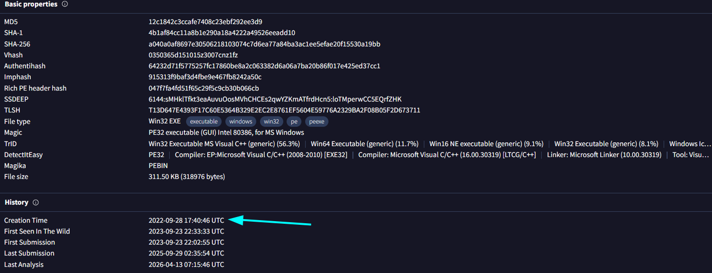
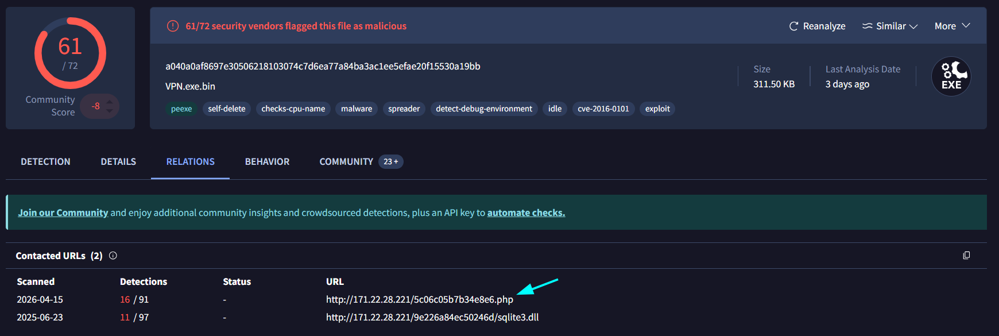
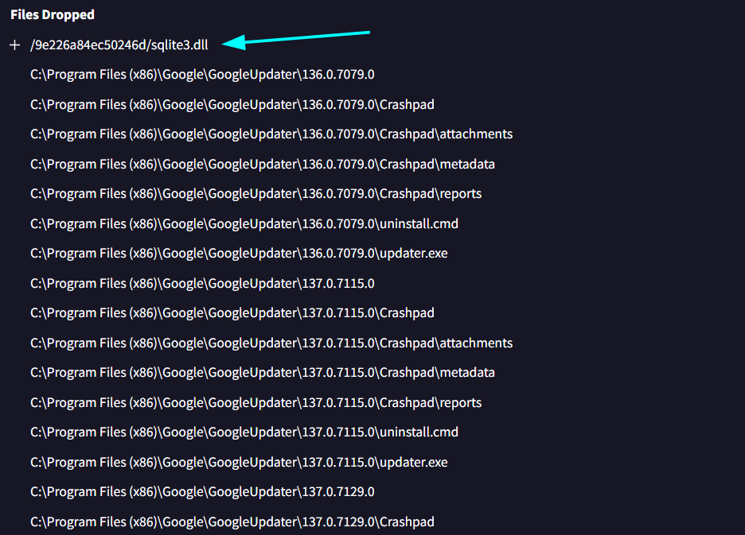
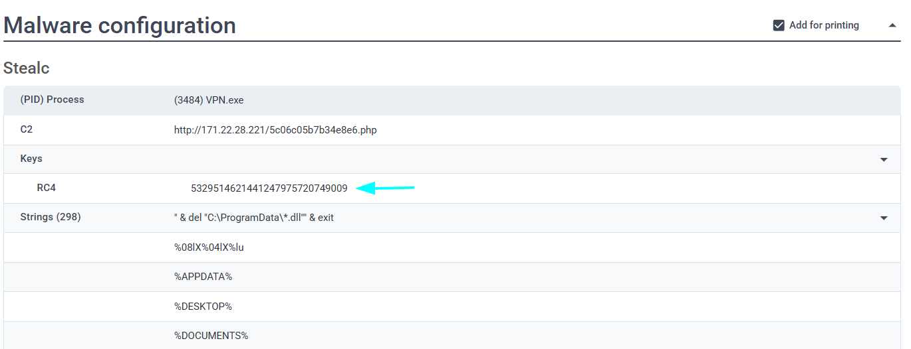
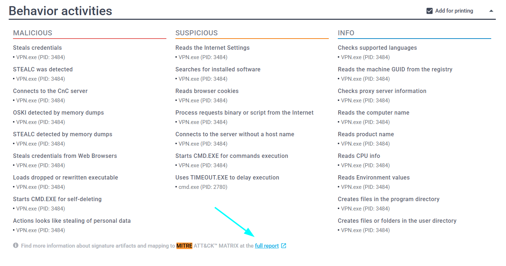
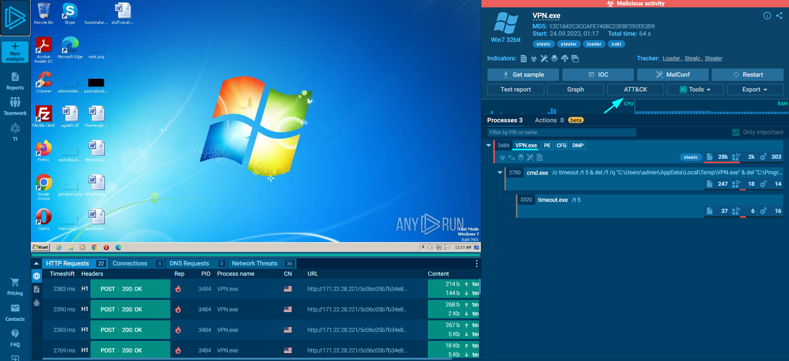
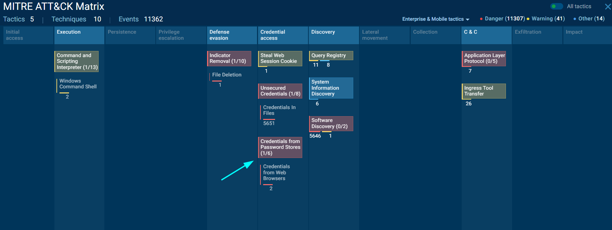
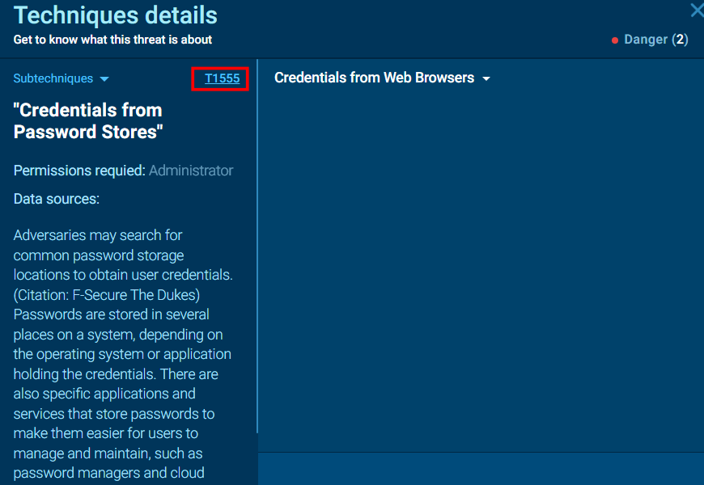
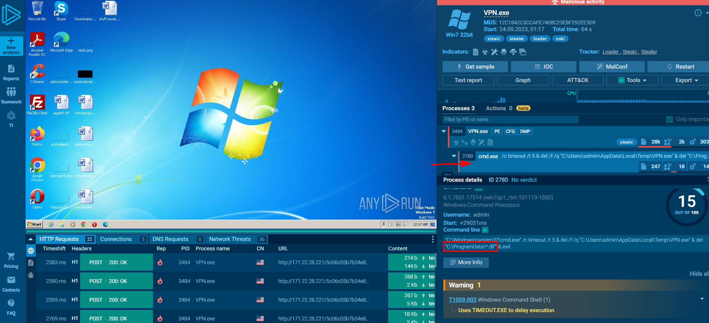

# Oski Lab 

**Platform:** CyberDefenders    
**Difficulty:** Easy  
**Duration:** ~30 min   
**Link:** https://cyberdefenders.org/blueteam-ctf-challenges/oski/
 
## Scenario
The accountant at the company received an email titled "Urgent New Order" from a client late in the afternoon. When he attempted to access the attached invoice, he discovered it contained false order information. Subsequently, the SIEM solution generated an alert regarding downloading a potentially malicious file. Upon initial investigation, it was found that the PPT file might be responsible for this download. Could you please conduct a detailed examination of this file?  

## Q1
Determining the creation time of the malware can provide insights into its origin. What was the time of malware creation?  

  
We can easily determine when the malware was created by searching its hash on VirusTotal.
If we go to the details section, the creation date is shown under the history tab.

## Q2
Identifying the command and control (C2) server that the malware communicates with can help trace back to the attacker. Which C2 server does the malware in the PPT file communicate with?

   
Just like before, we can find this in the relations section, specifically under contacted URLs

## Q3
Identifying the initial actions of the malware post-infection can provide insights into its primary objectives. What is the first library that the malware requests post-infection?  

   

In order to observe the initial actions of the malware in VirusTotal, we need to go to the Behavior tab and scroll down to the Files Dropped section.
Then, we have to identify the first library, which means finding the first .dll (Dynamic Link Library) file. This is straightforward, as it is the first one that appears.

## Q4
By examining the provided Any.run report, what RC4 key is used by the malware to decrypt its base64-encoded string?  

   
By scrolling down to the malware configuration section, we can find the RC4 key.

## Q5
By examining the MITRE ATT&CK techniques displayed in the Any.run sandbox report, identify the main MITRE technique (not sub-techniques) the malware uses to steal the user’s password.

   
To access the sandbox report, we can click on the Full Report link in ANY.RUN.  

     
Once inside, we can see a detailed report of all processes, but for this task, we will focus on the MITRE ATT&CK section.  
We can access it by clicking on the ATT&CK button on the right side.

 
To find stolen credentials, we need to focus on the Credential Access tactics. Out of the three options, Credentials from Password Stores seems to be the correct one, as cookies are not passwords per se, nor are they stored as unsecured credentials.  

 

## Q6
By examining the child processes displayed in the Any.run sandbox report, which directory does the malware target for the deletion of all DLL files?  

   

Going back to the sandbox report, we can see the main process, VPN.exe, which created a child process, cmd.exe.
If we click on the cmd.exe process, we can clearly see the location of the targeted libraries.

## Q7
Understanding the malware's behavior post-data exfiltration can give insights into its evasion techniques. By analyzing the child processes, after successfully exfiltrating the user's data, how many seconds does it take for the malware to self-delete?

  
It takes 5s to delete, as shown by the **timeout** comand

