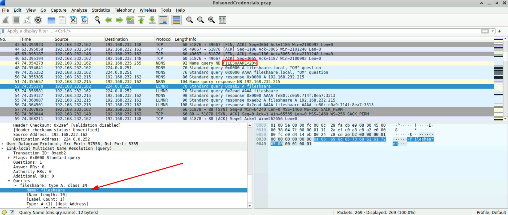
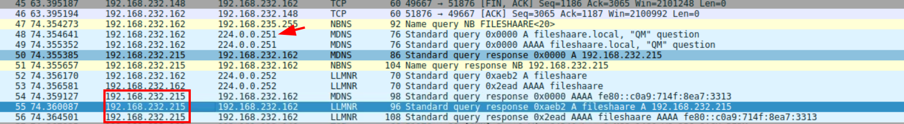
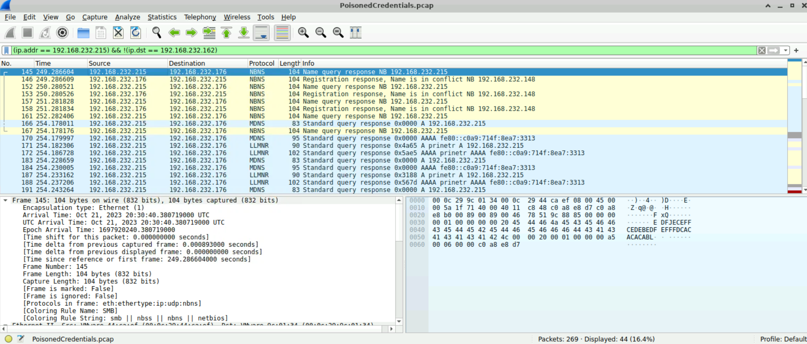
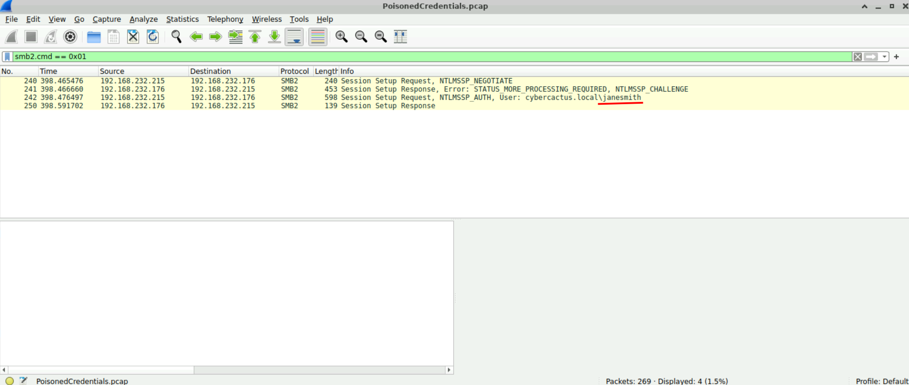
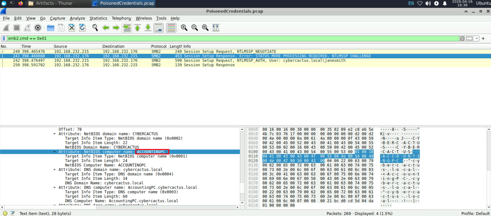

# PoisonedCredentials Lab 

**Platform:** CyberDefenders    
**Difficulty:** Easy  
**Duration:** ~30 min   
**Link:** https://cyberdefenders.org/blueteam-ctf-challenges/poisonedcredentials/
 
## Scenario
Your organization's security team has detected a surge in suspicious network activity. There are concerns that LLMNR (Link-Local Multicast Name Resolution) and NBT-NS (NetBIOS Name Service) poisoning attacks may be occurring within your network. These attacks are known for exploiting these protocols to intercept network traffic and potentially compromise user credentials. Your task is to investigate the network logs and examine captured network traffic.

## Q1
In the context of the incident described in the scenario, the attacker initiated their actions by taking advantage of benign network traffic from legitimate machines. Can you identify the specific mistyped query made by the machine with the IP address 192.168.232.162?

To detect this type of attack, it is essential to understand how it works, even at a basic level. By default, when a Windows device fails to resolve a DNS query, it does not stop there; instead, it attempts to resolve the address using other protocols such as LLMNR or NBT-NS through broadcast requests. When a user on the network fails to resolve a DNS query (for example, due to a typo), an attacker can intercept the LLMNR request and perform a poisoning attack.  

  

While analyzing the PCAP, we observe a failed NBNS query (which can be considered similar to DNS in this context). A few frames later, we see an LLMNR response providing its IP address. This indicates that a poisoning attack has taken place.

## Q2
We are investigating a network security incident. To conduct a thorough investigation, We need to determine the IP address of the rogue machine. What is the IP address of the machine acting as the rogue entity?

    

To identify the IP address, we simply need to check the source IP field (224.0.0.252 is the multicast address used by the LLMNR protocol).  

## Q3
As part of our investigation, identifying all affected machines is essential. What is the IP address of the second machine that received poisoned responses from the rogue machine?  

    
To identify other affected machines, we can apply a basic filter by searching for the attacker’s IP address and excluding the IP address of the known affected machine  

## Q4
We suspect that user accounts may have been compromised. To assess this, we must determine the username associated with the compromised account. What is the username of the account that the attacker compromised?

    

To find the username, we need to analyze the authentication protocol, which in this case is SMB2. This version of SMB2 uses a specific code for startup requests: 0x01.
After applying the filter, we can identify the username.

## Q5
As part of our investigation, we aim to understand the extent of the attacker's activities. What is the hostname of the machine that the attacker accessed via SMB?  

    

With the same filter, we find the challenge frame (the server response to the negotiation), which contains some information about the attacker, such as the hostname of the machine.

