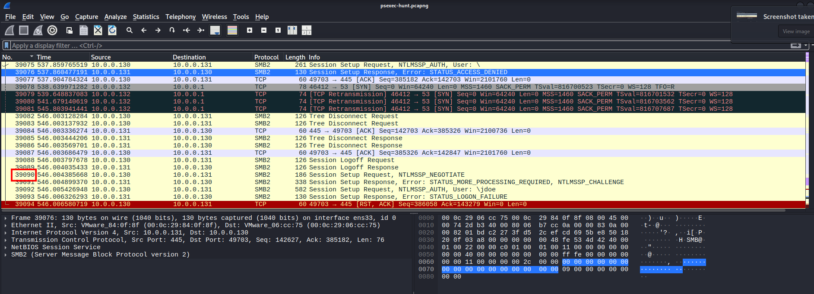
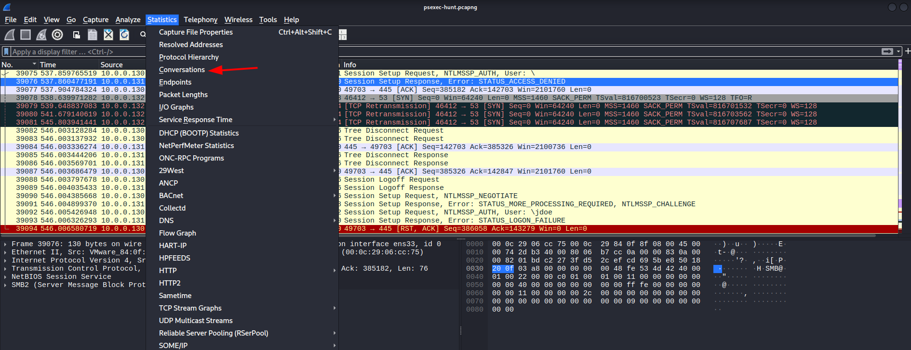
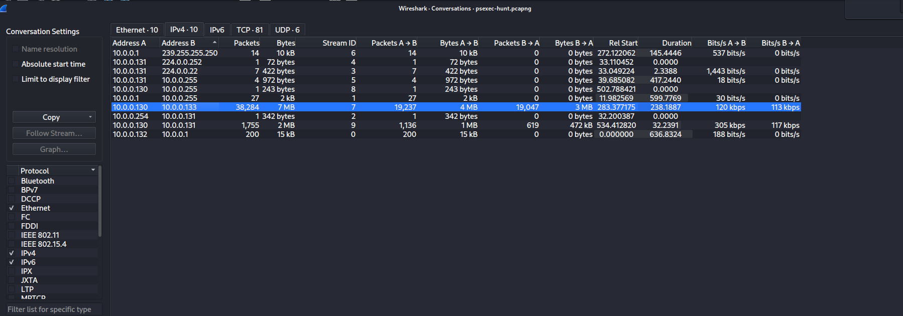
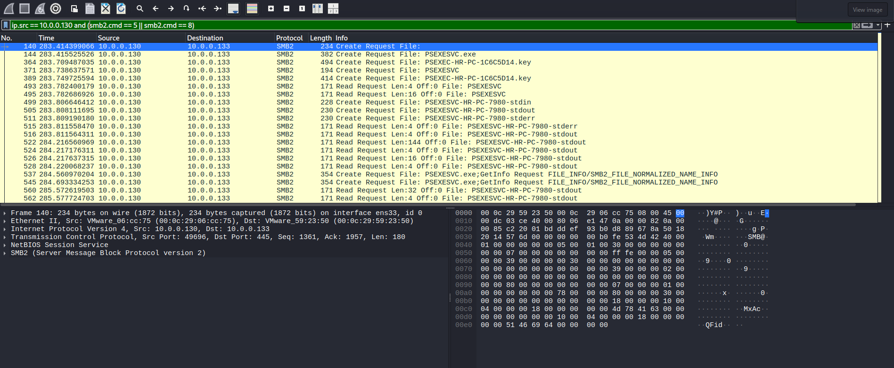
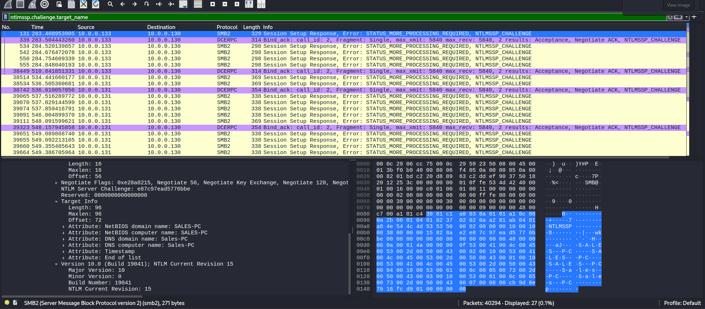
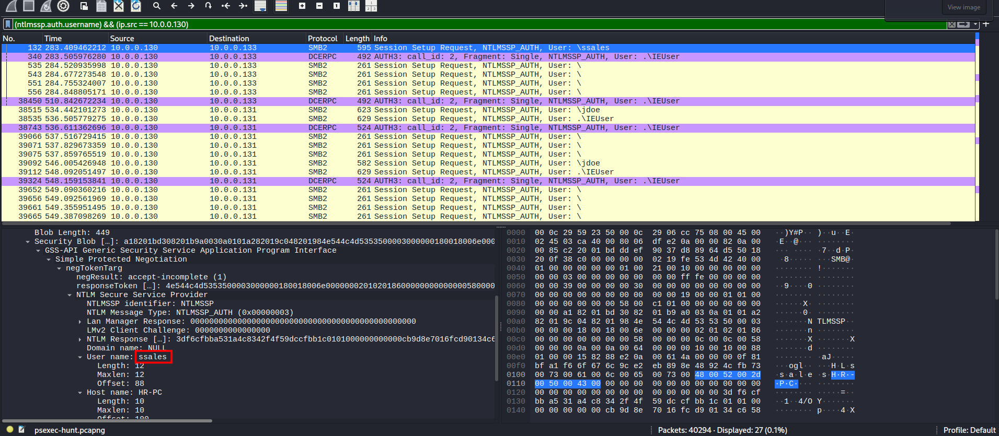
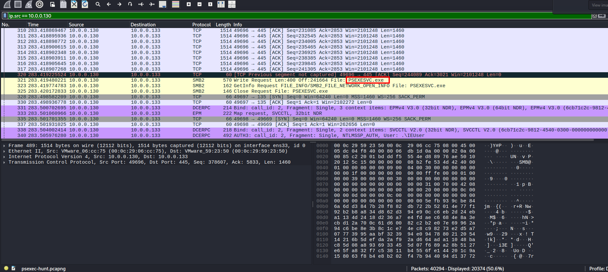
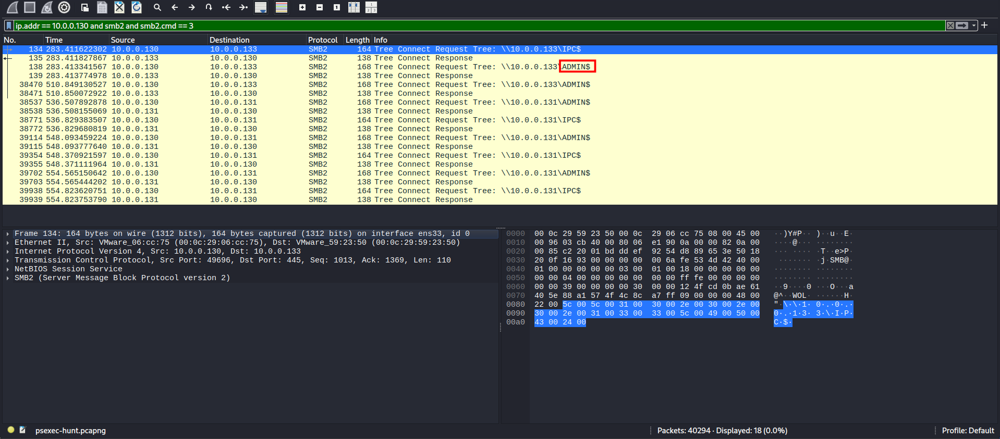
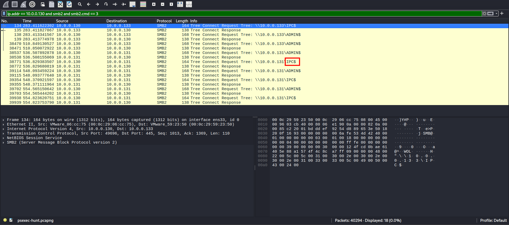
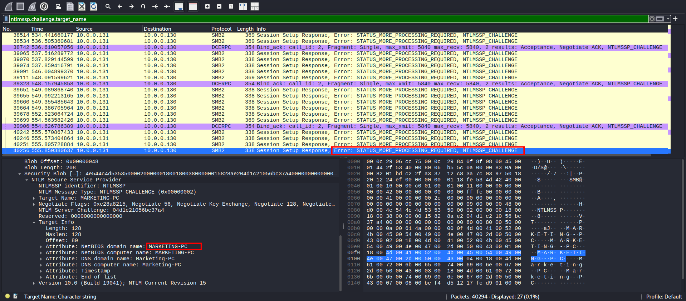

# PsExec Hunt Lab 

**Platform:** CyberDefenders    
**Difficulty:** Easy  
**Duration:** ~30 min   
**Category:** Network Forensics  
**Link:** https://cyberdefenders.org/blueteam-ctf-challenges/psexec-hunt/
 
## Scenario
An alert from the Intrusion Detection System (IDS) flagged suspicious lateral movement activity involving PsExec. This indicates potential unauthorized access and movement across the network.  
As a SOC Analyst, your task is to investigate the provided PCAP file to trace the attacker’s activities. Identify their entry point, the machines targeted, the extent of the breach, and any critical indicators that reveal their tactics and objectives within the compromised environment.

## Q1
To effectively trace the attacker's activities within our network, can you identify the IP address of the machine from which the attacker initially gained access?

    

We are given a pcap with a lot of frames, which means that we can not analyze it directly, unlike with smaller captures.

    

To begin, we access the 'Conversations' tab in Wireshark to obtain a concise summary of the traffic between hosts. We are specifically looking for communications with unknown IPs or a disproportionate volume of packets originating from a single source.

    

As shown in the screenshot above, a staggering number of packets were sent by the IP '10.0.0.130'.   

Having identified a suspect, we must examine their activity in detail. By filtering for this specific IP, I determined that the bulk of the traffic utilizes the SMB2 protocol.   

With the filter "smb2.nt_status == 0xc000006d" I searched for failed login attempts, however, no irregularities were found.  

Conversely, by applying the filter smb2.cmd == 5 || smb2.cmd == 8 (where 5 represents 'Create' and 8 'Read' requests), I discovered an excessive amount of requests from the suspicious IP. This pattern is characteristic of file enumeration; therefore, we can conclude that the attacker has been identified."  

## Q2
To fully understand the extent of the breach, can you determine the machine's hostname to which the attacker first pivoted?  

To find the hostname in the SMB2 traffic, I used the filter ntlmssp.challenge.target_name.

This is very useful because, during the login process, the protocol shares information about the machine. Since many automated hacking tools forget to hide or change this name, we can easily see the real name of the attacker's computer.

    

## Q3
Knowing the username of the account the attacker used for authentication will give us insights into the extent of the breach. What is the username utilized by the attacker for authentication?   

To find the hostname in the SMB2 traffic, I used the filter ntlmssp.auth.username.  

By applying this filter, we can identify the specific username used for authentication. This information is found by inspecting the 'Security' section within the packet details, which reveals the identity of the account attempting to access the network.

    

## Q4
After figuring out how the attacker moved within our network, we need to know what they did on the target machine. What's the name of the service executable the attacker set up on the target?  

I found this after taking a quick look with the filter "ip.src == 10.0.0.130"

## Q5
We need to know how the attacker installed the service on the compromised machine to understand the attacker's lateral movement tactics. This can help identify other affected systems. Which network share was used by PsExec to install the service on the target machine?  

By applying the filter ip.addr == 10.0.0.130 and smb2 and smb2.cmd == 3 —where command 3 isolates 'Tree Connect' requests— we can identify exactly which directories the attacker attempted to access.  

  

As we can see in the screenshot, the ADMIN share network was used in the attack.

## Q6
We must identify the network share used to communicate between the two machines. Which network share did PsExec use for communication?

Using the same filter as before, we can see the other network share, used for communication.

  

## Q7
Now that we have a clearer picture of the attacker's activities on the compromised machine, it's important to identify any further lateral movement. What is the hostname of the second machine the attacker targeted to pivot within our network?

  

Following our previous method, the filter ntlmssp.challenge.target_name can be used to uncover the second pivot in the network.