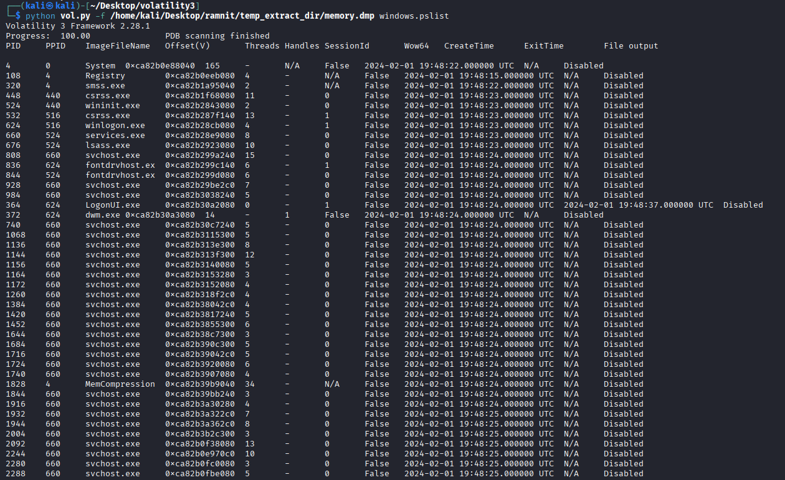
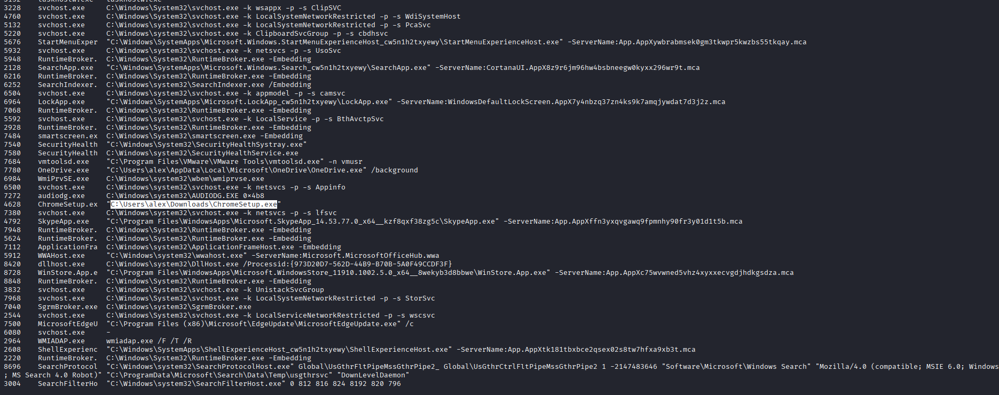
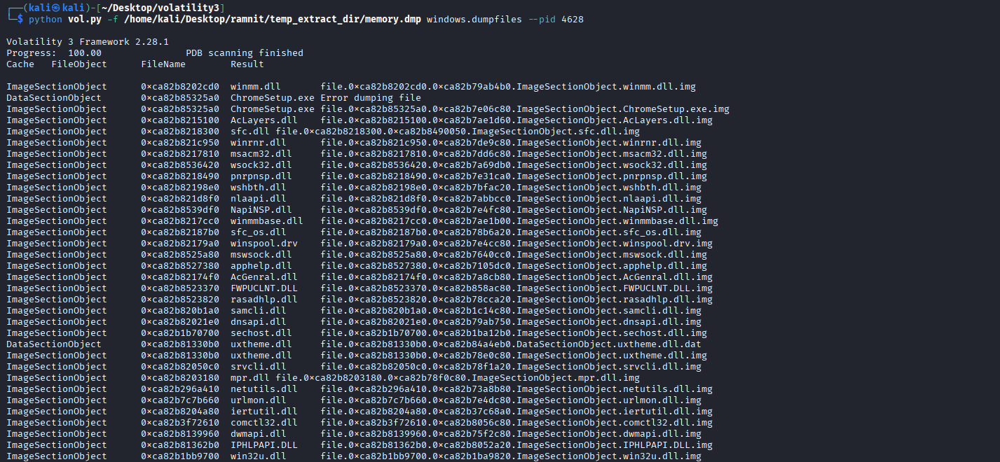
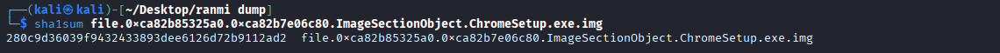
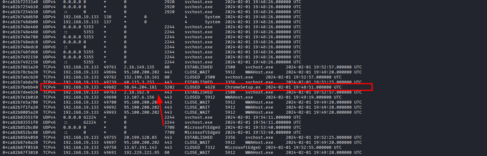
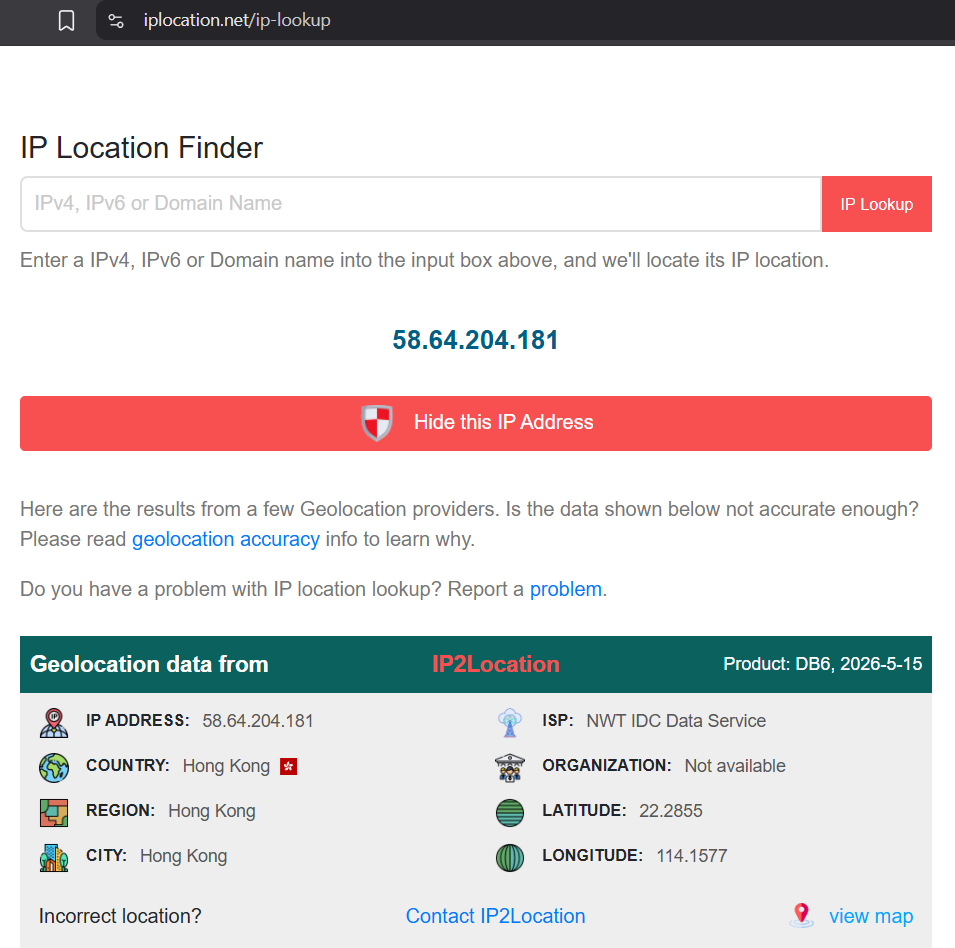
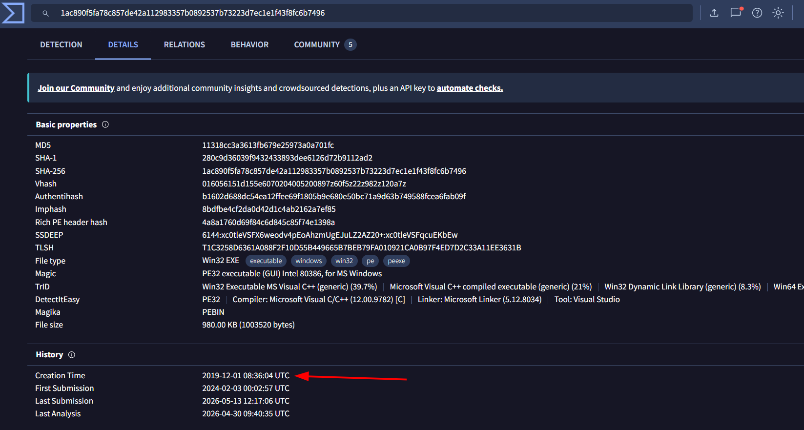
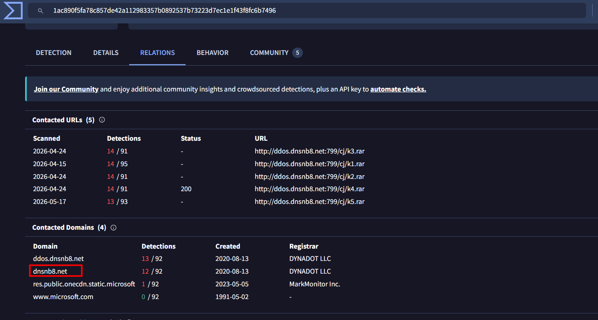

# Ramnit Lab

**Platform:** CyberDefenders    
**Difficulty:** Easy  
**Duration:** ~30 min   
**Category:** Endpoint Forensics  
**Link:** https://cyberdefenders.org/blueteam-ctf-challenges/ramnit/
 
## Scenario
Our intrusion detection system has alerted us to suspicious behavior on a workstation, pointing to a likely malware intrusion. A memory dump of this system has been taken for analysis. Your task is to analyze this dump, trace the malware’s actions, and report key findings.  

### Tools:

[+] [Volatility](https://github.com/volatilityfoundation/volatility3.git)   
[+] VirusTotal

[Commands For Volatility](https://github.com/volatilityfoundation/volatility/wiki/command-reference)

## Q1
What is the name of the process responsible for the suspicious activity?  


The first thing we always want to do when analysing a memory dump is to investigate the process list.

   

After investigating, I found nothing of interest for now, so I am going to try with the cmd.

Using the command:
```
vol -f ".mem" windows.cmdline
```
I found a suspicious file called ChromeSetup.exe in the download folder. The malware could be hiding itself as a legitimate program.

  

To verify this, I extracted the file to obtain it's hash.

  

Make sure to redirect the output to another folder, unlike me.  


  

Now that we have the hash, we just need to search on VirusTotal.    


Our theory was correct, it is indeed malware.  
  

## Q2
What is the exact path of the executable for the malicious process?  

The exact path, as we have seen in the Q1 is:   
```
"C:\Users\alex\Downloads\ChromeSetup.exe"
```


## Q3
Identifying network connections is crucial for understanding the malware's communication strategy. What IP address did the malware attempt to connect to?  

To locate this, we can use the command netscan.

```
python3 vol.py -f memory.dmp netscan
```
As we know, the pid of the process is 4628, so finding it is not a problem.  

  

## Q4
To determine the specific geographical origin of the attack, Which city is associated with the IP address the malware communicated with?  

We can determinate this using an online tool like iplocation.  

The origin of the attack comes from Hong Kong  

  

## Q5
Hashes serve as unique identifiers for files, assisting in the detection of similar threats across different machines. What is the SHA1 hash of the malware executable? 

As we know from Q1 the hash is:
```
280c9d36039f9432433893dee6126d72b9112ad2
```

## Q6
Examining the malware's development timeline can provide insights into its deployment. What is the compilation timestamp for the malware?  

Searching on VirusTotal, we can find the creation time below the history tab in the details section. 



## Q7
Identifying the domains associated with this malware is crucial for blocking future malicious communications and detecting any ongoing interactions with those domains within our network. Can you provide the domain connected to the malware?  

Similar to Q6, we can find this in the Relations section under Contacted Domains



