# Red Stealer Lab 

**Platform:** CyberDefenders    
**Difficulty:** Easy  
**Duration:** ~30 min   
**Category:** Threat Intel 
**Link:** https://cyberdefenders.org/blueteam-ctf-challenges/red-stealer/
 
## Scenario
You are part of the Threat Intelligence team in the SOC (Security Operations Center). An executable file has been discovered on a colleague's computer, and it's suspected to be linked to a Command and Control (C2) server, indicating a potential malware infection.
Your task is to investigate this executable by analyzing its hash. The goal is to gather and analyze data beneficial to other SOC members, including the Incident Response team, to respond to this suspicious behavior efficiently.

HASH: 248FCC901AFF4E4B4C48C91E4D78A939BF681C9A1BC24ADDC3551B32768F907B

## Q1
Categorizing malware enables a quicker and clearer understanding of its unique behaviors and attack vectors. What category has Microsoft identified for that malware in VirusTotal?

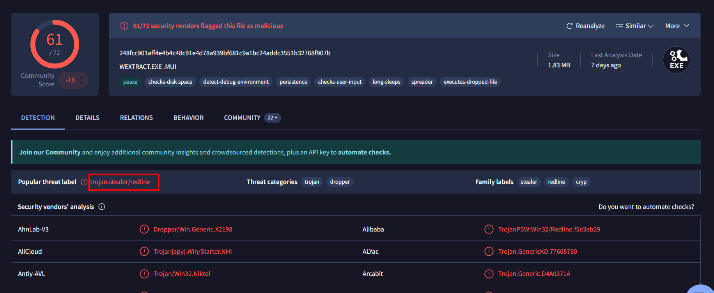    

With a quick search using the given hash on VirusTotal we can identify the malware as a trojan.

## Q2
Clearly identifying the name of the malware file improves communication among the SOC team. What is the file name associated with this malware?  

Continuing the investigation on VirusTotal, if we go to the Details tab, we can find the name below the History section.

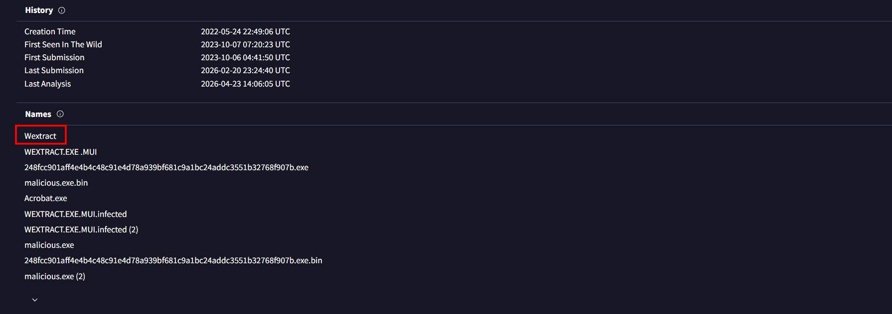  

## Q3
Knowing the exact timestamp of when the malware was first observed can help prioritize response actions. Newly detected malware may require urgent containment and eradication compared to older, well-documented threats. What is the UTC timestamp of the malware's first submission to VirusTotal?     

As mentioned in the second question, the History information is in the Details tab.  

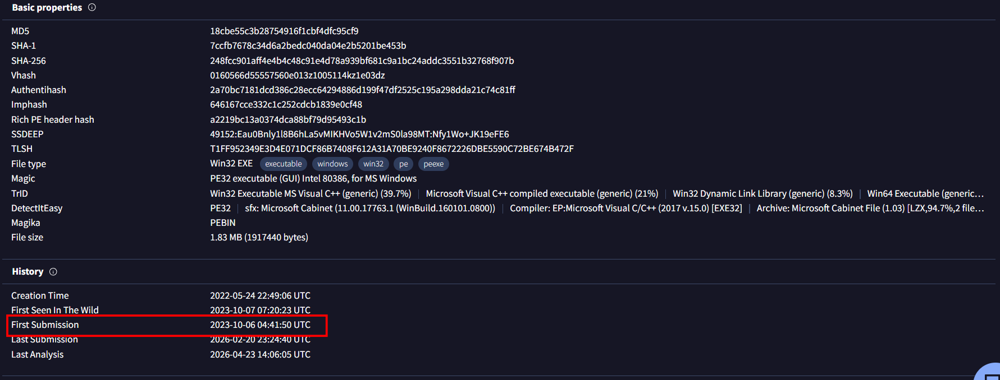  
  

## Q4
Understanding the techniques used by malware helps in strategic security planning. What is the MITRE ATT&CK technique ID for the malware's data collection from the system before exfiltration?  

To find information about MITRE ATT&CK techniques on VirusTotal, we need to navigate to the Behavior tab.

By scrolling down, we can locate the MITRE ATT&CK Tactics and Techniques panel. From there, we should focus on the Collection section.

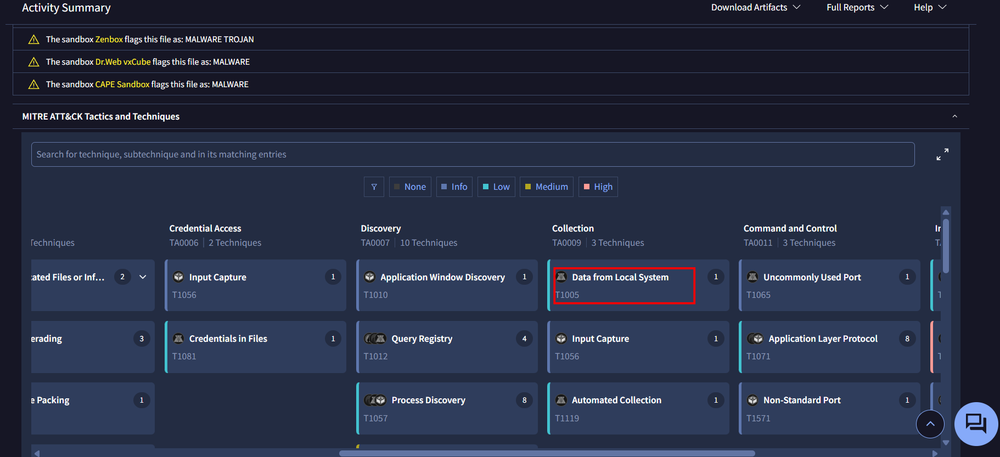 

## Q5
Following execution, which social media-related domain names did the malware resolve via DNS queries?  

In the same tab as before, we can the Network Communication section, where the DNS Resolutions are listed.

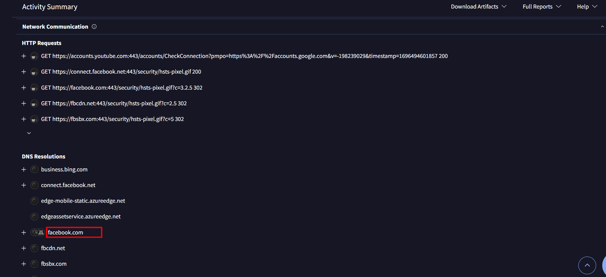 

## Q6
Once the malicious IP addresses are identified, network security devices such as firewalls can be configured to block traffic to and from these addresses. Can you provide the IP address and destination port the malware communicates with?  

Like stated before, we can locate the IP Traffic section below.  

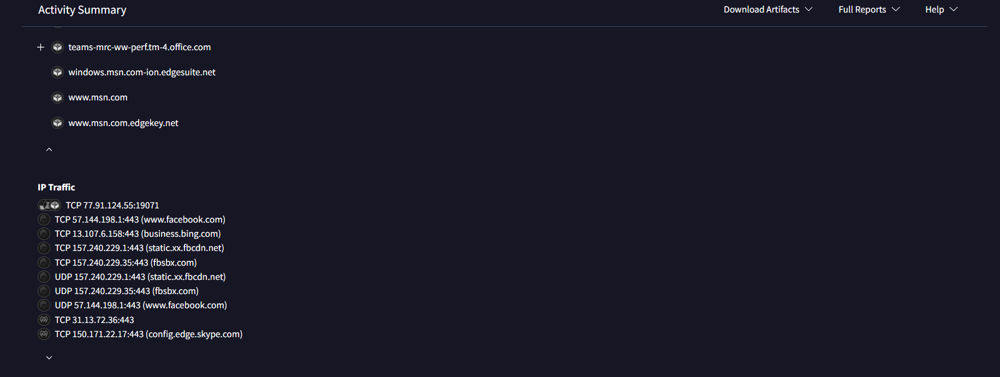   

## Q7
YARA rules are designed to identify specific malware patterns and behaviors. Using MalwareBazaar, what's the name of the YARA rule created by "Varp0s" that detects the identified malware?  

To use MalwareBazzar, we just need to use the searcher with the correct tag (sha256 in this case).  

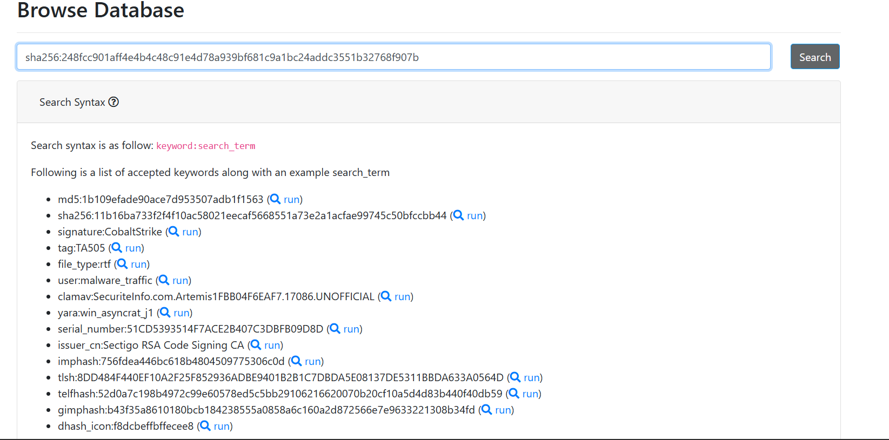 
 
The YARA Signature section is at the end of the page.

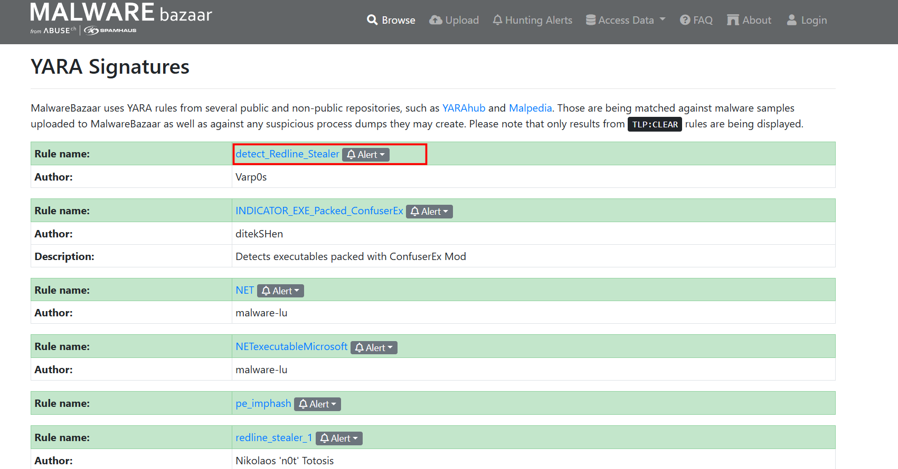

## Q8
Understanding which malware families are targeting the organization helps in strategic security planning for the future and prioritizing resources based on the threat. Can you provide the different malware alias associated with the malicious IP address according to ThreatFox?  

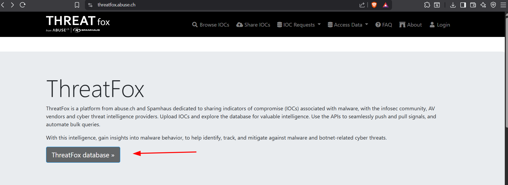

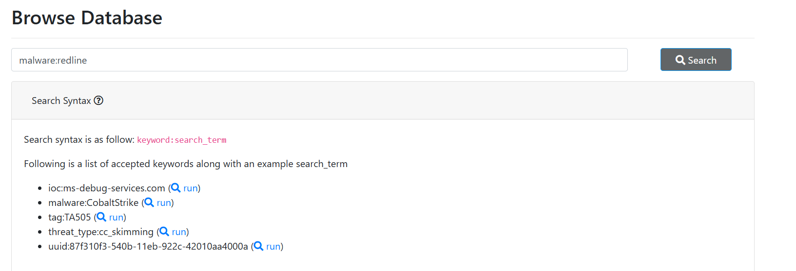  

To find this, we can do a quick seach on ThreatFox IOC Database, searching by the malware name, redline.

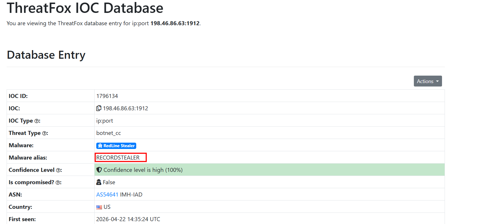  

## Q9  
By identifying the malware's imported DLLs, we can configure security tools to monitor for the loading or unusual usage of these specific DLLs. Can you provide the DLL utilized by the malware for privilege escalation?  

Returning to VirusTotal, we can find the imports on the Detail tab.

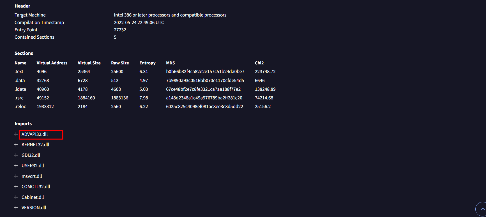
