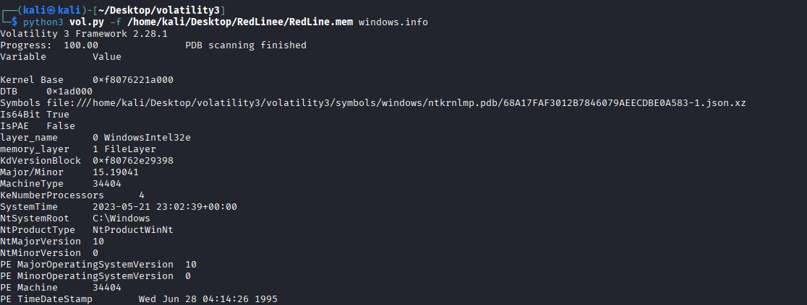
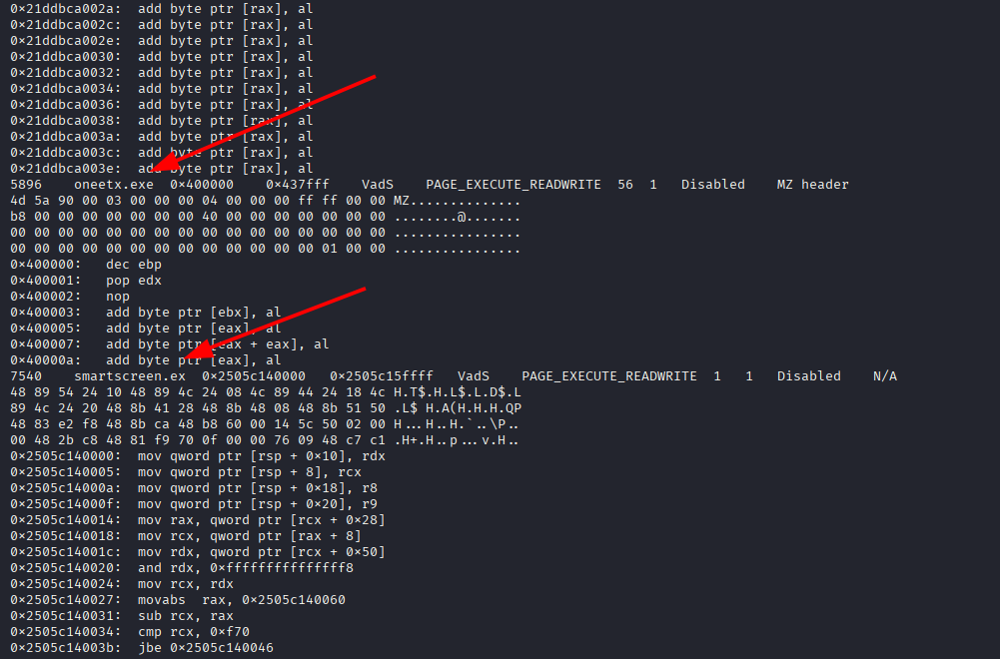
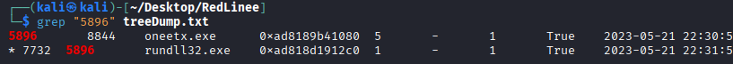
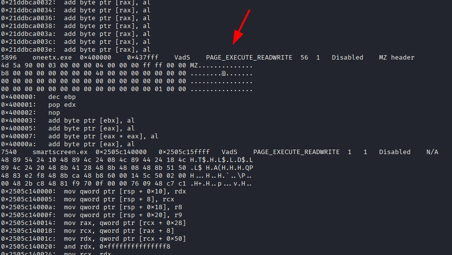
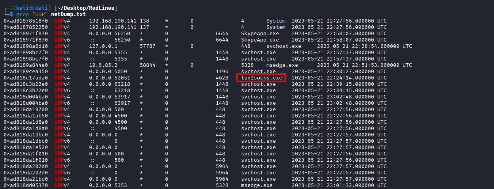
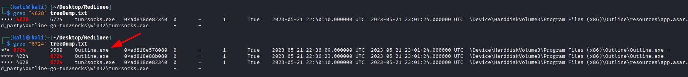
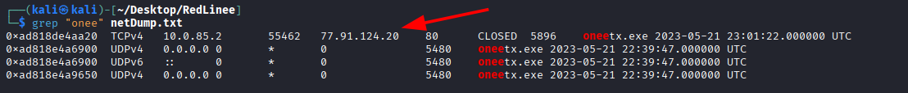
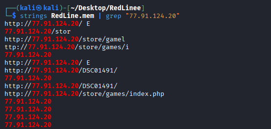
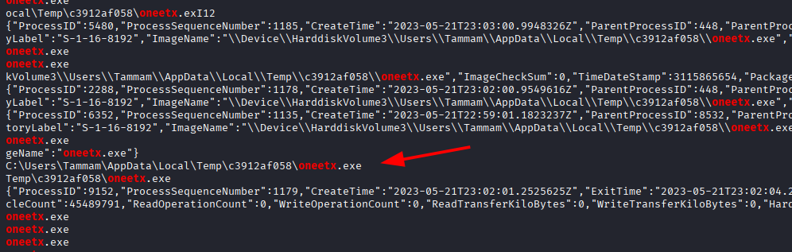

# RedLine Lab

**Platform:** CyberDefenders    
**Difficulty:** Easy  
**Duration:** ~45 min     
**Category:** Endpoint Forensics  
**Link:** https://cyberdefenders.org/blueteam-ctf-challenges/redline/  
 
## Scenario
As a member of the Security Blue team, your assignment is to analyze a memory dump using Redline and Volatility tools. Your goal is to trace the steps taken by the attacker on the compromised machine and determine how they managed to bypass the Network Intrusion Detection System (NIDS). Your investigation will identify the specific malware family employed in the attack and its characteristics. Additionally, your task is to identify and mitigate any traces or footprints left by the attacker.

## Tools

**Volatility3**

## Q1
What is the name of the suspicious process?

The first thing we need to know is the OS of the memory dump. To obtain this information we can use the command windows.info as shown in the image.

While we can obtain a lot of useful information from this command, for now knowing that we are working with a windows memory dump will suffice.

Using the command windows.malfind we discover two processes that were modified by the attacker: 'smartscreen' and 'oneetx'

Doing a quick search, we find out that while smartscreen is a real windows program, oneetx is not.

As stated before, the suspicious process is oneetx.

## Q2
What is the child process name of the suspicious process?

Using the command windows.pstree we can obtain the process list.

Knowing the PID of the suspicious file "5896" thanks to our previous investigation. It's easy to identify the child process using grep.

As shown in the image, the process is "rundll32.exe"

## Q3
What is the memory protection applied to the suspicious process memory region?

We already know it is "PAGE_EXECUTE_READWRITE" as it appears in the windows.malfind command.

## Q4
What is the name of the process responsible for the VPN connection?

To find possible VPN connections we can use the command windows.netscan.

Usually, VPN connections prefer UDP over TCP.  Knowing this, a good starting point is to search for UDP connections to see if there's anomalous traffic that might point to the use of a VPN (such as continuous UDP connections from the same IP)

Looking at the UDP connections, we find a program called tun2socks, which seems suspicious.

Knowing its PID, we can investigate further by using the command windows.pstree. By doing this we quickly find another program called "Outline".

Searching online, we found out "Outline" it's an open-source VPN, meaning we have find the responsible process.

## Q5
What is the attacker's IP address?

Using the command windows.netscan we can search the malicious process to find the attacker's IP, which is "77.91.124.20".

## Q6
What is the full URL of the PHP file that the attacker visited?

To find this, we can use the command strings and use grep to filter the results.

As shown in the image, the URL is:
http://77.91.124.20/store/games/index.php

## Q7
What is the full path of the malicious executable?

Using the same strategy as before, we obtain the full path of the malicious executable: "C:\Users\Tammam\AppData\Local\Temp\c3912af058\oneetx.exe"

