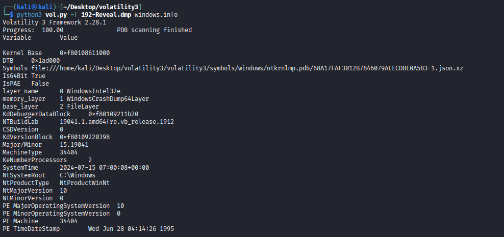
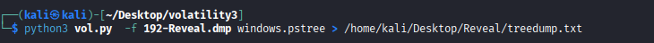
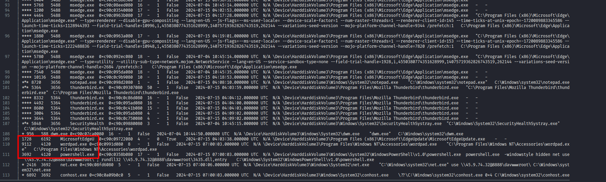
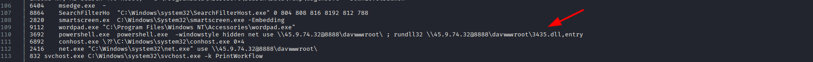
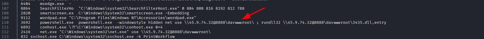
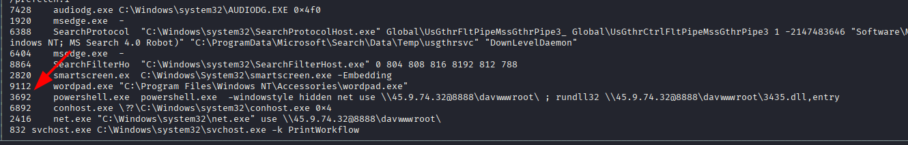
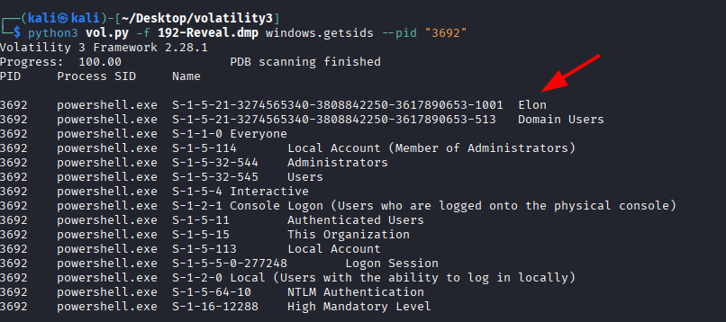
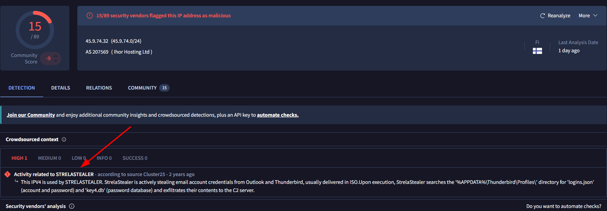

# Reveal Lab

**Platform:** CyberDefenders    
**Difficulty:** Easy
**Duration:** ~45 min     
**Category:** Endpoint Forensics  
**Link:** https://cyberdefenders.org/blueteam-ctf-challenges/reveal/  
 
## Scenario
You are a forensic investigator at a financial institution, and your SIEM flagged unusual activity on a workstation with access to sensitive financial data. Suspecting a breach, you received a memory dump from the compromised machine. Your task is to analyze the memory for signs of compromise, trace the anomaly's origin, and assess its scope to contain the incident effectively. 

## Tools

**Volatility3**

## Q1
Identifying the name of the malicious process helps in understanding the nature of the attack. What is the name of the malicious process?

*Most of the commands used in this walkthrough can be found in  [this blog](https://blog.onfvp.com/post/volatility-cheatsheet/).*

The first thing we need to know is the OS of the memory dump. To obtain this information we can use the command windows.info as shown in the image.

While we can obtain a lot of useful information from this command, for now knowing that we are working with a windows memory dump will suffice.

Our next step will be to analyze the process tree in order to find the malware. Normally, to explore the memory dump manually would be impossible. However, as this is a practice lab, the memory tree is only a hundred lines long. Meaning, we can do it by hand without much trouble. 

At the end of the file, we can observe a powershell.exe process, which is a not so subtle way to tell us that malware is being executed.

We can also use the command windows.malfind to automate the work.

## Q2
Knowing the parent process ID (PPID) of the malicious process aids in tracing the process hierarchy and understanding the attack flow. What is the parent PID of the malicious process?

The PPID is 4120.

## Q3
Determining the file name used by the malware for executing the second-stage payload is crucial for identifying subsequent malicious activities. What is the file name that the malware uses to execute the second-stage payload?

To find the file name, it is interesting to obtain the cmdline, as we already know that a powershell is being used. We can obtain this using the command windows.cmdline

Once we find the powershell command at the end of the output, it's easy to identify that the name used by the malware is "3436.dll".

## Q4
Identifying the shared directory on the remote server helps trace the resources targeted by the attacker. What is the name of the shared directory being accessed on the remote server?

As shown in the same powershell command, the remote directory accessed is "davwwwroot".

## Q5
What is the MITRE ATT&CK sub-technique ID that describes the execution of a second-stage payload using a Windows utility to run the malicious file?

In this case, the attacker is using the windows utility "rundll32" to execute a malicious remote library. By doing this using a genuine command, it evades the antivirus while also allowing it to remaing undetected.

This type of attack is known in the MITRE ATT&CK as System Binary Proxy Execution: Rundll32, with the ID "T1218.011".

## Q6
Identifying the username under which the malicious process runs helps in assessing the compromised account and its potential impact. What is the username that the malicious process runs under?

By obtaining the PID of the process, we can learn which user has executed it using the command windows.getsids as shown in the images below.

## Q7
Knowing the name of the malware family is essential for correlating the attack with known threats and developing appropriate defenses. What is the name of the malware family?

Looking up the attacker's IP address ("45.9.74.32") on VirusTotal, we find out that the name of the malware family is STRELASTEALER.

