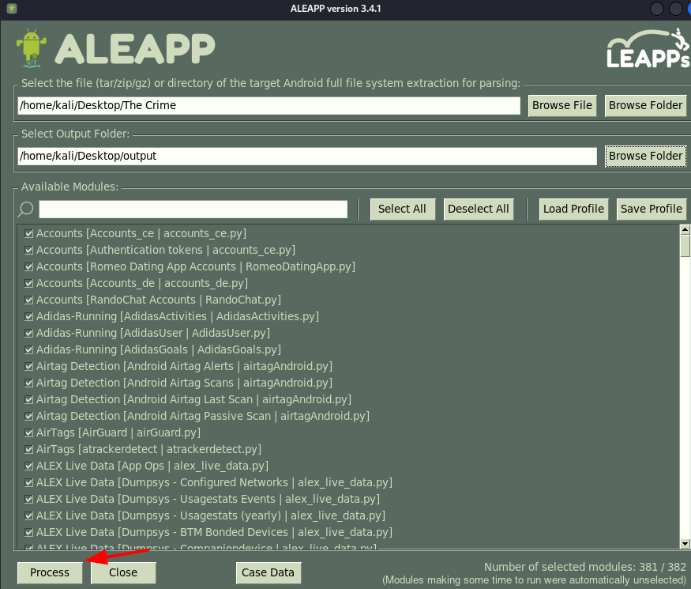
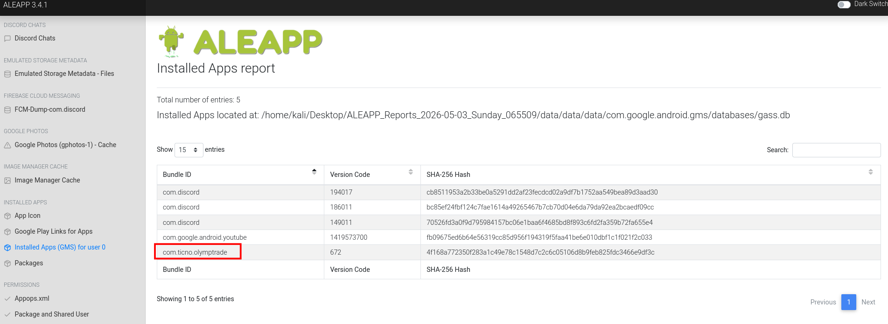
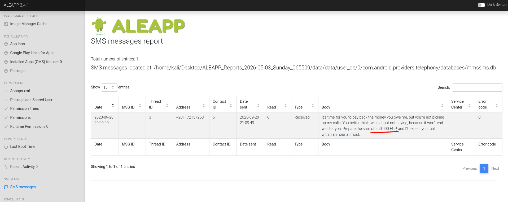
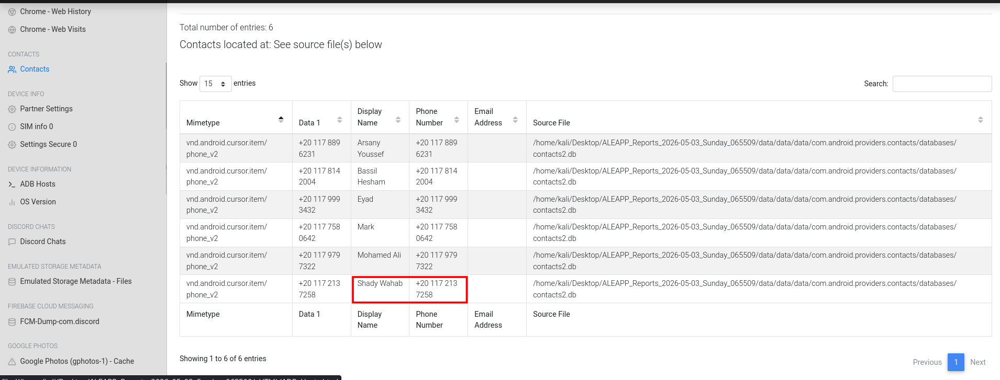
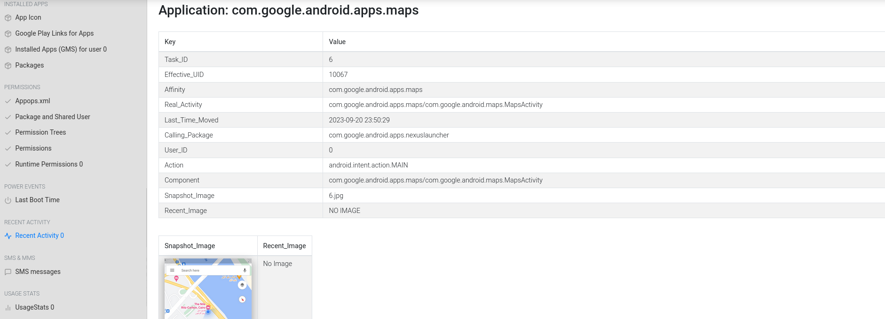
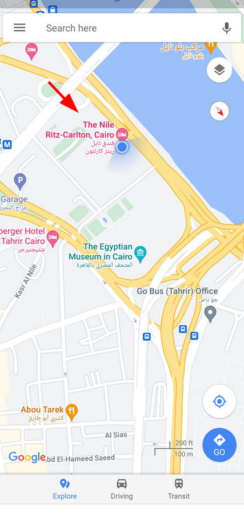
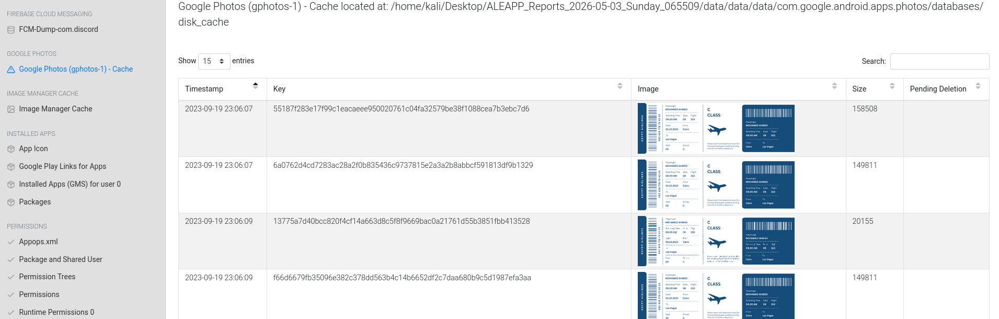
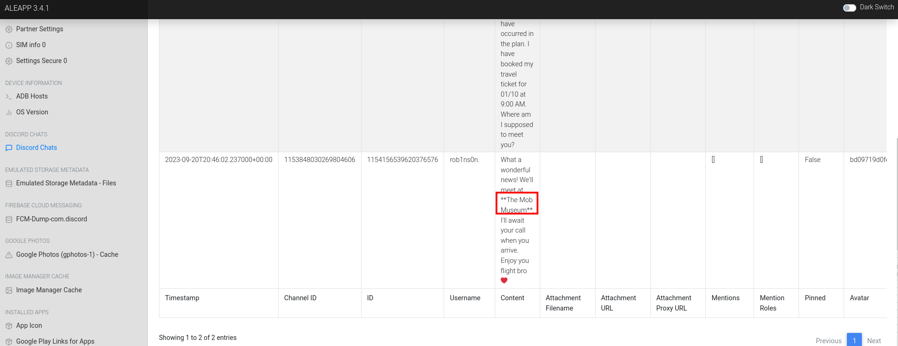

# The Crime Lab 

**Platform:** CyberDefenders    
**Difficulty:** Easy  
**Duration:** ~60 min   
**Category:** Endpoint Forensics
**Link:** https://cyberdefenders.org/blueteam-ctf-challenges/the-crime/
 
## Scenario
We're currently in the midst of a murder investigation, and we've obtained the victim's phone as a key piece of evidence. After conducting interviews with witnesses and those in the victim's inner circle, your objective is to meticulously analyze the information we've gathered and diligently trace the evidence to piece together the sequence of events leading up to the incident.

To complete this lab, I will use a free open-source forensic Android app named ALEAPP.  
Oficial github:[ALEAPP](https://github.com/abrignoni/ALEAPP)

## Q1
Based on the accounts of the witnesses and individuals close to the victim, it has become clear that the victim was interested in trading. This has led him to invest all of his money and acquire debt. Can you identify the SHA256 of the trading application the victim primarily used on his phone?  

The first step is to generate a report based on the provided samples. This can be done using the application's GUI

   

Once the report is generated, we can begin analyzing it.

To find the trading app, we need to search in the app tab, where we can quickly identify it.

   

## Q2
According to the testimony of the victim's best friend, he said, "While we were together, my friend got several calls he avoided. He said he owed the caller a lot of money but couldn't repay now". How much does the victim owe this person?

After a bit of research, I found an SMS message containing the debt amount.  

  

## Q3
What is the name of the person to whom the victim owes money?

Searching by the telephone number used to send the theatening SMS, We can find a Contact named Shady Wahab.

  

## Q4
Based on the statement from the victim's family, they said that on September 20, 2023, he departed from his residence without informing anyone of his destination. Where was the victim located at that moment?

Upon investigating the recent activity section, we found a Google Maps entry that contains the location we were searching for.  

 

  

## Q5
The detective continued his investigation by questioning the hotel lobby. She informed him that the victim had reserved the room for 10 days and had a flight scheduled thereafter. The investigator believes that the victim may have stored his ticket information on his phone. Look for where the victim intended to travel.  

Since the victim had saved the ticket as images, we can find it in the Google Photos section.  

 

 

## Q6
After examining the victim's Discord conversations, we discovered he had arranged to meet a friend at a specific location. Can you determine where this meeting was supposed to occur?

Examining some discord chats, we can identify the meeting location.

 
