# Tomcat Takeover Lab

**Platform:** CyberDefenders    
**Difficulty:** Easy  
**Duration:** ~30 min   
**Category:** Network Forensics
**Link:** https://cyberdefenders.org/blueteam-ctf-challenges/tomcat-takeover/
 
## Scenario
The SOC team has identified suspicious activity on a web server within the company's intranet. To better understand the situation, they have captured network traffic for analysis. The PCAP file may contain evidence of malicious activities that led to the compromise of the Apache Tomcat web server. Your task is to analyze the PCAP file to understand the scope of the attack.  

### Tools:
  
[+] WireShark

## Q1
Given the suspicious activity detected on the web server, the PCAP file reveals a series of requests across various ports, indicating potential scanning behavior. Can you identify the source IP address responsible for initiating these requests on our server?  

As we already know from que question, this is likely to be a scanning. To check this, we can obtain a brief of every ip in the stadistics tab like shown in the screenshot below.   

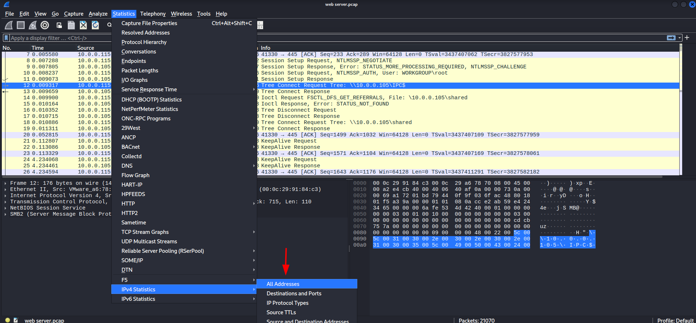   

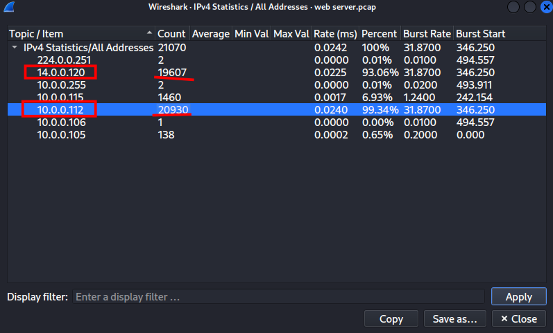

From the screenshot, we can deduce that one of the two IPs belongs to the victim and the other to the attacker. To determine which one is the attacker, we need to examine the destination port summary.

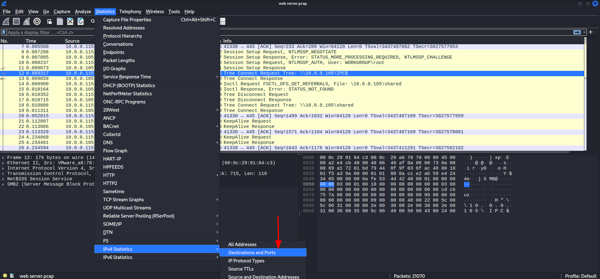

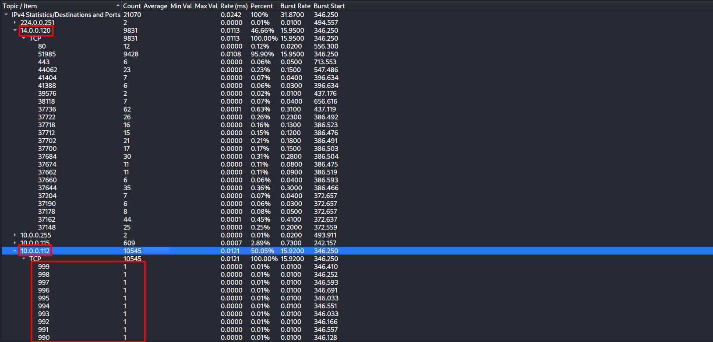

The  destinations and ports column shows how many times an IP address has been reached across diferent ports. With this in mind, we can observe in the screenshot that 10.0.0.112 has been contacted from multiple ports, suggesting that it is the victim of a port scan.  

This leads us to conclude that the IP address of the attacker is "14.0.0.120"

## Q2
Based on the identified IP address associated with the attacker, can you identify the country from which the attacker's activities originated?  

We can determinate this using an online tool like iplocation.  

The attack originated from China.

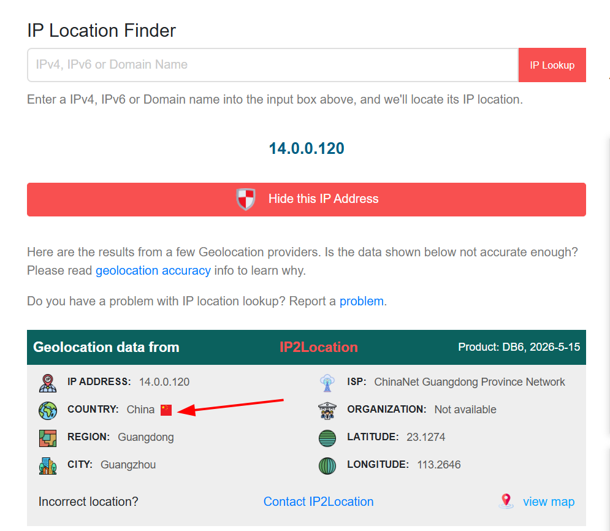

## Q3
From the PCAP file, multiple open ports were detected as a result of the attacker's active scan. Which of these ports provides access to the web server admin panel?  

I attempted using the contains filter searching for "admin", and I found it immediately. Alternatively, one could filter by the http protocol, as we are asked to find a web server.

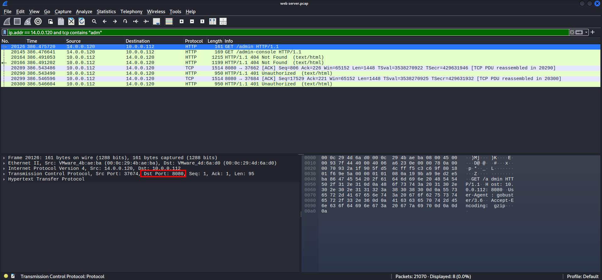

## Q4
Following the discovery of open ports on our server, it appears that the attacker attempted to enumerate and uncover directories and files on our web server. Which tools can you identify from the analysis that assisted the attacker in this enumeration process?

Investigating the frame, we can observe that the user agent is "gobuster" a popular brute-forcing tool for enumeration. By default, this tool sets the User-Agent as gobuster and it seems that the attacker failed to change it.

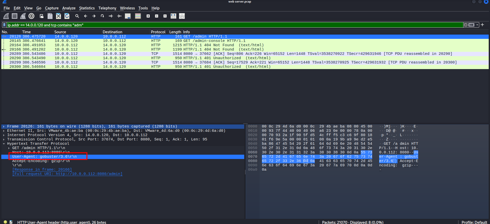

## Q5
After the effort to enumerate directories on our web server, the attacker made numerous requests to identify administrative interfaces. Which specific directory related to the admin panel did the attacker uncover?

As stated previously, I will modify the current filter to http in order to have a bigger scope of the situation.  

Investigating, I found a manager directory where the attacker managed to upload something, so I suspect this is the admin directory.

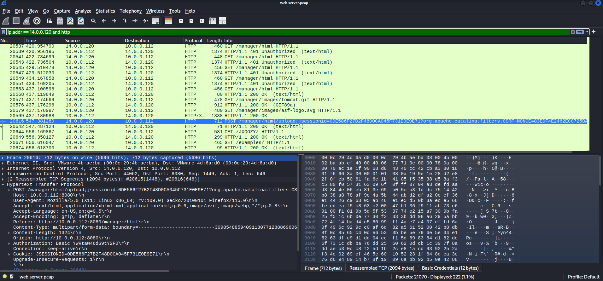

## Q6
After accessing the admin panel, the attacker tried to brute-force the login credentials. Can you determine the correct username and password that the attacker successfully used for login?

The best method for detecting brute-force attacks is to find the failed logins. In the case of HTTP, unauthorized access.  

Once we find this, we just need to find an authorized login.

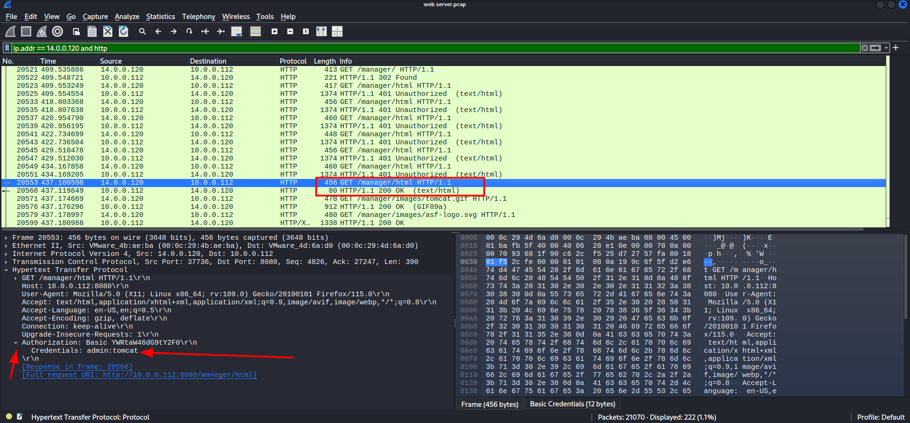

## Q7
Once inside the admin panel, the attacker attempted to upload a file with the intent of establishing a reverse shell. Can you identify the name of this malicious file from the captured data?  

To find the file, we need to apply a filter searching for http, as it was uploaded via the web from the malicious IP.

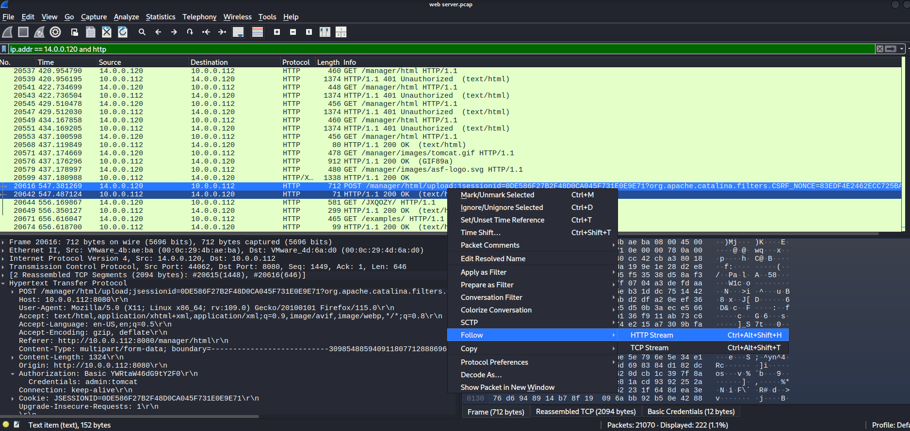

After finding the correct frame, all we have to do is search for the filename.

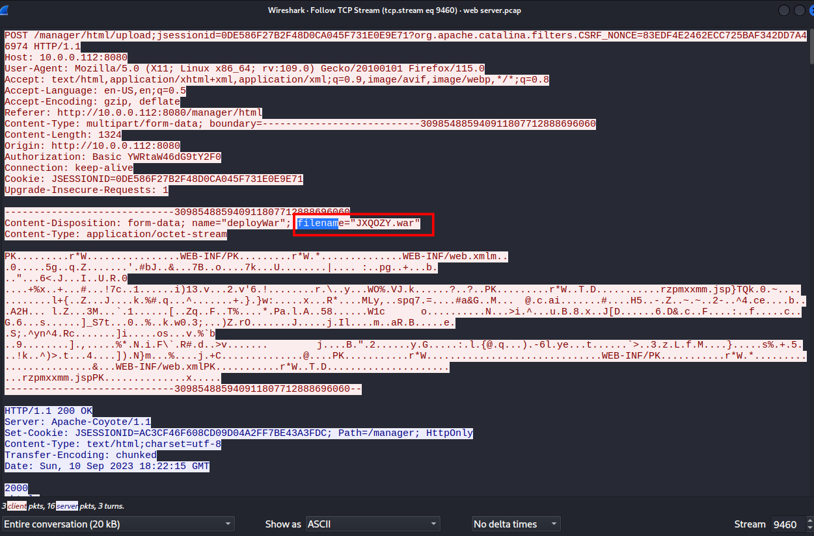

## Q8
After successfully establishing a reverse shell on our server, the attacker aimed to ensure persistence on the compromised machine. From the analysis, can you determine the specific command they are scheduled to run to maintain their presence?

In order to look for reverse shell commands, we need to follow the tcp streams after the shell has been uploaded in the system.

We can aply a simple wireshark filter to do this.

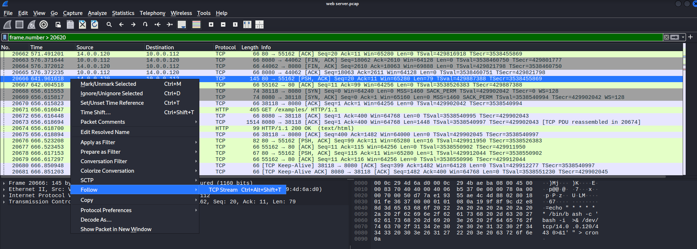

After following the stream, we can quickly find the command.

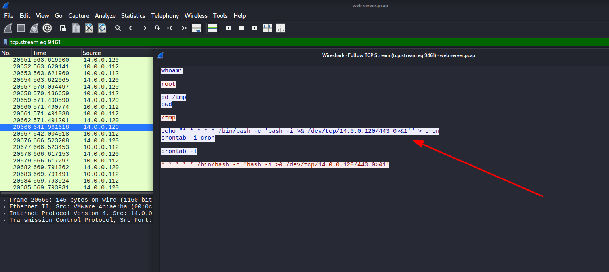

