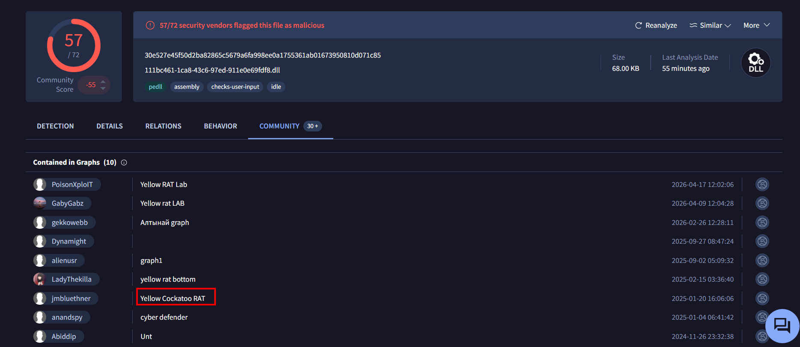
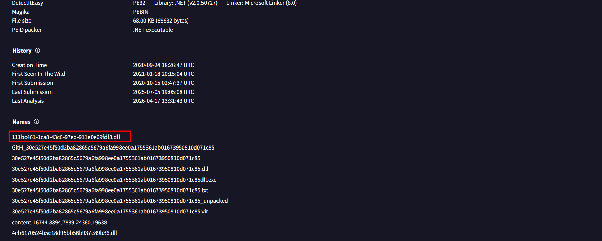
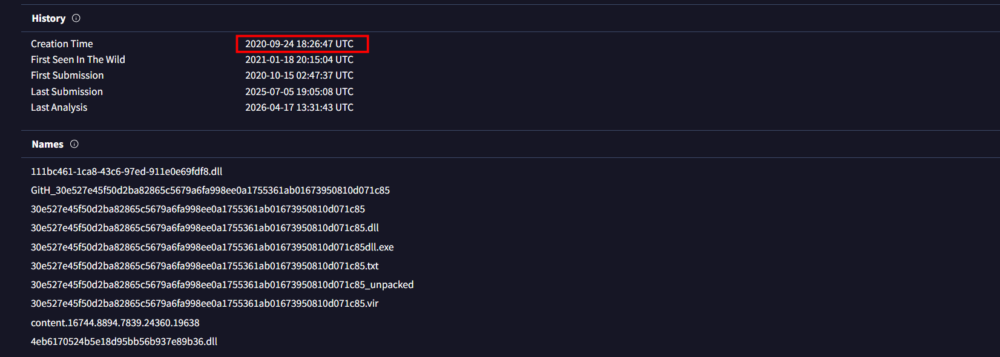
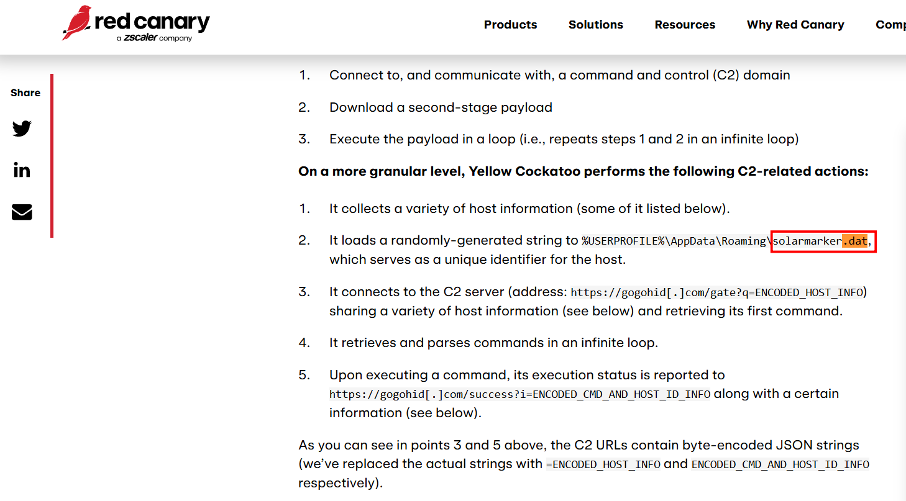
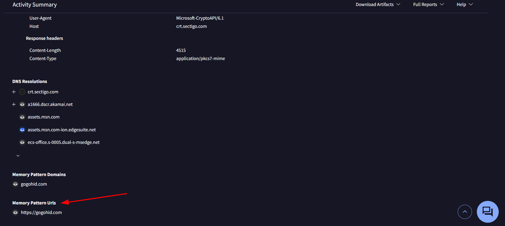

#  Yellow RAT Lab

**Platform:** CyberDefenders    
**Difficulty:** Easy  
**Duration:** ~30 min   
**Category:** Thread Intel
**Link:** https://cyberdefenders.org/blueteam-ctf-challenges/yellow-rat/
 
## Scenario
Your organization's security team has detected a surge in suspicious network activity. There are concerns that LLMNR (Link-Local Multicast Name Resolution) and NBT-NS (NetBIOS Name Service) poisoning attacks may be occurring within your network. These attacks are known for exploiting these protocols to intercept network traffic and potentially compromise user credentials. Your task is to investigate the network logs and examine captured network traffic.

## Q1
Understanding the adversary helps defend against attacks. What is the name of the malware family that causes abnormal network traffic?

  

After conducting an extensive search on VirusTotal(we just have to search it by the given hash), I only found a mention of the malware family in the Community section (which is likely there because of the lab).

## Q2
As part of our incident response, knowing common filenames the malware uses can help scan other workstations for potential infection. What is the common filename associated with the malware discovered on our workstations?

  

To find a common filename, we can go to the Details section on VirusTotal and scroll down until we find the “Names” entry.

## Q3
Determining the compilation timestamp of malware can reveal insights into its development and deployment timeline. What is the compilation timestamp of the malware that infected our network?

  

The Creation Time is on top of the Names entry.

## Q4
Understanding when the broader cybersecurity community first identified the malware could help determine how long the malware might have been in the environment before detection. When was the malware first submitted to VirusTotal?

The first submission is listed under the creation time we found earlier.

## Q5
To completely eradicate the threat from Industries' systems, we need to identify all components dropped by the malware. What is the name of the .dat file that the malware dropped in the AppData folder?

 

After failing to find the .dat file on VirusTotal, I searched for it online. After a few attempts, I came across the following page: https://redcanary.com/blog/threat-intelligence/yellow-cockatoo/, which contains the required information.

## Q6
It is crucial to identify the C2 servers with which the malware communicates to block its communication and prevent further data exfiltration. What is the C2 server that the malware is communicating with?

 

To find this, we can go to VirusTotal. In the Behavior section, we just need to locate the “Memory Pattern URLs” tab (URLs that the malware contains by default).

